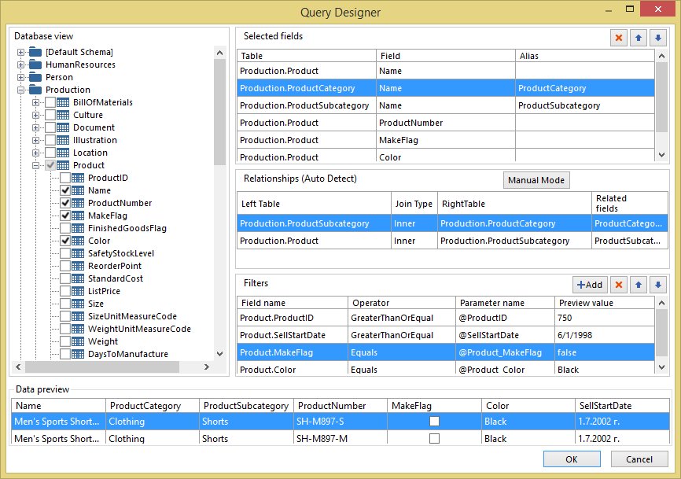
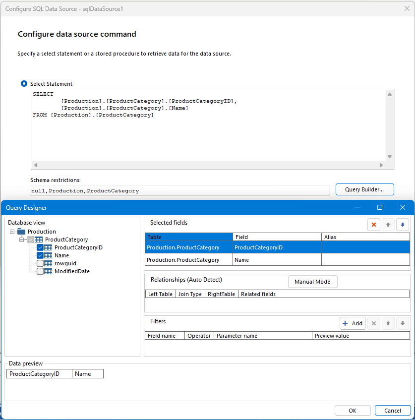

				---
title: Query Designer
page_title: Query Designer in the Standalone Report Designer at a Glance
description: "Learn more about the Query Designer in the Standalone Designer and how to use it to create basic queries easily in Telerik Reporting."
slug: telerikreporting/designing-reports/report-designer-tools/desktop-designers/tools/data-source-wizards/sqldatasource-wizard/query-designer-in-the-standalone-designer
tags: query,designer,standalone,designer
published: True
position: 15
previous_url: /sql-datasource-query-designer,/designing-reports/report-designer-tools/desktop-designers/tools/data-source-wizards/sqldatasource-wizard/query-designer-in-the-standalone-designer
---

# Standalone Designer's Query Designer

Standalone Report Designer provides both a graphical and a text-based query designer to help you create queries to retrieve data from a relational database for a SqlDataSource component. The Query Designer supports any ADO.NET/ODB/OLEDB data provider with a working implementation of `GetSchema` with COLUMN collection support. Automatic relations functionally require relational databases supported by [Telerik Data Access](https://www.telerik.com/data-access-sunsetting):

* [Microsoft SQL Server](https://docs.telerik.com/data-access/developers-guide/database-specifics/microsoft-sql-server/database-specifics-sql-overview)
* [Microsoft SQL Server Compact Edition](https://docs.telerik.com/data-access/developers-guide/database-specifics/database-specifics-sqlce-overview)
* [Microsoft SQL Azure](https://docs.telerik.com/data-access/developers-guide/database-specifics/microsoft-sql-azure/getting-started-root-quickstart-azure-overview)
* [Oracle](https://docs.telerik.com/data-access/developers-guide/database-specifics/oracle/database-specifics-oracle-overview)
* [MySql](https://docs.telerik.com/data-access/developers-guide/database-specifics/database-specifics-mysql-overview)
* [Advantage Database Server](https://docs.telerik.com/data-access/developers-guide/database-specifics/database-specifics-ads-overview)
* [SQL Anywhere](https://docs.telerik.com/data-access/developers-guide/database-specifics/sql-anywhere/database-specifics-sqlanywhere-voerview)
* [Firebird](https://docs.telerik.com/data-access/developers-guide/database-specifics/firebird/database-specifics-firebird-overview)
* [VistaDB](https://docs.telerik.com/data-access/developers-guide/database-specifics/vistadb/database-specifics-vistadb-overview)
* [SQLite](https://docs.telerik.com/data-access/developers-guide/database-specifics/sqlite/database-specifics-sqlite-overview)
* [PostgreSQL](https://docs.telerik.com/data-access/developers-guide/database-specifics/postgresql/database-specifics-postgresql-overview)

> Please note that Telerik Data Access is a discontinued product and its [supported databases list](https://docs.telerik.com/data-access/developer-guide-integration-prerequisities#access-to-a-relational-database) will not be appended. The versions of the supported database drivers will not be updated as well.

The following figure shows the graphical query designer.



Use the graphical query designer to explore the database tables and views, interactively build SQL SELECT statements, and view the result. The select statement specifies the database tables, views, and columns from which to retrieve data for a [SqlDataSource Component](). If you choose multiple related tables, the query designer describes the relationship between sets of two tables.

## Schema Restrictions

As of 2025 Q1, the Query Builder of the Standalone Report Designer accepts a new property called [SchemaRestrictions](/api/telerik.reporting.sqldatasource#Telerik_Reporting_SqlDataSource_SchemaRestrictions). The value of this property is a comma-separated list of schema restrictions that will be used by the chosen data provider to query a subset of data from the database schema. This allows report creators to load only the necessary schema information and benefit from faster load times.

Behind the scenes, the Reporting engine calls the [ADO.NET GetSchema method](https://learn.microsoft.com/en-us/dotnet/framework/data/adonet/getschema-and-schema-collections) on the [columns collection](https://learn.microsoft.com/en-us/dotnet/framework/data/adonet/schema-restrictions#columns) and passes the schema restrictions specified by the user. The exact number and order of schema restriction arguments can vary depending on the selected data provider. For example, provided we have a connection to the Microsoft SQL Server AdventureWorks sample database, we can pass the following string to the schema restrictions field to instruct the Query Builder to load the schema of the ProductCategory table only.

````
null,Production,ProductCategory
````

> Schema restrictions are case-sensitive and empty arguments are respected. If you need to provide a null value for a specific argument, you can use the `null` keyword as demonstrated in the example above.

> The schema restrictions work only with .Net 6+



## Query Designer Panes

The following sections describe the function of each pane.

* [Database View](#database-view-pane) Displays a hierarchical view of tables and views that are organized by database schema.
* [Selected Fields](#selected-fields-pane) Displays the list of database field names from the selected items in the _Database View_ pane.
* [Relationships](#relationships-pane) Displays a list of relationships that are inferred from the selected tables or views or the relationships that you created manually.
* [Filters](#filters-pane) Displays a list of filter criteria for tables or views.
* [Data Preview](#data-preview-pane) Displays sample data for the automatically generated query.

### Database View Pane

The __Database View__ pane displays the metadata for database objects that you have permission to view. The permission is determined by the data source connection and credentials. The hierarchical view displays database objects organized by database schema. Expand the node for each schema to view tables and views. Expand a table or view to display the columns.

### Selected Fields Pane

The __Selected Fields__ pane displays the selected columns to include in the query. The fields displayed in this pane become the field collection for the report data item. These fields represent the data you can display in tables, graphs, and other report items when you view a report.

The following options are available:

* __Delete__ Deletes the selected field from the fields collection.
* __Move Up__ or __Move Down__ Moves fields up or down the fields list. The fields are added to the query in the order they appear in the _Selected Fields_ list.

The following columns are displayed:

* __Table__ Displays the field table name.
* __Field__ Displays the field name.
* __Alias__ The alias to use for the field. The alias will be automatically generated if the last added field name is already in use. Additionally, field aliases can be changed or added manually.

### Relationships Pane

The __Relationships__ pane displays the join relationships. The relationships can be detected automatically from the foreign key relationships that are retrieved from the database metadata or you can create them manually.

The following options are available:

* __Manual Mode/Auto Detect__ Toggles the auto-detect feature that automatically creates relationships between tables. If auto-detect is turned on, the query designer creates relationships from foreign keys in tables; otherwise, you must create the relationships manually. When you select tables in the _Database View_ pane, auto-detect automatically attempts to create relationships. If you turn on auto-detect after you have manually created joins, those joins will be discarded.
* __Add Relationship__ Adds a relationship to the _Relationship_ list. If auto-detect is turned on, the tables from which columns are used in the query are automatically added to the _Relationship_ list. When auto-detect identifies that two tables are related, one table is added to the Left Table column, the other to the Right Table column, and an inner join is created between them. Each relationship generates a JOIN clause in the query. If the tables are not related, all of them are listed in the Left Table column and the Join Type column indicates the tables are not related to other tables. When auto-detect is turned on, you cannot manually add relationships between tables auto-detected as unrelated. In manual mode, you can add and change relationships between tables. Click the _Related Fields_ cell to specify the fields to use to join the two tables. When using multiple relationships in a query, one of the tables in each relationship, except the first one, must be referenced in a proceeding relationship.
* __Delete__ Deletes the selected relationship from the relationships collection.
* __Move Up__ or __Move Down__ Moves relationships up or down the filter list. The relationships are added to the query in the order they appear in the _Relationships_ list. Still, the SQL query builder may reorder the relationships to create a correct SQL statement.

The following columns are available:

* __Left Table__ Displays the name of the first table that is part of a join relationship.
* __Join Type__ Displays the type of SQL JOIN statement that is used in the automatically generated query. By default, if a foreign key constraint is detected, INNER JOIN is used. Other join types can be LEFT JOIN, RIGHT JOIN or FULL OUTER JOIN. If none of these join types apply, the Join Type column displays Unrelated. No CROSS JOIN joins are created for unrelated tables; instead, you must manually create relationships by joining columns in the left and right tables.
* __Right Table__ Displays the name of the second table that is part of a join relationship.
* __Join Fields__ Lists the pairs of joined fields. If a relationship has multiple join conditions the pairs of joined fields are separated by commas (,).
* __Related Fields__ Displays the relationships between the tables. Clicking a Related Fields cell while in manual mode opens a dialog box in which to add and modify relationships between tables. You choose the fields in the right and left tables to join. You can join multiple fields from the left and the right table to specify multiple join conditions in a relationship. The two fields that join the left and right tables do not need to have the same name. The joined fields must have compatible data types.

### Filters Pane

The __Filters__ pane displays the criteria that are used to limit the number of data rows that are retrieved at run time. Criteria specified in this pane are used to generate an SQL WHERE clause.

The following columns are displayed:

* __Field Name__ Displays the name of the field to apply the criteria.
* __Operator__ The operator to use in the filter expression.
* __Parameter name__ The parameter name to add to the query.
* __Preview value__ The value to use for the _Data Preview_ pane.

The following options are available:

* __Add__ Add a new filter to the filters collection.
* __Delete__ Deletes the selected filter from the filters collection.
* __Move Up__ or __Move Down__ Moves fields up or down the filter list. The filters are added to the query in the order they appear in the _Filters_ list.

### Data Preview Pane

The __Data Preview__ pane displays the results for the automatically generated query that is specified by selections in the other panes. The columns in the result set are the fields that you specify in the _Selected Fields_ pane.

The data is not saved in the report definition. The actual data in the report is retrieved when the report is processed.

Sort order in the result set is determined by the order the data is retrieved from the database. The sort order can be changed after the data is retrieved for the report data item by adding sorting expressions with the [Edit Sorting Dialog]().

You can group the data and use aggregates after the data is retrieved using the report data item grouping abilities and [Expressions]().

## Query Designer State

Clicking OK the [SqlDataSource Wizard]() Select Statement will be replaced with the currently generated SQL query. The OK button is only enabled if the query is valid.

The Query Designer keeps the current setup state. However, if you modify the SQL query outside it and then use the Query Designer, it will override the SQL query manually made modification.

## See Also

* [Standalone Report Designer Overview]()
