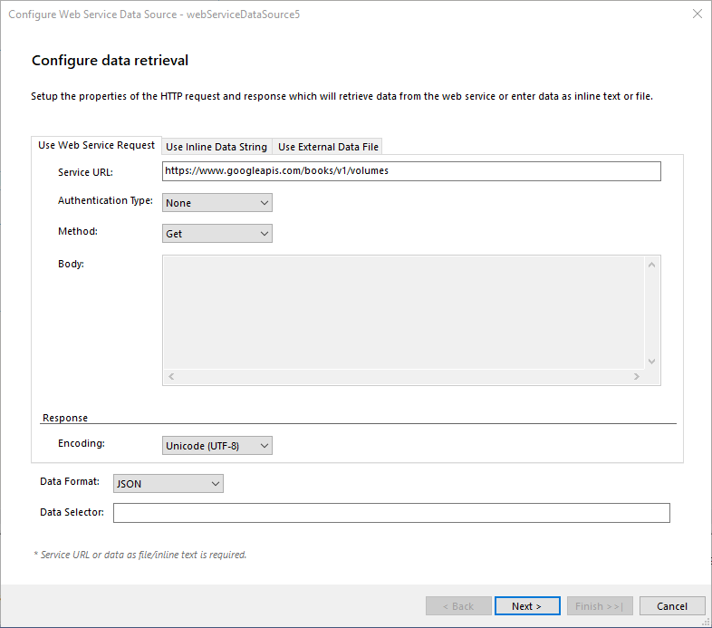
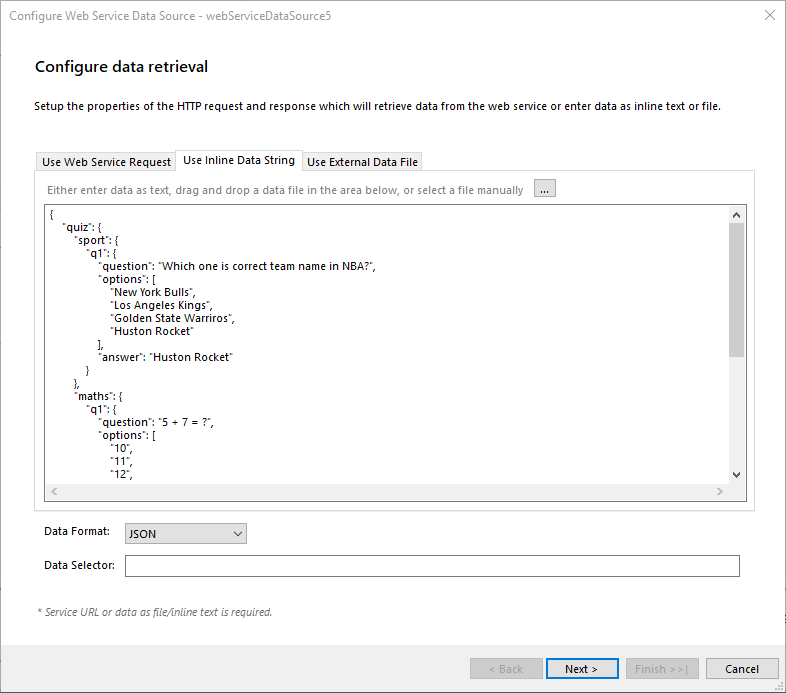
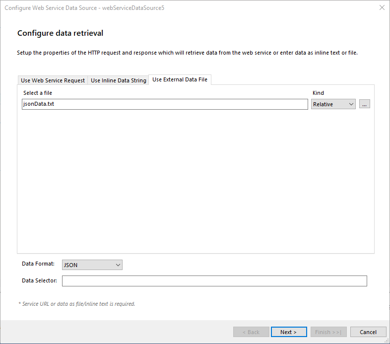
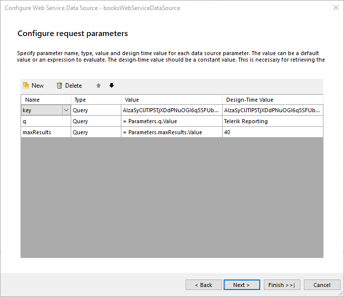
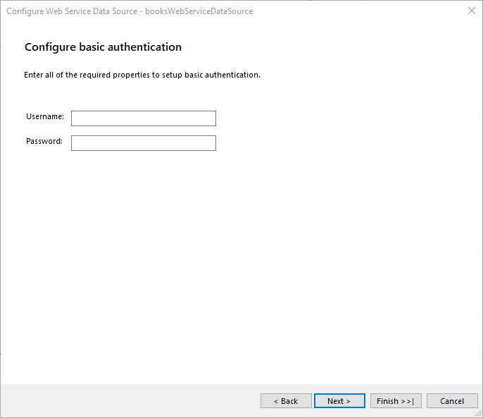
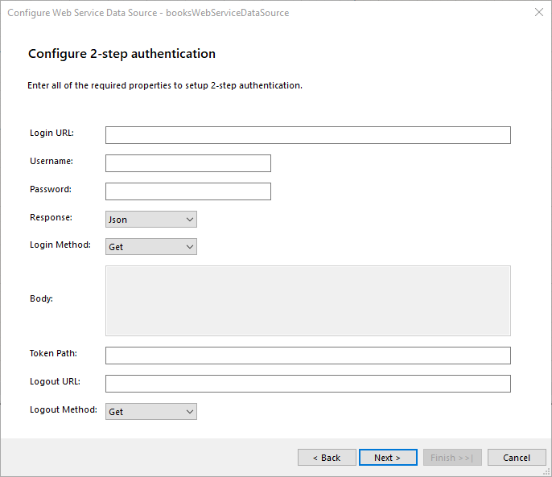

# WebServiceDataSource Wizard of the Report Designer

The **Web Service Data Source Wizard** allows you to create a new or edit an existing **WebServiceDataSource** component based on several settings. After the wizard appears you have to perform the following steps:

1. **Configure data retrieval** Setup the properties of the HTTP request which will retrieve data from the web service:

   

   | Setting             | Description                                                                                                                                                                                                                                                                                                                                                  |
   | ------------------- | ------------------------------------------------------------------------------------------------------------------------------------------------------------------------------------------------------------------------------------------------------------------------------------------------------------------------------------------------------------ |
   | Service URL         | The URL the request is sent to. Returns the data from the web service. Required.                                                                                                                                                                                                                                                                             |
   | Authentication Type | The authentication type. We support Basic and 2-step authentications.                                                                                                                                                                                                                                                                                        |
   | Encoding            | Data encoding. Default is UTF-8.                                                                                                                                                                                                                                                                                                                             |
   | Method              | HTTP request method. GET and POST are the supported methods.                                                                                                                                                                                                                                                                                                 |
   | Body                | The body of the POST method. Applicable only for POST HTTP request method.                                                                                                                                                                                                                                                                                   |
   | Data Selector       | The [JSONPath](https://www.rfc-editor.org/rfc/rfc9535) expression string which will be used to query the data. For more information please refer to [How to Use JSONPath to filter JSON data](). |

   And/or enter data inline:

   

   | Setting       | Description                                                                                                                                                                                                                                                                                                                                                       |
   | ------------- | ----------------------------------------------------------------------------------------------------------------------------------------------------------------------------------------------------------------------------------------------------------------------------------------------------------------------------------------------------------------- |
   | Source        | The inline data string containing the data. Required if Service URL or external data file is not set.                                                                                                                                                                                                                                                             |
   | Data Selector | The [JSONPath](https://www.rfc-editor.org/rfc/rfc9535) expression string which will be used to query the JSON data. For more information please refer to [How to Use JSONPath to filter JSON data](). |

   And/or reference an external data file:

   

   | Setting       | Description                                                                                                                                                                                                                                                                                                                                                       |
   | ------------- | ----------------------------------------------------------------------------------------------------------------------------------------------------------------------------------------------------------------------------------------------------------------------------------------------------------------------------------------------------------------- |
   | Source        | The external data file containing the data. The URI to the file might be relative or absolute. Required if Service URL or inline data string is not set.                                                                                                                                                                                                          |
   | Data Selector | The [JSONPath](https://www.rfc-editor.org/rfc/rfc9535) expression string which will be used to query the JSON data. For more information please refer to [How to Use JSONPath to filter JSON data](). |

1. **Configure request parameters** The parameters of the HTTP request to be applied. The supported types are Query, Header, Cookie, and Inline. The inline parameters are parameters that are used to replace parameter tokens (@param1) in the URL and the Body fields with the expression result or static value.

   

1. **Basic Authentication**

   

   | Setting  | Description                                  |
   | -------- | -------------------------------------------- |
   | Username | The username used to authenticate. Required. |
   | Password | The password used to authenticate.           |

1. **2-Step Authentication**

   

   | Setting       | Description                                                                                                                                                                                                                                                                                                                                                                                                                                                                                                                                                |
   | ------------- | ---------------------------------------------------------------------------------------------------------------------------------------------------------------------------------------------------------------------------------------------------------------------------------------------------------------------------------------------------------------------------------------------------------------------------------------------------------------------------------------------------------------------------------------------------------- |
   | Login URL     | This URL returns the authentication token or session key that allows you to access the API. Required.                                                                                                                                                                                                                                                                                                                                                                                                                                                      |
   | Username      | The username used to authenticate. The username and password are needed only when the Login URL uses Basic Authentication to retrieve the authentication token/key.                                                                                                                                                                                                                                                                                                                                                                                        |
   | Password      | The password used to authenticate.                                                                                                                                                                                                                                                                                                                                                                                                                                                                                                                         |
   | Response      | Specifies the type of the expected response from the Login URL. JSON and plain text are supported.                                                                                                                                                                                                                                                                                                                                                                                                                                                         |
   | Login Method  | Specifies the HTTP request method to be used.                                                                                                                                                                                                                                                                                                                                                                                                                                                                                                              |
   | Token Path    | This is a regular expression that allows to retrieve the authentication or session key from the response received via the Login URL. For example, when the Login URL returns a JSON response containing the authentication token in the form: _{"access_token":"cbm9W3MeTeVPuO5CIq_DTvG5KbzydpRQ","token_type":"bearer","expires_in":1799,"userName":"demouser",".issued":"Tue, 15 May 2018 08:42:32 GMT",".expires":"Tue, 15 May 2018 09:12:32 GMT"}_ the token path regular expression to retrieve the token would be: _(?:"access_token":")(._?)(?:")\* |
   | Logout URL    | This URL is called if the resource features a lockout for having too many sessions open. Refresh the report and try again after successfully logging out.                                                                                                                                                                                                                                                                                                                                                                                                  |
   | Logout Method | Specifies the HTTP request method used for the Logout URL.                                                                                                                                                                                                                                                                                                                                                                                                                                                                                                 |
   | Body          | The body of the login HTTP request. Applicable only for POST HTTP request method.                                                                                                                                                                                                                                                                                                                                                                                                                                                                          |

1. **2-Step Authentication Parameters** The parameters of the HTTP request to be applied. The supported types are Query, Header, Cookie and Inline. The inline parameters are parameters that are used to replace parameter tokens (@param1) in the URL and the Body fields with the expression result or static value.

## See Also

- [WebServiceDataSource Component Overview]()
