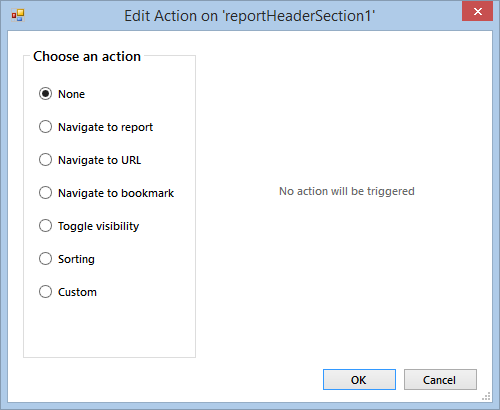

# Edit Action Dialog of the Report Designer

The Action dialog box can be used to enable interactive actions for all items that support interactivity: TextBox, Table/List/Crosstab, SubReport, PictureBox, Checkbox, Shape, Barcode, Panel, HtmlTextBox, Graph, Map, Choropleth. The Graph, Map and Choropleth items support interactivity on element level like series.

Define an action so that a user can click on the report and link to a URL, to a different report, to a different location in the same report or toggle the visibility of items.

The __Edit Action__ offers the following choices:

* None
* Navigate to Report
* Navigate to URL
* Navigate to Bookmark
* Toggle Visibility
* Sorting
* Custom

Depending on the purpose of the interactive actions you can choose the appropriate option which would open an additional pane below. For more information review the following articles:

* [Actions]()
* [Document Map]()
* [Drillthrough Report Action]()
* [BookMark Action]()
* [Hyperlink Action]()
* [Drilldown Report Action]()
* [Custom Report Action]()
