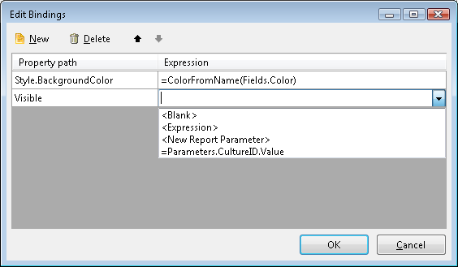

# Edit Bindings Dialog of the Report Designer

Generally only some properties of certain report items can handle expression values. Other properties of a report item can take advantage of expression values by adding Binding objects to its __Bindings collection__. Only write-enabled properties can be set through binding expressions, so read-only properties are not suitable for "data-binding".

The Edit Bindings dialog is available in the property grid by clicking on the ellipsis of the Bindings property.

## Add a Binding object

The dialog accepts __Property Path__ and __Expression__ for that property. The property can have a period-delimited navigation path in order to reference a property down the object hierarchy. The Expression can be constant, expression value, user defined function or even a report parameter. The evaluated expression should return an object of appropriate type for the bound property.

For example, you can bind the __Style.Font.Bold__ property of a TextBox item to an expression such as __=Fields.MyBoolField__ that would return __true__ or __false__. In certain cases using user-defined functions to perform appropriate type conversions should be considered e.g. for __System.Drawing.Color__ as seen on the image.

For example the following navigation paths are valid:

* DataSource
* Style.BackgroundColor
* Style.Font.Name

## Edit a Binding object

To edit a Binding object, click in the inline editors directly.

## Delete a Binding object

To delete a Binding object, use the Delete Button.

> Not all item properties support expression bindings. Please refer to the API reference to check if a property supports binding.
