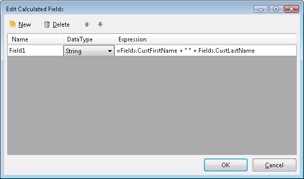

# Edit Calculated Fields Dialog

Calculated fields can be used to create new values        that do not exist in the data source. For example, a calculated field       can represent a new value, a constant, an expression value, user defined        function or even a report parameter, or an existing field that is converted        to a different datatype.

## Add a Calculated Field

You specify a calculated field manually by creating an             expression. The Edit Calculated Fields dialog is available in the property             grid of our DataSource components:           

* [SqlDataSource]()

* [ObjectDataSource]()

* [EntityDataSource]()

* [OpenAccessDataSource]()

by clicking on the ellipsis of the __CalculatedFields__  property.             

  

The dialog accepts __Name__ , __DataType__  and __Expression__ .           

## Edit a Calculated Field

To edit a Calculated Field, click in the inline editors directly

## Delete a Calculated Field

To delete a Calculated Field, use the Delete Button

>note Names must be unique in the datasource and the expression for a calculated                   field cannot contain aggregates, RowNumber or ColumnNumber global functions.                 

# See Also

