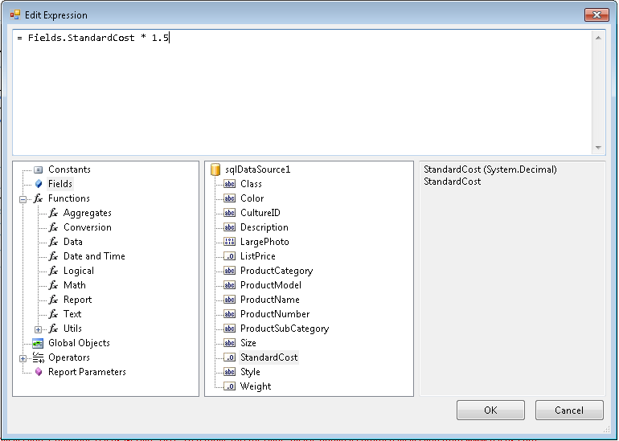

# Edit Expression Dialog in the Report Designer

The __Edit Expression__ dialog allows you to dynamically produce a value for a report item in place of a hard coded value. The Edit Expression dialog provides a list of predefined and dynamic elements that can be used in your expression. A list of expression element categories is located in the lower left hand list of the dialog, the elements for each category are located in the lower middle of the dialog, and descriptions are displayed in the lower right hand of the dialog.

To use the Edit Expression dialog either type an expression in directly or double click the list of elements in the bottom middle list to add them to the expression. In the figure below an expression with two database Fields multiplied provide an extended price value. For a list of the supported expression elements see [Using Item Binding Expressions]().

