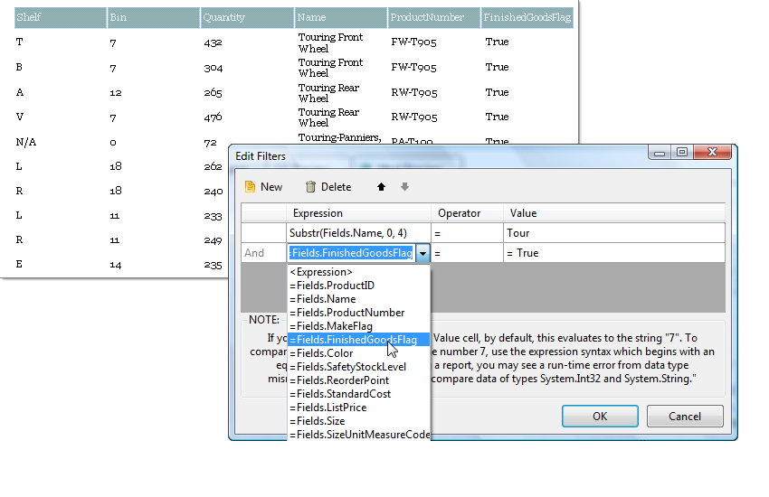

# Edit Filter Dialog of the Report Designer

The Edit Filters dialog allows you to specify which records will be displayed. The dialog populates the __Filters__ collection. See the example below that displays only records where the first four characters of the "Name" field must be "Tour" and the "FinishedGoodsFlag" field must be True.

## Using the Edit Filters Dialog

For more information on adding filters to [Data Items](), please refer to the [Filtering Data]() help topic.

## See Also

* [Data Items]()
* [Filtering Data]()
