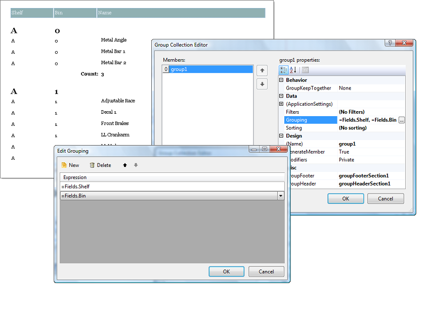

# Edit Grouping Dialog of the Report Designer

The __Edit Grouping__ dialog controls how sets of records are broken out and displayed with headings and subtotals. The dialog populates the __Report.Grouping__ collection. In the example below products are grouped first by Shelf then by Bin. Headings and subtotals appear for each Shelf/Bin combination.

You can arrive at the __Edit Grouping__ dialog by  clicking on the ellipsis in the __Report.Groups__ property. 

## Using the Edit Grouping Dialog

For more information on adding groups to [Data Items](), please refer to the [Grouping Data]() help topic.
