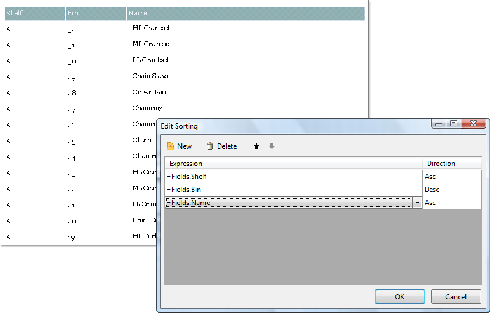

# Edit Sorting Dialog

The __Edit Sorting__ dialog controls the order that records are displayed in. The dialog populates the __Sortings__ collection. In the example below products are sorted first by Shelf, then Bin (in descending order) and finally by product Name.

  

## Using the Edit Sorting Dialog

For more information on sorting [Data Items](), please refer to the [Ordering Data]() help topic.
