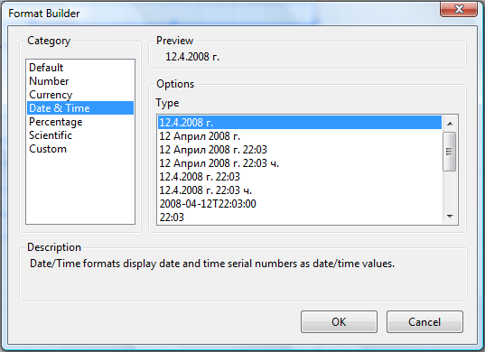

# Format Builder Dialog of the Report Designer

The Format Builder dialog allows you to apply formating to the TextBox and CheckBox items. You can open that dialog either from the property grid of those  items or from their [context menu](), by selecting the __Format__ menu item.

The expression values are handled differently depending on what type of formatting you have assigned.For example, if you choose Currency formatting, Telerik Reporting will automatically  convert 3 into $3.00; if you choose Date formatting it would convert 3/1 to March 1; if you choose Percent formatting, it would change 0.3 to 30% etc.

If you want a format that is not included in the pre-made formats, you can make  your own custom format, using the Custom category. For example if you have a numeric field that holds social security numbers, you can format it to look correct in the report by specifying a custom format: ###-##-####. Look through the list of Custom formats and try making some of your own.
