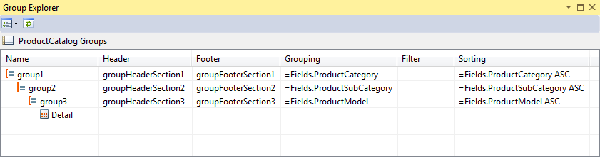
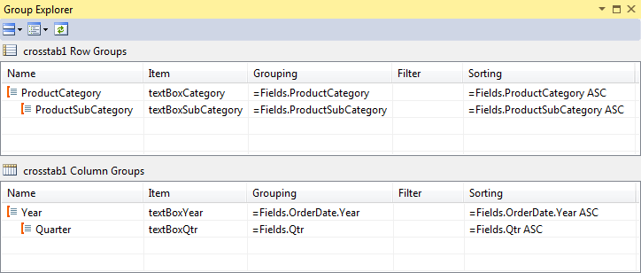
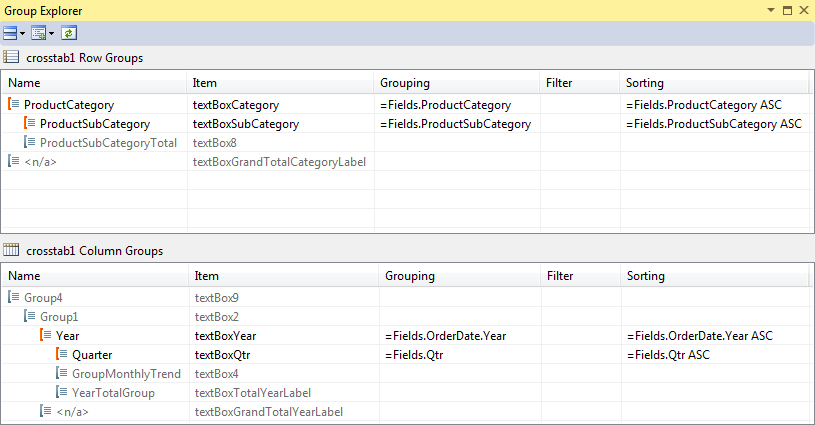

# Group Explorer


The Group Explorer is an aid to navigating report/table groups. The Group Explorer allows you to see the structure of the groups, to select them and change the Grouping, Sorting and Filtering. The Group Explorer can be especially handy for complex reports where there might be a lot of groups and it would be difficult to select a group and distinguish group hierarchy.

## 

The Group Explorer allows you to easily apply grouping, sorting and filtering to your report. With this dialog, you don't need to manually invoke the Grouping dialog, Sorting dialog and Filtering dialog and define the group, sort and filter properties. Instead, you can use the Grouping, Sorting and Filter fields to do this with several intuitive mouse clicks.  

  

The Group Explorer can be accessed from the context menu View | Group Explorer when right-clicking the area next to the report design surface.         


When a Table/Crosstab item is selected, the Group Explorer dialog layout changes to show you the Row and Column Groups:  

  

When a Graph item is selected, the Group Explorer will show you the Series and Categories Groups.

When a Map item is selected, the Group Explorer will show you the Series and Geolocation Groups.


It does not show the Static groups by default, except for Report groups, but you can enable them from the "Display Mode" button           by selecting the "Extended Mode" option:           

  

You can also change the Layout of the Groups pane by switching between Horizontal and Vertical mode.

Each group type has a distinct group icon:

* Detail group:  

  

* Dynamic group:  

  

* Static group:  

  

Groups wihtout a name assigned to them will have the text "```<n/a>```" displayed in the group's Name field.
