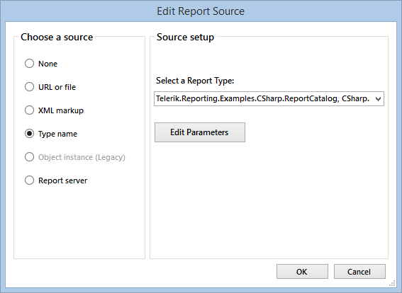
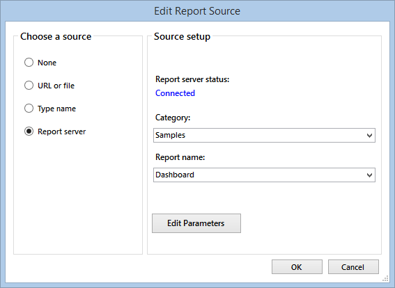

# Edit Report Source Dialog of the Report Designer

The Edit Report Source dialog is used to select the source for a report that would be displayed in a report viewer, SubReport item, or drill-through action.

The dialog offers the available report sources, which are:

* URL or file
* XML markup
* Type name (Supported in Visual Studio only)
* Object instance (Supported in Visual Studio only)
* Report server (Supported in Visual Studio by WinForms and HTML5.WebForms viewers)

When the __Report server__ option is selected, the dialog will try to connect to a [Telerik Report Server](https://docs.telerik.com/report-server/introduction) instance using the connection details, provided by the report viewer. In case the connection succeeds, the dialog will read the categories and report names that are accessible to the user and populate the editor fields:

If a connection to the report server instance is not available, the user can just enter the category and report name in the drop-down fields and they will be used in the resulting report source.

> The __Report server__ option provides just a UI for choosing the category and report name from an active Telerik Report Server instance. It does not provide a new report source type - it uses a [UriReportSource](/api/Telerik.Reporting.UriReportSource) instance for initialization and returned results.

For examples that demonstrate how to programmatically create a report source, check the API reference examples below.

Reports can be stored in different locations and in different formats so use the uniform way to access them via the appropriate option. It would open an additional pane below allowing you to select the report source and set report source parameters as well.

> When choosing __Type name__ for a source, you must make sure that both reports use the same Telerik Reporting version then rebuild the application to load the sub-report report source.

## See Also

* [Report Sources]()
* [UriReportSource](/api/Telerik.Reporting.UriReportSource)
* [TypeReportSource](/api/Telerik.Reporting.TypeReportSource)
* [InstanceReportSource](/api/Telerik.Reporting.InstanceReportSource)
* [XmlReportSource](/api/Telerik.Reporting.XmlReportSource)
