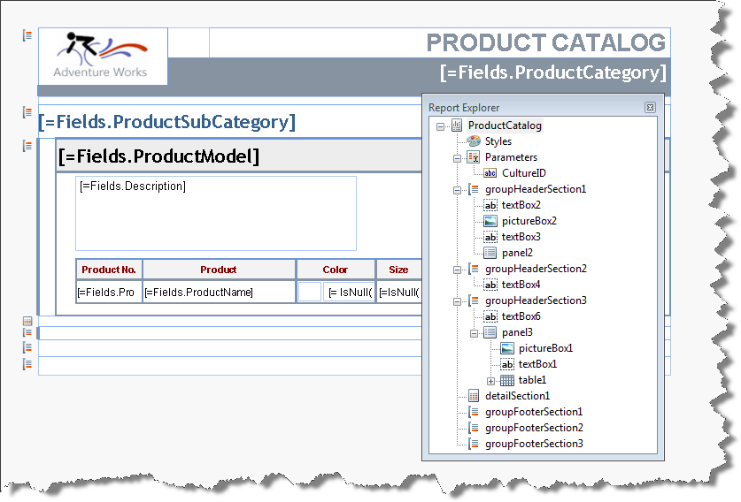

# Report Explorer of the Report Designer

The __Report Explorer__ is an aid to navigating report elements. The Report Explorer allows you to see the structure of the report and select any item in the report. The Report Explorer can be especially handy for complex reports where components may be nested and where it would be difficult to select an item with the mouse.

__Report Explorer__ helps to rearrange items in your report - it supports basic operations like Cut, Copy and Paste that allow you to move a selection of report items to another node in the tree view, thus assigning them to a new parent. You can also reorder the selected report items by dragging and dropping them onto any sibling node. This is especially handy when its needed to maintain strict items order for creating accessible reports.

In the screenshot below you can see that the report is represented by the root node of the tree. Underneath that you see the styles, report parameters and the sections of the report and for each section/item the report items in the section/item.

The __Report Explorer__ can be accessed from the [context menu]() __View | Report Explorer__ when right-clicking the area next to the report design surface.

