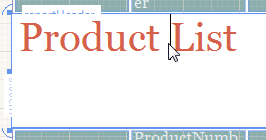
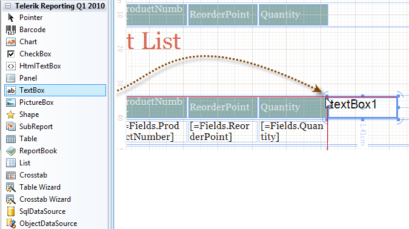
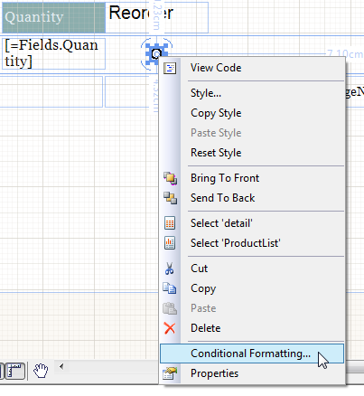
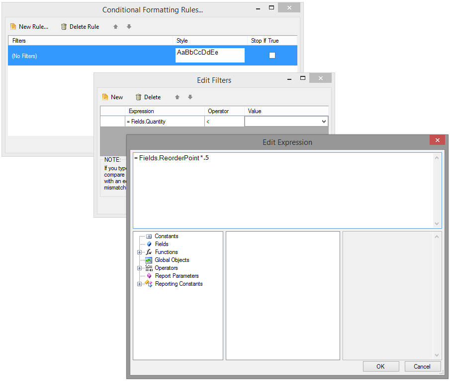
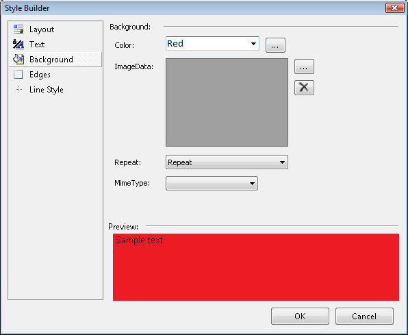
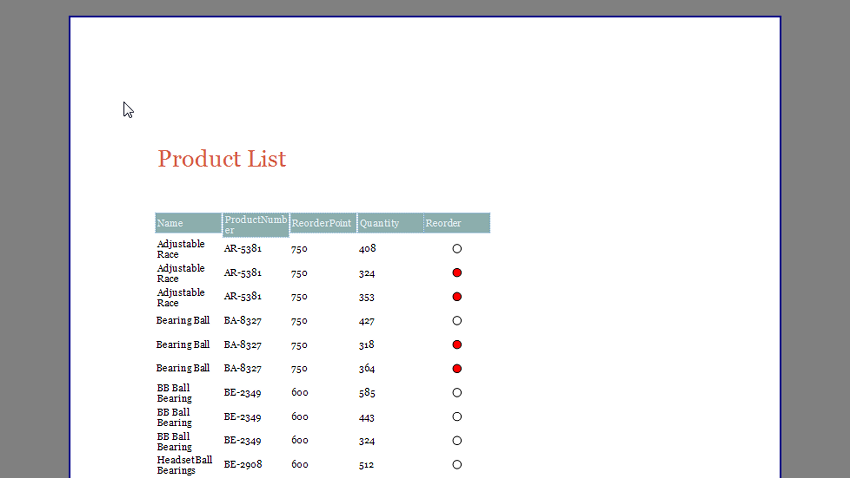
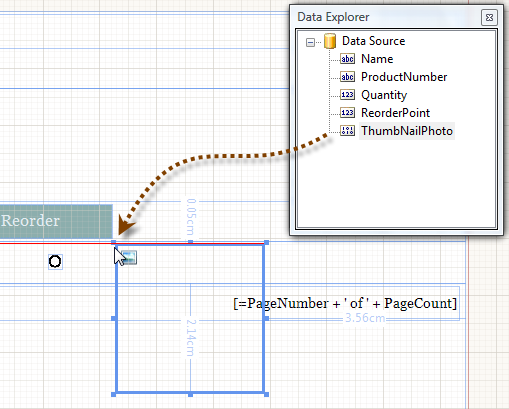
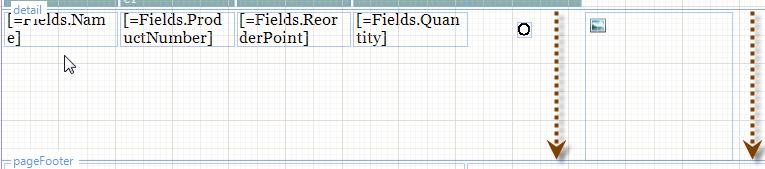
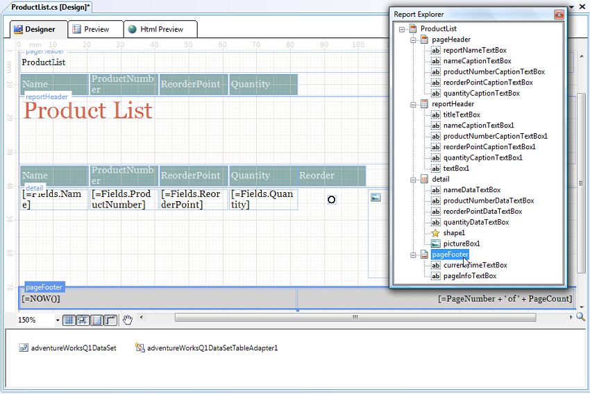
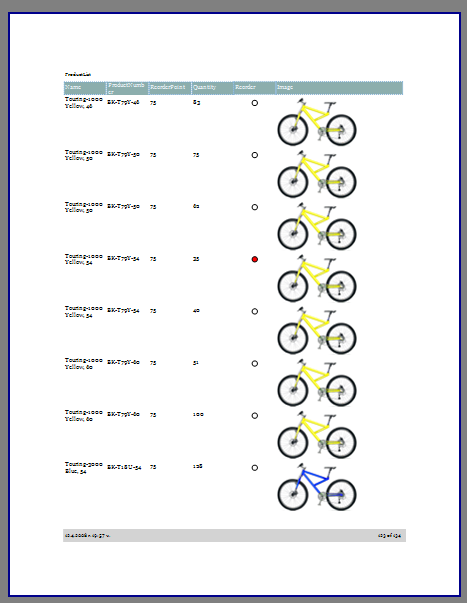

# Extending a Band Report in Few Easy Steps

This topic will extend the example [Creating a Simple Report]() to show several unique Telerik Reporting features including:

* In Place Editing.
* Copying and pasting styles.
* Conditional formatting.
* Navigating and sizing report items.
* Resizing report sections.
* Adding Text, Shape and PictureBox report items to the report designer.
* Using the Data Explorer.
* Using the Report Explorer.

Use the report design created in [Creating a Simple Report]() as a starting point.

1. Double click the "ProductList" TextBox report item in the report header. This will activate the "in place" editor, allowing you to enter text right in the designer without having to find the appropriate property in the Property Window. Add a space so the TextBox reads "Product List".

	

1. __Zoom__ to 150% from the __Zoom Combo Box__ in the lower left corner of the design surface.

	+ For [Visual Studio Report Designer](): From the __ToolBox__ window drag a __TextBox__ item to the report header just to the right of the "Quantity" column. While dragging the TextBox, the __Snap Lines__ will aid you in positioning it so it aligns nicely with its neighbors.

		

	+ For [Standalone Report Designer](): Select the target [report section]() and from the Insert tab click on the TextBox item. The TextBox item is added to the selected report section and with dragging you can position the TextBox in the correct location. Double-click the __TextBox__ and enter "Reorder".

1. Select the "Quantity" TextBox and copy the style rule applied in the __StyleName__ property. Select the "Reorder" field and paste the style rule in its __StyleName__ property.
1. In these next steps you define a circle Shape item that reacts to changes in the data so that when inventory falls below 50% of the "reorder point" quantity the circle will be filled in red. Add a new __Shape__ item to the detail section just below the "Reorder" column. In the __Properties__ window set the __Size.Width__ property to "0.1in" and the __Size.Height__ property to "0.1in". Right click the __Shape__ item and select __Conditional Formatting__ from the context menu.

	

1. The __Conditional Formatting Rules__ dialog will display.

	+ Click the __New Rule__ button and a new row will be added in the grid.
	+ The __Edit Filters__ dialog will display on clicking in the Filters cell.
	+ Click the __New__ button to create a rule. Use the drop down lists to set __Expression__ to Fields.Quantity, __Operator__ to "<" and __Value__ to "```<Expression>```". When you select "```<Expression>```" the __Edit Expression__ dialog displays. This dialog allows you to select from predefined data (i.e. constants, database fields, report parameters, etc.) and create an expression with them.
	+ Select __Fields__ from the list on the bottom right of the dialog.
	+ Double-click "ReorderPoint" from the bottom middle list to add it to the expression.
	+ Add to the expression at the top of the dialog so the complete expression reads "= Fields.ReorderPoint *.5". This rule will fire when the quantity of a product falls below half of the ReorderPoint value. Click __OK__ to close the __Edit Expression__ dialog.

		

	+ On the __Conditional Formatting Rules__ dialog click the __Style__ button to display the __Style Builder__ dialog.
	+ Click __Background__ from the list on the left and select "Red" from the __Background Color__ drop down list.
	+ Click __OK__ to close the dialog.Click __OK__ twice more to close the remaining rule dialogs.

		

1. Press __F6__ to build the report.
1. Click the __Preview__ button to display the report. Scroll through the data and notice that the "Quantity" values that are below 50% of the "Reorder point" are displayed in red.

	

1. The last set of steps to building this report design add an image item to the report and format the page footer. These last steps also use the [Data Explorer]() and the [Report Explorer](). From the [Telerik Reporting menu]() select the [Data Explorer]().

	

1. Select the "ThumbNailPhoto" column from the [Data Explorer]() list and drag it to the detail section of the report designer, just to the right of the "Reorder" column. Notice that this step automatically creates a [PictureBox]() report item.
1. After dropping the ThumbNailPhoto the DetailSection will be automatically resized to accommodate the entire PictureBox item:

	

1. The [Report Explorer]() provides a hierarchical view of all the report sections and items in the report design. This allows you to easily locate items that might otherwise be difficult to find in a visually complex report. From the [Telerik Reporting menu]() select the [Report Explorer]().
1. Click "pageFooterSection1" to select the report page footer.

	

1. In the __Properties__ window set the __Style.BackgroundColor__ property to "LightGray".
1. Click the __Preview__ button to view the report. Scroll through the report pages to find records that have images.

	
