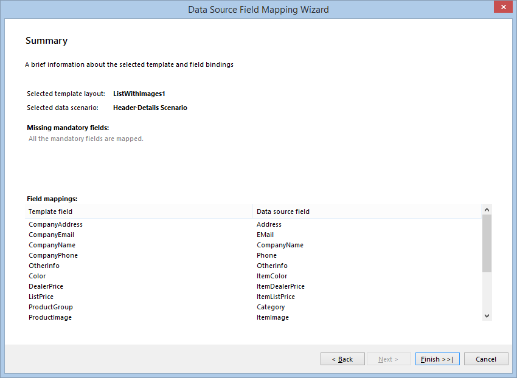

# Product Catalog Report Wizard of the Report Designer

Product catalogs are among the most useful business presentation documents and Telerik reporting provides a way to create such catalogs easy and quick. The current walkthrough will explain how to generate product catalogs using the Product Catalog Template using only a report designer of your choice.

The proposed product catalog template allows the items to be grouped in two-level group hierarchy, having each group displaying aggregate information in its footer. The user can also make some adjustments to the design of the selected template layout, which will be applied when the wizard finishes.

## Create a Product Catalog using the Product Catalog Template

1. Similar to the [Invoice template]() and the most report templates, the Product Catalog Template uses a wizard to guide you step-by-step through the generation process. If you are using the [Standalone Report Designer](), you can start the __Product Catalog Wizard__ from the New command, or in case you are using the [Visual Studio Report Designer](), you can add a __New Report Wizard item__ to your project and select the __Product Catalog Wizard__ from the __Wizard Selector__ that should appear.
1. The first page of the wizard presents four different product catalog layouts to choose from. There is also a brief note that explains in which case the selected layout will be suitable. On the right is a sample picture displaying the resulting catalog design. These four layouts correspond with four predefined reports that are used as a base templates and once the wizard finishes, it will apply the changes onto the selected one and load it into the designer.

	

1. Once you select the appropriate layout and go to the next page, you need to define the data scenario you will be using when creating the product catalog.

	+ The __Plain Data scenario__ is suitable where all the data is contained in one data set and the company details is repeated on every data row along with the product items that form the catalog details. Although it is not a very common scenario, it might be preferred for catalogs with a few items where you want to setup just one data source.
	+ The __Header-Details scenario__ is more common and contains two data sources – the first one is for the static data, related with the company and contains fields that are not to be listed in the catalog details. Such fields are CompanyName, Phone, Fax, etc. The second data source contains the data for the products, listed in the catalog – ProductNumber, ProductName, Color, Size, Weight, Price, etc.

	

1. The next couple of pages guide the user through the data source setup. If the __Plain Data scenario__ is selected, the Wizard will start a “create-and-setup” sequence for a single data source. If the __Header-Details scenario__ is selected, there will be two sequences displayed consecutively. These wizard pages are common for the most of the report wizards, so we won’t explain their structure and behavior in details. However, the last page of the data source sequence is newly introduced and it defines the relations between the predefined template fields and the fields from the data sources which were set in the previous step.

	

1. The FieldMappings form consists of a treeview that contains the data source fields (on the left) and a grid with two columns for template and mapped fields (on the right). The data source fields should be mapped to the template fields, which are shown in the left column of the grid. On the right column are displayed the already mapped fields. Initially the Wizard will automatically map the data source fields that have the same name as the template fields. The fields that are present in the template but you do not need them in your product catalog, should be left unmapped and they will not exist in the resulting report.

	> Some of the template fields are noted with a red star. This means that these fields must be mapped to data fields or the report building and processing might result in an unexpected behavior. These fields actually are the most important fields for a product catalog– the ProductGroup, ProductNumber and ProductName. If the ProductGroup or ProductSubGroup fields are not mapped, the respective groups will not be created and the articles hierarchy will be flatten to a simple list.

	You can map the data source fields to the template fields by dragging them from the tree view and dropping them onto the grid. You can also select the necessary data field from the combobox item in the right grid column. In case you need to delete a mapping, you can do this by using the DEL key or selecting `< none >` from the combobox. For convenience, the data source fields that are already mapped are displayed in a gray color in the treeview.

	

1. Once you are done mapping the fields, click Next to go to the __Preview page__. It shows a live preview of your report with some sample data to illustrate how the actual report would look like. You can change the various settings according to the selected layout and the changes will be shown on the right.

	

1. Once you are done styling the report, click Next to go to the __Summary page__. It displays a brief information about the selected layout, data scenario and the defined mappings. It will also display a message if you are missing some mandatory mapping so you could go back and fix it if it is not intentional.

	

1. When you are all set, you can click Finish and the designer will load the produced product catalog report, ready to be used. If you have setup the data sources and field mappings properly, you should just click __Preview__ and your catalog will be displayed.
