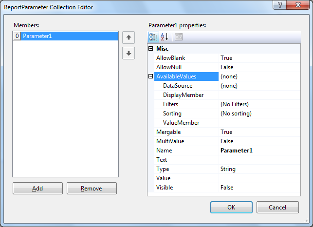

# ReportParameter Collection Editor

The ReportParameter Collection Editor dialog allows you to        add/remove entries from the Report.ReportParameters collection.

## Access the Report Parameter Collection Editor

There are several ways to open the ReportParameter Collection Editor:        

* Click the ellipses on the __Report.ReportParameters__  property.

* Select the __Report Parameters ..__  option from the[Context Menu]()

* Right click on the Parameters node of the[Report Explorer]()

* From the __Configure Data Source Parameters__  step of the[DataSource Components]()

  

  More information on adding and working with Report Parameters is available in the[Adding Parameters to Report]() article.
    

# See Also

