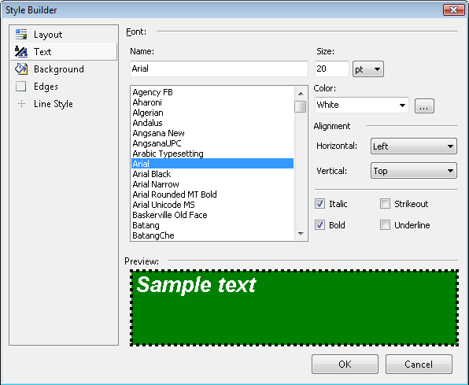

# Style Builder Dialog

The Style Builder dialog lets you set Text, Background, Edges and Line Style for any given report item including sections and the report as a whole. The dialog is accessed through the __Style__ property ellipses button and is also used in [conditional formatting](). The dialog lets you change several style elements at one time and see the result in the Preview pane at the bottom of the dialog.       

To use the Style Builder dialog choose a style element from the list on the left of the dialog. Change style characteristics in the area to the right of the list. Click the __OK__ button to apply the style changes or the __Cancel __ to leave the previous style untouched.             

  

> The Style Builder dialog loads a standard Color Palette and a list of System Colors. If reports will be displayed in a             Web Application,  please consider using the Color Palette instead of System Colors.

