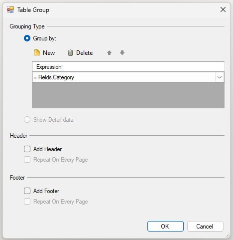
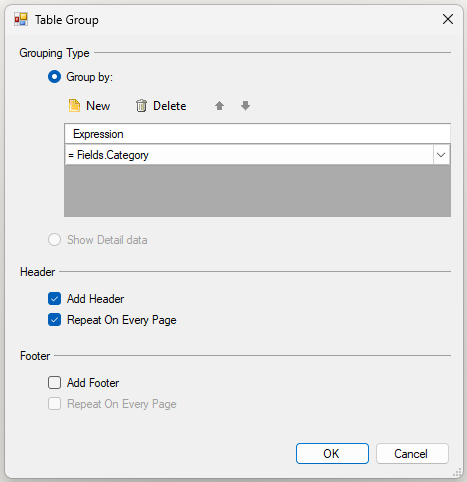
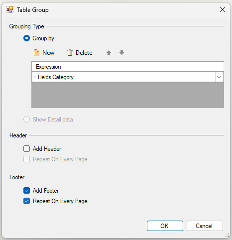

# Table Group Dialog Overview

The Table Group dialog allows you to add and configure row and column groups for Table, Crosstab, and List items in the [Standalone Report Designer]() and [Visual Studio Report Designer]().

You can invoke the Table Group dialog when adding a new group through the [Group Explorer]().

## Dialog Configuration Options

The Table Group dialog provides two main modes of operation, controlled by radio button selection.

### Grouping Type

Define how data is organized within the group.

| Option | Description |
| ------ | ----------- |
| **Group by** | Creates a regular group that aggregates data based on an expression. Click **New** to add a grouping expression (for example, `= Fields.Category`). Multiple expressions can be combined using a logical AND. |
| **Show detail data** | Creates a details group that displays individual data records without grouping. A details group has no grouping expression and creates a row (for row groups) or column (for column groups) for each record in the dataset. |

> When **Show detail data** is selected, the header and footer options in the sections below become disabled.

### Group Header Options

Configure whether and how the group header appears.

>tip The **Repeat On Every Page** functionality for group headers and footers was introduced in the 2026 Q1 release.

| Option | Description |
| ------ | ----------- |
| **Add Header** | Adds a group header row (for row groups) or column (for column groups). The header displays once at the beginning of each group. |
| **Repeat On Every Page** | Repeats the group header on every page where the group appears. This option is only enabled when **Add Header** is selected. Useful for multi-page reports where a group spans multiple pages. |

### Group Footer Options

Configure whether and how the group footer appears.

| Option | Description |
| ------ | ----------- |
| **Add Footer** | Adds a group footer row (for row groups) or column (for column groups). The footer displays once at the end of each group. |
| **Repeat On Every Page** | Repeats the group footer on every page where the group appears. This option is only enabled when **Add Footer** is selected. |

>important Repeatable headers and footers are not compatible with the `PageBreak` property. If any group in the table has a `PageBreak` value other than `None`, repeatable headers and footers will not be processed and rendered, even if `PrintOnEveryPage` is enabled.

## See Also

* [Adding Groups to Tables]()
* [Group Explorer]()
* [Table Group Dialog (Web Report Designer)]()
