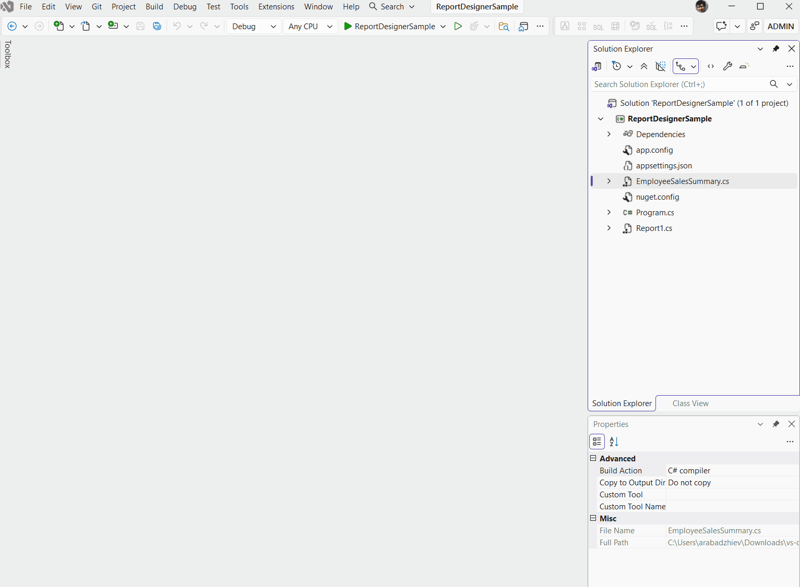

# Getting Started with the Visual Studio Report Designer for .NET

>note The Visual Studio Report Designer for .NET is available as a preview starting with Telerik Reporting 2026 Q3 (20.2.26.1007).

The Visual Studio Report Designer for .NET edits C# and VB coded report definitions in SDK-style .NET projects. The designer is distributed as the `Telerik.Reporting.VSDesigner` NuGet package, which depends on the `Telerik.Reporting` package of the same version. NuGet restores `Telerik.Reporting` automatically as a dependency of the designer package. The designer does not require the Telerik Reporting Visual Studio extension, a VSIX, or the Telerik Reporting installer.

The [.NET Framework designer](slug:telerikreporting/designing-reports/report-designer-tools/desktop-designers/visual-studio-report-designer/overview#installing-the-net-framework-designer) uses a different installation workflow.

## Trying the Bundled Sample

Start with the download bundle to open a prepared report. The sample restores the designer package directly from the extracted bundle, so you do not need to run the installer or register a feed.

The bundle contains the following files:

| File or folder | Purpose |
| ------ | ------ |
| `Telerik.Reporting.VSDesigner.<version>.nupkg` | Provides the designer package. |
| `Install-VsDesigner.ps1` | Optionally registers a local NuGet feed for your existing report projects. |
| `README.md` | Describes installation and troubleshooting. |
| `Sample` | Contains `ReportDesignerSample.slnx`, the coded `SampleReport`, and `nuget.config`. |

The engine and other dependencies are not bundled. The sample's `nuget.config` restores them from [nuget.org](https://www.nuget.org/).

To start the designer with the sample:

1. Verify the [prerequisites](#prerequisites). The sample targets `net10.0-windows` and requires the .NET 10 SDK and Desktop Runtime.
1. [Set up your Telerik Reporting license key](slug:license-key).
1. Extract the complete download. Keep the designer `.nupkg` at the bundle root, immediately above the `Sample` folder.
1. Open `Sample\ReportDesignerSample.slnx` in Visual Studio 2026.
1. Select **Build > Build Solution**. Visual Studio restores the packages before the build. Resolve any restore or build errors before you continue.
1. In **Solution Explorer**, right-click `SampleReport.cs` and select **View Designer**, or select the file and press `Shift+F7`.
1. Select **Preview** to render the report. For parameter and export procedures, see [Previewing Reports in the .NET Designer](slug:vs-report-designer-net-preview).

`SampleReport` contains visible .NET designer instructions and links to the documentation. Its **Date** parameter controls the date in the report header.

>note Pressing `F5` runs an application that displays instructions to open the report in the designer. It does not host a runtime report viewer.

The sample's `nuget.config` clears inherited package sources and defines the following mappings:

* `Telerik.Reporting.VSDesigner` restores from `..\`, which points to the extracted bundle root.
* All other packages restore from `https://api.nuget.org/v3/index.json`.

The project references the designer, Web Service, and GraphQL data-source packages. NuGet restores `Telerik.Reporting` as a dependency of the designer package.

>important Keep `Sample\nuget.config` and the designer package in their original relative locations. Selecting **All** in Visual Studio does not override this configuration or its mappings.

For an existing report project, use [Installing the Packages from a Download](#installing-the-packages-from-a-download) to register a permanent feed, then [configure your project](#configuring-your-report-project).

## Prerequisites

To use the designer, you need the following:

* Windows with Visual Studio 2026 version 18.10 or later and the **.NET desktop development** workload. Visual Studio 2022 and earlier versions of Visual Studio 2026 cannot load the designer.
* An SDK-style project that targets `net8.0-windows` or later and sets `UseWindowsForms` to `true`.
* A .NET SDK that supports the target framework of the project. The .NET 10 SDK, which Visual Studio 2026 installs, supports projects that target .NET 8, .NET 9, and .NET 10.
* The .NET Desktop Runtime of the .NET version that the project targets. For example, a project that targets `net8.0-windows` requires the .NET 8 Desktop Runtime. You can download the runtimes from the [.NET download page](https://dotnet.microsoft.com/download/dotnet).
* Access to enabled NuGet sources that provide `Telerik.Reporting`, `Telerik.Reporting.VSDesigner`, and their dependencies. Sources can include [nuget.org](https://www.nuget.org/), the Telerik NuGet feed, or a local feed.
* A [Telerik Reporting license key](slug:license-key).

The designer runs in a separate process on the target framework of the report project. The package contains the designer for .NET 8 and .NET 10. A project that targets .NET 9 uses the .NET 8 designer, and a project that targets .NET 10 or later uses the .NET 10 designer.

## Configuring Your Report Project

To use the designer in an existing report project:

1. Make the packages available through a NuGet package source. If you received the packages as a download, see [Installing the Packages from a Download](#installing-the-packages-from-a-download).
1. Set the target framework of the project to `net8.0-windows` or later, and set `UseWindowsForms` to `true`.
1. Add references to the `Telerik.Reporting` and `Telerik.Reporting.VSDesigner` packages of the same version. Set [PrivateAssets](https://learn.microsoft.com/en-us/nuget/consume-packages/package-references-in-project-files#controlling-dependency-assets) to `all` in the reference to the designer package.
1. If your reports use JSON, Web Service, or GraphQL data sources, add references to the matching data source packages of the same version.
1. [Activate your Telerik Reporting license](slug:license-key).
1. Restore the packages and build the project.
1. [Open an existing coded report](#opening-a-report).

Keep an explicit `Telerik.Reporting` reference for the report library's runtime dependency. The designer reference uses `PrivateAssets="all"`, so its dependencies do not flow to projects or packages that consume the library through that reference.

The following project file configures a report library for the designer:

```xml
<Project Sdk="Microsoft.NET.Sdk">
  <PropertyGroup>
    <TargetFramework>net10.0-windows</TargetFramework>
    <UseWindowsForms>true</UseWindowsForms>
  </PropertyGroup>
  <ItemGroup>
    <PackageReference Include="Telerik.Reporting" Version="{{site.buildversion}}" />
    <PackageReference Include="Telerik.Reporting.VSDesigner" Version="{{site.buildversion}}" PrivateAssets="all" />
    <!-- Add the data source packages only if your reports use these data sources. -->
    <PackageReference Include="Telerik.Reporting.WebServiceDataSource" Version="{{site.buildversion}}" />
    <PackageReference Include="Telerik.Reporting.GraphQLDataSource" Version="{{site.buildversion}}" />
  </ItemGroup>
</Project>
```

The following table describes the packages:

| Package | Purpose |
| ------ | ------ |
| `Telerik.Reporting` | Provides the report engine that your reports and the designer use. |
| `Telerik.Reporting.VSDesigner` | Provides the designer and depends on the same-version `Telerik.Reporting` package, which NuGet restores automatically. `PrivateAssets="all"` keeps the designer package out of the dependencies of projects and NuGet packages that consume your report project. |
| `Telerik.Reporting.WebServiceDataSource` | Provides the runtime of the JSON and Web Service data sources. Without it, the designer cannot read the data of these data source types. |
| `Telerik.Reporting.GraphQLDataSource` | Provides the runtime of the GraphQL data source. Without it, the designer cannot read the data of this data source type. |

Use the same version for all Telerik Reporting packages in the project. Do not mix them with another Telerik Reporting version.

>note When you add `Telerik.Reporting.VSDesigner` through the NuGet Package Manager, Visual Studio prompts you to accept the license agreement of the package.

The package does not supply Visual Studio project or item templates. The report templates of the Telerik Reporting Visual Studio extension are not part of this setup. To start, use an existing coded report or the [sample from the download](#trying-the-bundled-sample).

>note If Telerik Reporting is installed on your Windows machine with Visual Studio integration, you can also use its blank-report template. In your configured .NET project, select **Add > New Item** and choose the Telerik Reporting blank-report template. You can ignore the template warning displayed before the blank report is created and continue. Build the project, then open the report's main `.cs` or `.vb` file with **View Designer**.

## Installing the Packages from a Download

The [bundled sample](#trying-the-bundled-sample) does not require installation. To make the designer available to your other projects, use `Install-VsDesigner.ps1` to register a permanent local feed. The download contains the designer package at its root, not a `packages` folder with engine or optional data-source packages.

To register the package with the script:

1. Extract the download and close all instances of Visual Studio.
1. Open PowerShell in the extracted folder. Verify that the script comes from a trusted source, then run the following command:

   ```powershell
   powershell -NoProfile -ExecutionPolicy Bypass -File .\Install-VsDesigner.ps1
   ```

   The execution policy applies only to this process. The script does not require administrator rights.

1. [Configure your report project](#configuring-your-report-project) and build it.

The script performs the following actions:

* Checks the .NET SDK and Visual Studio requirements.
* Verifies the designer package against the publisher certificate when the script carries a signing certificate.
* Copies the package to `%LOCALAPPDATA%\Telerik\VsDesigner\packages` by default.
* Registers that folder as `Telerik Reporting VS Designer` in your user-level `%APPDATA%\NuGet\NuGet.Config`.
* Removes conflicting cached builds of the same package version and clears the related Visual Studio designer cache when needed.

The script does not install a Visual Studio extension, modify projects, or restore and build the bundled sample. Keep the registered feed while your existing projects reference its packages.

The following options customize the script:

| Option | Purpose |
| ------ | ------ |
| `-Path` | Selects a designer package or a folder that contains it. |
| `-FeedDirectory` | Sets the local package folder to register. |
| `-SourceName` | Sets the name of the registered source. |
| `-WhatIf` | Shows planned installation or removal changes without applying them. |
| `-Uninstall` | Removes the registered feed, its Telerik Reporting packages, and matching cached copies. |

### Installing Without the Script

If you cannot use the script, register the designer package manually. For more details, see [Setup a Local NuGet Package Feed](slug:setup-local-nuget-feed).

To register the feed and configure the project:

1. Extract the download.
1. Create a permanent folder, for example, `%LOCALAPPDATA%\Telerik\VsDesigner\packages`. Copy `Telerik.Reporting.VSDesigner.<version>.nupkg` from the extracted folder into it.

	Your projects restore the designer package from this folder. Keep the folder while your projects reference that package.

1. Register the folder as a package source by using one of the following options:

	* In Visual Studio, select **Tools** > **NuGet Package Manager** > **Package Manager Settings** > **Package Sources**. Add a source, name it, for example, `Telerik Reporting VS Designer`, set its source to the package folder, and save the settings.
	* In PowerShell, run the following command:

		```powershell
		dotnet nuget add source "$env:LOCALAPPDATA\Telerik\VsDesigner\packages" --name "Telerik Reporting VS Designer"
		```

	* In the `nuget.config` file of your solution, add the package folder to the `packageSources` element:

		```xml
		<packageSources>
		<add key="Telerik Reporting VS Designer" value="%LOCALAPPDATA%\Telerik\VsDesigner\packages" />
		</packageSources>
		```

	The first two options store the source in your user-level `NuGet.Config` file, so all your projects can use it. A source in the `nuget.config` file of a solution applies only to the projects in the folder of that file and its subfolders.

1. Verify that enabled sources provide the same-version `Telerik.Reporting` package and the other dependencies.
1. [Configure your report project](#configuring-your-report-project) to reference the package version from the download.

### Restoring from Configured Package Sources

Your own projects use all enabled NuGet sources unless an applicable configuration restricts them. In Visual Studio's NuGet Package Manager, select **All** in the **Package source** list to browse those sources. This selection does not change the sources used for restore.

The bundled sample has its own `nuget.config`. It clears inherited sources and maps the designer to the bundle root and all other packages to [nuget.org](https://www.nuget.org/).

To review the effective sources, open PowerShell in the solution folder and run the following command:

```powershell
dotnet nuget list source
```

If a solution or parent `nuget.config` clears inherited sources with `<clear />`, add the designer feed to that file. If package-source mappings are present, map the designer package to the local feed:

```xml
<packageSourceMapping>
  <packageSource key="Telerik Reporting VS Designer">
    <package pattern="Telerik.Reporting.VSDesigner" />
  </packageSource>
</packageSourceMapping>
```

Keep the existing mappings for your other sources. Map `Telerik.Reporting`, optional data-source packages, and dependencies such as `Telerik.Licensing` to sources that provide them, not to the designer-only feed.

NuGet uses the most specific matching pattern. The exact designer package ID takes precedence over a broader pattern such as `Telerik.*`. Disabled sources and package-source mappings still restrict restore.

## Updating the Designer Package

The designer version follows the `Telerik.Reporting.VSDesigner` package reference of your project, not the Telerik Reporting version that is installed on the machine.

To update to the packages from a newer download:

1. Close Visual Studio.
1. Extract the newer bundle and run its `Install-VsDesigner.ps1`. Use the same `-FeedDirectory` and `-SourceName` values if you previously customized them.
1. Update all Telerik Reporting package references of your project to the new version. Use the same version for all of them.
1. Open the solution, build the project, and reopen the report in the designer.

The script does not update or build any projects. To try the newer sample, open the solution from the complete newer bundle and build it. If you installed the feed manually, copy the newer designer package into that feed before you update your project's references.

>important For a different build with the same version number, rerun the installer to remove conflicting cached copies. For manual installations, see [The Previous Designer Build Still Loads](slug:telerikreporting/designing-reports/report-designer-tools/desktop-designers/visual-studio-report-designer/visual-studio-problems#the-previous-designer-build-still-loads).

For packages from another package source, update all Telerik Reporting package references to the same newer version, and then restore and build the project. The [Upgrade Wizard](slug:telerikreporting/designing-reports/report-designer-tools/desktop-designers/visual-studio-report-designer/upgrade-wizard) does not upgrade .NET projects.

## Removing the Designer

If you installed the feed with the script, remove the designer package reference from your projects and close Visual Studio. Then run the following command from the extracted bundle:

```powershell
powershell -NoProfile -ExecutionPolicy Bypass -File .\Install-VsDesigner.ps1 -Uninstall
```

Use the same `-FeedDirectory` if you installed to a custom folder.

>warning Uninstall removes Telerik Reporting packages from the configured feed and their matching cached copies. Projects that still depend on that feed cannot restore those packages. The script does not remove package references from your projects.

To stop using the designer and remove a manually registered feed:

1. Remove the `Telerik.Reporting.VSDesigner` package reference from your projects. If your projects restore the other Telerik Reporting packages from the package folder, update them to a version from another package source, or remove them.
1. Remove the package source by using the same option that you used to add it:

	* In Visual Studio, select **Tools** > **NuGet Package Manager** > **Package Manager Settings** > **Package Sources**. Remove the source and save the settings.
	* In PowerShell, run the following command:

		```powershell
		dotnet nuget remove source "Telerik Reporting VS Designer"
		```

	* In the `nuget.config` file of your solution, remove the source and its `packageSourceMapping` entries.

1. Close Visual Studio and delete the package folder.
1. (_Optional_) Delete the cached copies of the packages from the NuGet global packages folder, by default `%USERPROFILE%\.nuget\packages`. In that folder, delete the version subfolders of `telerik.reporting.vsdesigner` and of the other Telerik Reporting packages that came from the package folder.

Projects that still reference packages from the deleted folder cannot restore them.

## Opening a Report

By default, Visual Studio opens the files of SDK-style projects in the code editor when you double-click them. The first time you open a report in the designer, the designer changes a Visual Studio setting. After that, double-click opens component files in their designer. The designer changes the setting only if you have never chosen a default editor for component files.

### Open a Coded Report in the Designer from the Context Menu

1. In **Solution Explorer**, locate the report's main `.cs` file for C# or `.vb` file for VB, not its `.Designer.cs` or `.Designer.vb` file.
1. Right-click the file and select **View Designer**. You can also select the file and press `Shift+F7`.

The following animation shows the **View Designer** command and the report design surface:



### Set Coded Reports to Open in the Designer with Double-Click

1. In **Solution Explorer**, right-click a report file and select **Open With**.
1. Select **Component (Windows Forms) Designer**, select **Set as Default**, and then select **OK**.

### Make Double-Click Open Component Files in the Code Editor

The setting is the same one that **Open With** > **Set as Default** changes. It applies to all component files in SDK-style projects, not only to reports.

1. In **Solution Explorer**, right-click a report file and select **Open With**.
1. Select **C# Editor** for a C# report or the Visual Basic code editor for a VB report.
1. Select **Set as Default**, and then select **OK**.

## Open Report/Data/Group Explorer

To open Report Explorer, Data Explorer, or Group Explorer, right-click the report design surface and select **View** > the explorer. For more information, see [Explorer Windows](slug:visual-studio-report-designer-structure#explorer-windows). To preview or export the report, see [Previewing Reports in the Visual Studio Report Designer for .NET](slug:vs-report-designer-net-preview).

## Next Steps

* [Structure of the Visual Studio Report Designer](slug:visual-studio-report-designer-structure)
* [Previewing Reports in the Visual Studio Report Designer for .NET](slug:vs-report-designer-net-preview)
* [Troubleshooting the Visual Studio Report Designer](slug:telerikreporting/designing-reports/report-designer-tools/desktop-designers/visual-studio-report-designer/visual-studio-problems)
