# Visual Studio Report Designer Overview

The Visual Studio Report Designer is dedicated to editing CLR/type report definitions (i.e. `CS` or `VB` files) in the Visual Studio environment. The Visual Studio designer is available only under the `.NET Framework`. Due to technical limitations, we do not yet provide one for `.NET Core`.

> The Visual Studio Report Designer works only with the last installed Reporting version. If you have multiple Reporting versions installed on the machine, you will be able to edit CS/VB Reports from the last installed version. Consider the [Upgrade Wizard]() for upgrading your ReportLibrary projects.

## Starting the Designer and Opening Reports

To start/open the designer, double-click on an existing CS/VB file containing the report definition or right-click on it and select "View Designer". If there is no such file, you may create it using the __Add --> New Item --> Telerik Report *version*__ (from the *Reporting* menu of the wizard).

You may create new Reports in the Visual Studio Report Designer, or open existing ones for editing. The designer lets you also import files from other supported formats.

### Creating New Reports and Importing Reports from other formats in the Designer

You may create a new report through the Telerik Reporting Visual Studio Item Template. Here are the steps to follow:

1. Right-click over the project you want to add the new Report type to. We recommend the ReportLibrary or ClassLibrary project types. Select __Add > New Item...__ From the context menu:

	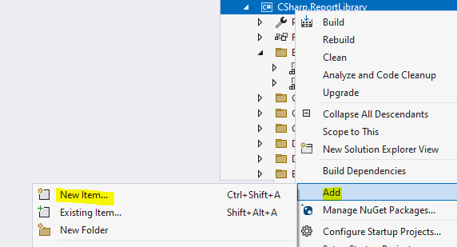

1. From the popped-up `Add New Item` Wizard, select the `Installed` > `C# Items` (for C# projects) or `Common Items` (for VB projects) > `Reporting` section. It gives you three choices:

	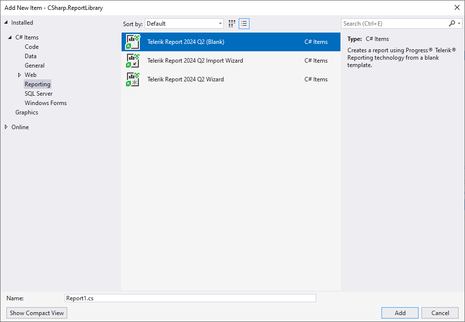

	* `Telerik Reporting {{site.suiteversion}} (Blank)` option creates a new report
	* `Telerik Reporting {{site.suiteversion}} Import Wizard` option lets you import a report from a supported format and open it in the designer for editing:

		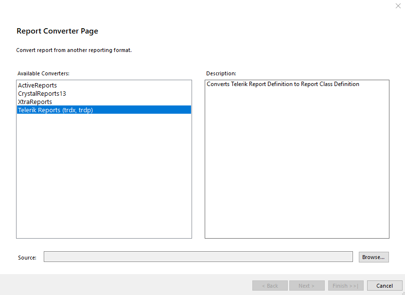

		The wizard lets you select one of the external formats we support as explained in the [Importing Reports Overview](), or import/open a declarative report definition (TRDX and TRDP files) as explained in the article [Importing Reports Created with the Standalone or Web Report Designer]().

	* `Telerik Reporting {{site.suiteversion}} Wizard` option lets you create a new blank report or use one of our wizards to create a specific template:

		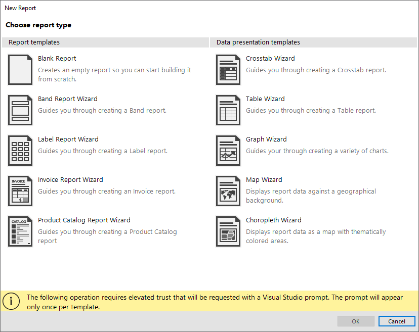

1. (optional)If the _Security Warning_ window pops up, click `Trust` to let the Visual Studio Report Designer create/open the selected report definition:

	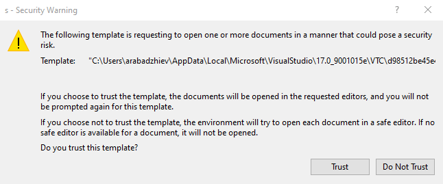

### Opening existing C#/VB Reports in the Designer

Double-click on the report type in the [Visual Studio Solution Explorer](https://learn.microsoft.com/en-us/visualstudio/ide/use-solution-explorer?view=vs-2022) to invoke the Visual Studio Report Designer and open the corresponding report for editing.

## Structure of the Visual Studio Report Designer

After you have opened a report in the Telerik Visual Studio Report Designer, you may use the following elements it exposes:

### Telerik Reporting Menu

The [menu]() lets you run the [Report Explorer](), [Data Explorer](), [Group Explorer](), [Report Wizard]() and [Upgrade Wizard](). It is accessible through the __Telerik Menu --> Reporting__ for Visual Studio versions up to 2017. For Visual Studio 2019 and later through the __Extensions Menu --> Telerik --> Reporting__.

### Design Views Buttons

Use these buttons to switch between __Design__, __Preview__, and __HTML__ view mode of the report.

### Report Selector Button

Located in the upper left-hand of the report designer. Clicking this button makes the report active in the __Properties__ window.

### Rulers

They are on the top and left side of the designer and provide a point of reference to the report layout.

### Report Sections

The high-level report design consists of report sections for the report header, report footer, page header, page footer, detail, group header, and group footer. Each section can be resized by dragging the sizing grips at the bottom/right of each section. Most sections except the detail can be deleted by selecting the section and hitting the delete key. To delete a group section, you have to delete the whole group from the `Group Explorer`.

### Component Tray

Shows the [DataSource components]() that are used in this report.

### Context Menu

The [Context Menu]() will conditionally display contents depending on the area that was right-clicked. In the figure below the menu is invoked in the area next to the report design surface.

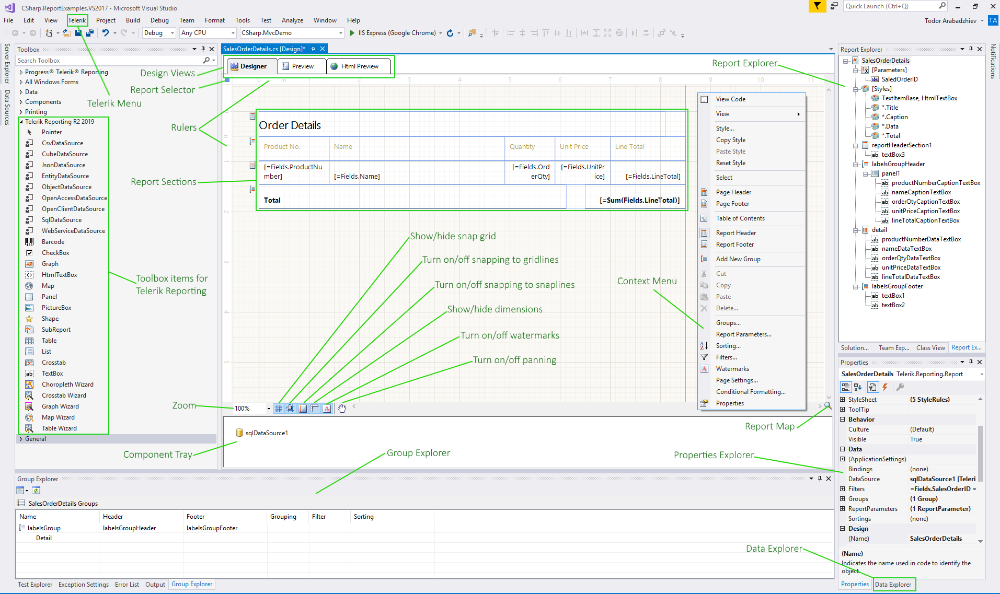

### Tooltip Buttons

All the buttons in the tooltip, placed at the lower left corner of the designer, are designed to ease you in your Report designing experience.

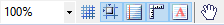

They toggle various options that help in aligning, snapping, and stretching the report items and also adjust different designer settings.

#### Zoom

The combo box enables you to easily specify the zoom percentage in which you see the design surface. You can do that by holding the `Ctrl` key and using the mouse wheel to zoom as well.

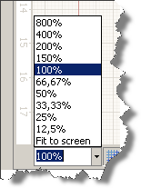

#### Show/Hide the Snap Grid

The button switches on or off the displayed __snap grid__. The snap grid provides a set of horizontal and vertical gridlines that — when you drag an object on the design surface — will *snap* or pull towards the closest vertical or horizontal gridlines. Objects can also snap to column and row dividers within a grid panel. Here is a workspace showing the snap grid turned on:

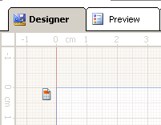

#### Turn On/Off Snapping to Gridlines

This option allows you to drag objects on the design surface and have them snap to the grid lines shown on the designer's surface. The snapping will be applied regardless of the visibility of the snap grid.

#### Turn On/Off Snapping to Snaplines

When this option is enabled, it allows you to drag objects on the design surface and snap them to the margins or alignment lines (red dashed line) of other objects within the same container element such as a layout panel, column, and row dividers in a grid panel. If a container has padding applied, it will be taken into account when snapping an object inside the container.

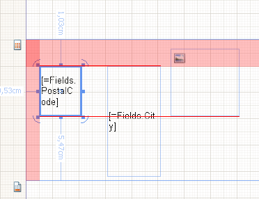

#### Show/Hide Dimensions

When enabled, the designer will show the distances from the currently selected object to the nearest elements.

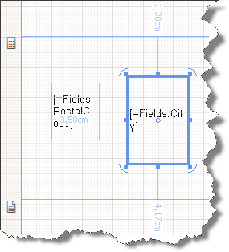

#### Show/Hide Watermarks

If enabled, the report watermarks will be shown in the designer. Note that the displayed watermarks are just for reference and their contents may not look the same as when rendered.

#### Turn On/Off Pan

This option allows you to switch between drag and pan mode in the designer. When enabled, the cursor is changed to a hand, and clicking and dragging on the designer surface will move the report contents. This tool is useful when working on higher zoom levels.

### Show/Hide the Report MiniMap

In the lower-right corner of the design surface, click Show MiniMap. This element is especially useful when you have zoomed the report and want to focus on a specific element. To hide the map, click on the design surface to have it closed.

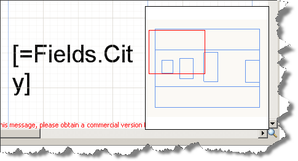

### Change the Alignment of an Element

Alignment determines how an element resizes. For example, a left-aligned element stretches to the right as the parent layout container gets resized. To change the alignment of an element use the __Layout__ toolbar and do *one* of the following:

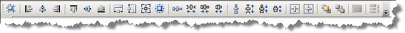

* Select two report items and change their `HorizontalAlignment` by clicking __Left__, __Center__, __Right__, or __Stretch__.
* Select two report items and change their `VerticalAlignment` by clicking __Top__, __Center__, __Bottom__, or __Stretch__. You can also change alignment by moving an element on the design surface.

The Visual Studio Report Designer features also `Properties Explorer`, `Report Explorer`, `Group Explorer`, and `Data Explorer`. The first one is displayed by default in the Visual Studio. The other three can be opened from the Telerik Menu.

> If you are using **Visual Studio 2022**, ensure that the `Platform target` of your `Report Library` project is not set to `x86`, or you won't be able to preview your reports. This is because **Visual Studio 2022** is a 64-bit application and, by design, `.NET` does not allow mixing 32-bit and 64-bit assemblies in the same process.

## Working with Code

All Telerik Reporting CS/VB reports, for example, _ReportName.cs_ inherit from the base [Telerik.Reporting.Report](/api/telerik.reporting.report) type. The Visual Studio Report Designer generates automatically the code in the `InitializeComponent` method of the _ReportName_ type that resides in the `ReportName.designer.cs` file. It is a special method recognized and parsed by the Report Designer to display the report in design time.

You may add custom code to the _ReportName_ type in the `ReportName.cs` file, where you may find by default only the parameterless constructor of the _ReportName_ type. For example, you may add [Report Event Handlers](), etc.

## See Also

* [Visual Studio Report Designer Troubleshooting]()
