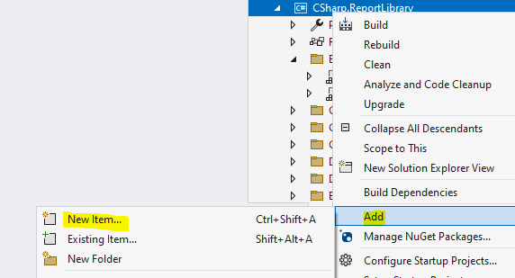
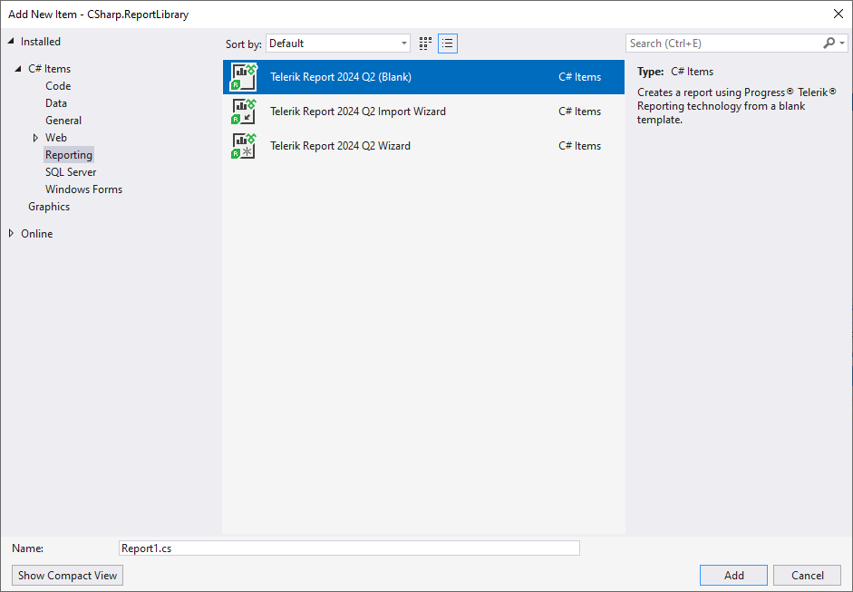
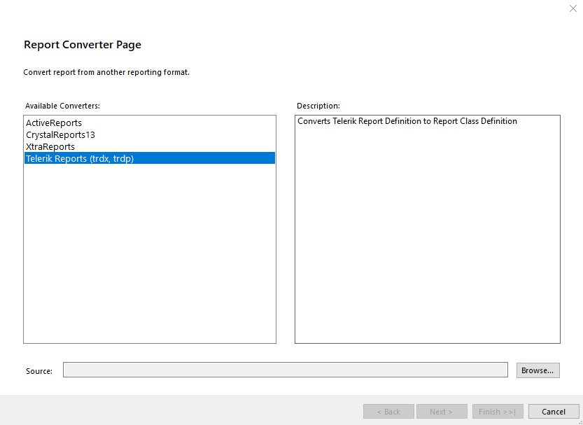
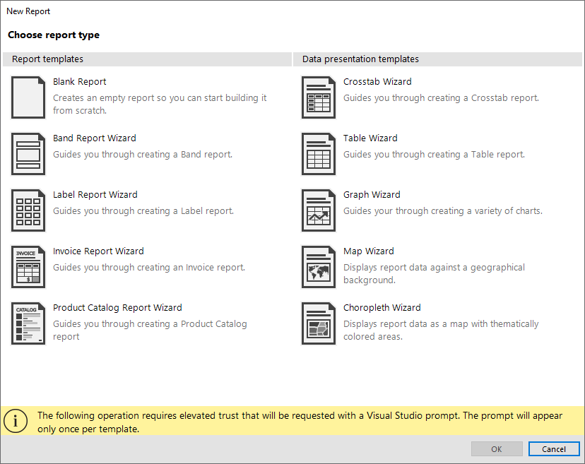
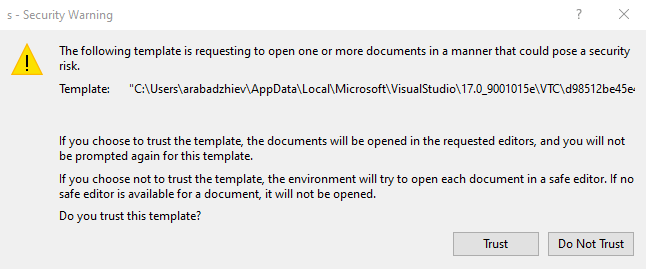
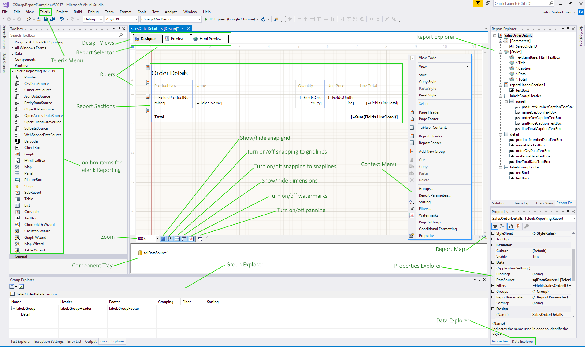

# Visual Studio Report Designer Overview

The Visual Studio Report Designer supports editing CLR type report definitions (that is, `CS` or `VB` files) in the Visual Studio environment. The Visual Studio designer targets `.NET Framework` projects only. Due to architectural constraints, it cannot be extended to support SDK-style projects or `.NET Core`/`.NET 5+` targets. For an alternative design workflow for `.NET` coded reports, see [Designing Coded Reports for .NET](#designing-coded-reports-for-net) in this article.

## Designing Coded Reports for .NET

Starting with [Progress® Telerik® Reporting 2025 Q3](https://www.telerik.com/support/whats-new/reporting/release-history/progress-telerik-reporting-2025-q3-19-2-25-813), the Standalone Report Designer for .NET (SRD.NET) supports opening, designing, and previewing coded (`.CS`) report definitions in C# projects targeting `.NET`. This capability addresses the long-standing limitation that the Visual Studio Report Designer cannot support SDK-style or `.NET Core`/`.NET 5+` projects.

For the full workflow — including prerequisites, code-behind support, event handlers, custom functions, and migration from `.NET Framework` — see [Coded Reports in the Standalone Report Designer for .NET](slug:telerikreporting/designing-reports/report-designer-tools/desktop-designers/standalone-report-designer/srd-net-working-with-type-report-definitions).

## Installation

The Visual Studio Report Designer requires installation on a Windows machine.

The designer gets installed automatically with the [installation of the Telerik Reporting product](slug:telerikreporting/installation). The installation process detects the installed Visual Studio versions on your Windows machine and lets you select which of the supported ones would be integrated with Telerik Reporting - see [System Requirements - IDE Support](https://www.telerik.com/products/reporting/system-requirements).

> The Visual Studio Report Designer works only with the last installed Reporting version. If you have multiple Reporting versions installed on the machine, you will be able to edit CS/VB Reports from the last installed version. Consider the [Upgrade Wizard](slug:telerikreporting/designing-reports/report-designer-tools/desktop-designers/visual-studio-report-designer/upgrade-wizard) for upgrading your ReportLibrary projects.

## Starting the Visual Studio Report Designer and Opening Reports

To start/open the designer, open an existing CS/VB file containing the report definition, import or create it as explained below.

### Creating New Reports and Importing Reports from other formats in the Designer

Create a new report through the Telerik Reporting Visual Studio Item Template:

1. Right-click over the project you want to add the new Report type to. We recommend the ReportLibrary or ClassLibrary project types. Select **Add > New Item...** from the context menu:

	

1. From the popped-up `Add New Item` Wizard, select the `Installed` > `C# Items` (for C# projects) or `Common Items` (for VB projects) > `Reporting` section. It gives you three choices:

	

	* `Telerik Reporting {{site.suiteversion}} (Blank)` option creates a new report
	* `Telerik Reporting {{site.suiteversion}} Import Wizard` option lets you import a report from a supported format and open it in the designer for editing:

		

		The wizard lets you select one of the external formats we support as explained in the [Importing Reports Overview](slug:telerikreporting/designing-reports/converting-reports-from-other-reporting-solutions/overview), or import/open a declarative report definition (TRDX and TRDP files) as explained in the article [Importing Reports Created with the Standalone or Web Report Designer](slug:telerikreporting/designing-reports/report-designer-tools/desktop-designers/visual-studio-report-designer/how-to-import-reports-created-with-standalone-report-designer).

	* `Telerik Reporting {{site.suiteversion}} Wizard` option lets you create a new blank report or use one of our wizards to create a specific template:

		

1. (optional) If the _Security Warning_ window pops up, click `Trust` to let the Visual Studio Report Designer create/open the selected report definition:

	

### Opening existing C#/VB Reports in the Designer

Double-click on the report type in the [Visual Studio Solution Explorer](https://learn.microsoft.com/en-us/visualstudio/ide/use-solution-explorer?view=vs-2022) or right-click on it and select "View Designer" to invoke the Visual Studio Report Designer and open the corresponding report for editing.

## Key Features of the Visual Studio Report Designer

Opening a report in the Telerik Visual Studio Report Designer lets you use its key features indicated in the following image:

The following key elements are available in the VS Report Designer. For detailed information about each element, see [Structure of the Visual Studio Report Designer](slug:visual-studio-report-designer-structure):

* Telerik Reporting Menu
* Design Views Buttons
* Report Selector Button
* Rulers
* Report Sections
* Component Tray
* Context Menu
* Tooltip Buttons
* Show/Hide the Report MiniMap
* Change the Alignment of an Element
* Properties Explorer
* Report Explorer
* Group Explorer
* Data Explorer

> If you are using **Visual Studio 2022**, ensure that the `Platform target` of your `Report Library` project is not set to `x86`, or you won't be able to preview your reports. This is because **Visual Studio 2022** is a 64-bit application and, by design, `.NET` does not allow mixing 32-bit and 64-bit assemblies in the same process.

## Working with Code

All Telerik Reporting CS/VB reports, for example, _ReportName.cs_ inherit from the base [Telerik.Reporting.Report](/api/telerik.reporting.report) type. The Visual Studio Report Designer generates automatically the code in the `InitializeComponent` method of the _ReportName_ type that resides in the `ReportName.designer.cs` file. It is a special method recognized and parsed by the Report Designer to display the report in design time.

Add custom code to the _ReportName_ type in the `ReportName.cs` file, which contains by default only the parameterless constructor of the _ReportName_ type. For example, add [Report Event Handlers](slug:telerikreporting/using-reports-in-applications/program-the-report-definition/report-events/using-report-events) and similar customizations.

## Visual Studio Report Designer Troubleshooting

To troubleshoot problems related to the Visual Studio Report Designer and Visual Studio Project/Item Templates, follow the suggestions in [Visual Studio Report Designer Troubleshooting](slug:telerikreporting/designing-reports/report-designer-tools/desktop-designers/visual-studio-report-designer/visual-studio-problems).

## See Also

* [Structure of the Visual Studio Report Designer](slug:visual-studio-report-designer-structure)
* [How to use Visual Studio Report Designer to edit CS Reports in .NET Projects](slug:how-to-use-vs-designer-in-dotnet-core)
* [Standalone Report Designer Overview](slug:telerikreporting/designing-reports/report-designer-tools/desktop-designers/standalone-report-designer/overview)
* [Web Report Designer Overview](slug:telerikreporting/designing-reports/report-designer-tools/web-report-designer/overview)
* [.NET Coded Report Design, No IDE Strings Attached](https://www.telerik.com/blogs/net-coded-report-design-no-ide-strings-attached)
* [Coded Reports in the Standalone Report Designer for .NET](slug:telerikreporting/designing-reports/report-designer-tools/desktop-designers/standalone-report-designer/srd-net-working-with-type-report-definitions)
