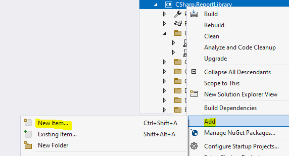
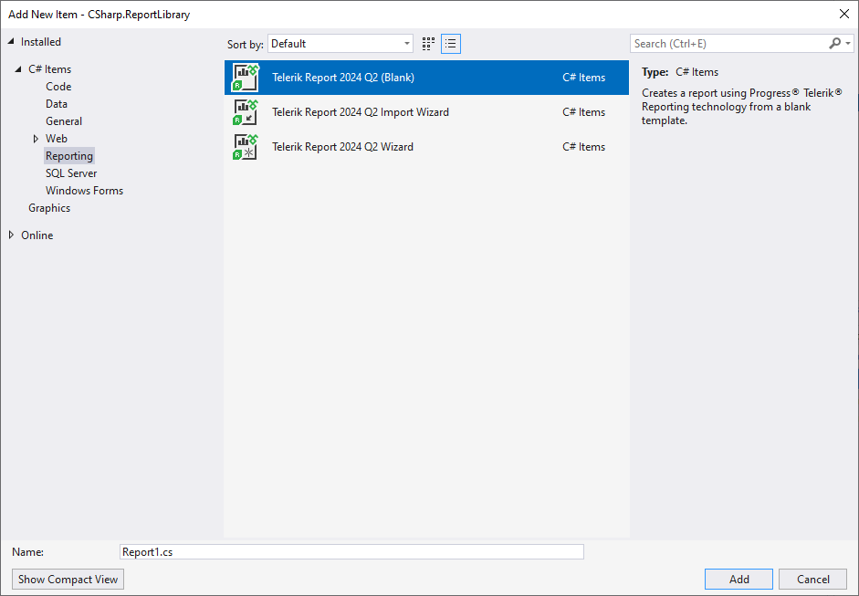
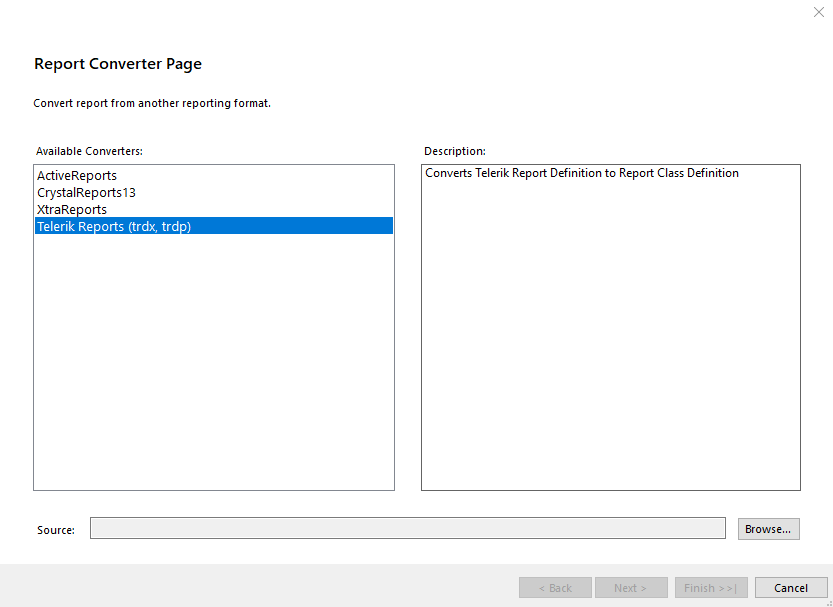
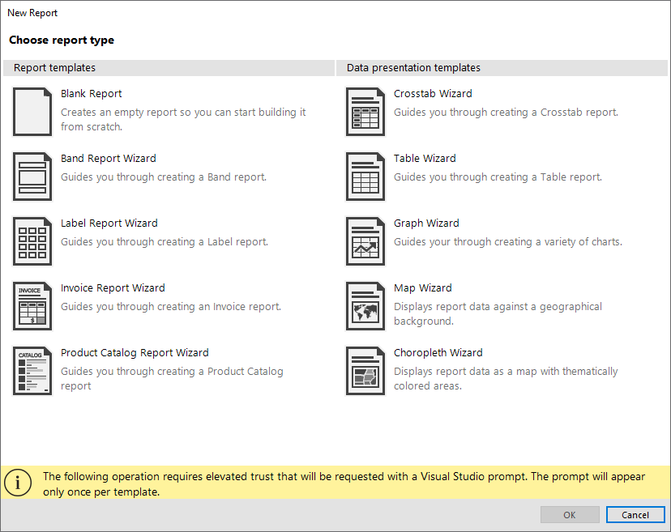
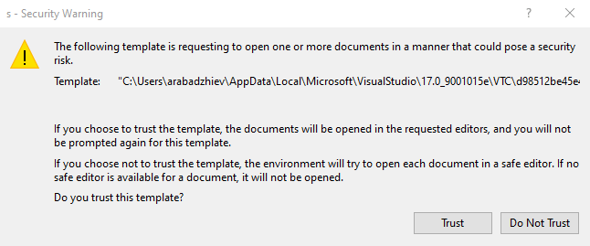

# Visual Studio Report Designer Overview

The Visual Studio Report Designer edits coded report definitions in Visual Studio. Telerik Reporting provides two designer implementations with different installation and user interface workflows:

* **Visual Studio Report Designer for .NET** uses design-time assemblies in the `Telerik.Reporting` NuGet package and runs in a separate process for SDK-style projects.
* **Visual Studio Report Designer for .NET Framework** uses the installed Telerik Reporting Visual Studio extension to edit C# and VB reports in .NET Framework projects.

See [Structure of the Visual Studio Report Designer](slug:visual-studio-report-designer-structure#comparing-the-designers) for the feature and workflow differences.

## Designing Coded Reports for .NET

To design coded reports in Visual Studio, [set up the Visual Studio Report Designer for .NET](slug:vs-report-designer-net-getting-started). Select a package version that includes the new designer and configure the required project target and workload.

The Standalone Report Designer for .NET is an alternative outside Visual Studio. Starting with [Telerik Reporting 2025 Q3](https://www.telerik.com/support/whats-new/reporting/release-history/progress-telerik-reporting-2025-q3-19-2-25-813), it supports coded C# report definitions.

For its prerequisites, code-behind support, and migration workflow, see [Coded Reports in the Standalone Report Designer for .NET](slug:telerikreporting/designing-reports/report-designer-tools/desktop-designers/standalone-report-designer/srd-net-working-with-type-report-definitions).

## Installation

Both designers require Windows, but use different installation workflows.

### Installing the .NET Designer

Reference a `Telerik.Reporting` NuGet package version that includes the .NET designer. Its version follows your project's package reference, not the most recent Reporting installation.

The current setup requires Visual Studio 2026, the .NET desktop development workload, and a `net10.0-windows` project with `UseWindowsForms=true`. See [Getting Started with the Visual Studio Report Designer for .NET](slug:vs-report-designer-net-getting-started) for setup, the prerelease installer, and the sample workflow.

### Installing the .NET Framework Designer

The .NET Framework designer is installed with the [Telerik Reporting product](slug:telerikreporting/installation). The installer detects your Visual Studio versions and lets you choose which supported versions to integrate. See [System Requirements - IDE Support](https://www.telerik.com/products/reporting/system-requirements).

>note The .NET Framework designer works with the last installed Reporting version. Use the [Upgrade Wizard](slug:telerikreporting/designing-reports/report-designer-tools/desktop-designers/visual-studio-report-designer/upgrade-wizard) to upgrade ReportLibrary projects. This installation restriction does not apply to the NuGet-based .NET designer.

## Starting the Visual Studio Report Designer and Opening Reports

For .NET projects, use the [opening procedure](slug:vs-report-designer-net-getting-started#opening-a-report) after you configure the package and project. The new designer does not supply Visual Studio report templates.

The following template and import procedures apply to the **.NET Framework designer**.

### Creating New Reports and Importing Reports from Other Formats in the Designer

Create a new report through the Telerik Reporting Visual Studio Item Template:

1. Right-click over the project you want to add the new Report type to. We recommend the ReportLibrary or ClassLibrary project types. Select **Add > New Item...** from the context menu:

	

1. From the popped-up `Add New Item` Wizard, select the `Installed` > `C# Items` (for C# projects) or `Common Items` (for VB projects) > `Reporting` section. It gives you three choices:

	

	* `Telerik Reporting {{site.suiteversion}} (Blank)` option creates a new report
	* `Telerik Reporting {{site.suiteversion}} Import Wizard` option lets you import a report from a supported format and open it in the designer for editing:

		

		The wizard lets you select one of the external formats we support as explained in the [Importing Reports Overview](slug:telerikreporting/designing-reports/converting-reports-from-other-reporting-solutions/overview), or import/open a declarative report definition (TRDX and TRDP files) as explained in the article [Importing Reports Created with the Standalone or Web Report Designer](slug:telerikreporting/designing-reports/report-designer-tools/desktop-designers/visual-studio-report-designer/how-to-import-reports-created-with-standalone-report-designer).

	* `Telerik Reporting {{site.suiteversion}} Wizard` option lets you create a new blank report or use one of our wizards to create a specific template:

		

1. (optional) If the _Security Warning_ window pops up, click `Trust` to let the Visual Studio Report Designer create/open the selected report definition:

	

### Opening Existing C#/VB Reports in the Designer

In a .NET Framework project, double-click the report type in [Solution Explorer](https://learn.microsoft.com/en-us/visualstudio/ide/use-solution-explorer?view=vs-2022), or right-click it and select **View Designer**.

### Opening .NET Reports in the Designer

In a configured .NET project, right-click the report's main `.cs` file in **Solution Explorer** and select **View Designer**. For an animation and details about the default editor, see [Opening a Report](slug:vs-report-designer-net-getting-started#opening-a-report).

## Key Features of the Visual Studio Report Designer

The following image shows the **.NET Framework designer** and its key features:

The .NET Framework designer provides the following elements:

* Telerik Reporting Menu
* Design Views Buttons
* Report Selector Button
* Rulers
* Report Sections
* Component Tray
* Context Menu
* Tooltip Buttons
* Show/Hide the Report MiniMap
* Change the Alignment of an Element
* Properties Explorer
* Report Explorer
* Group Explorer
* Data Explorer

The .NET designer also provides report sections, rulers, a component tray, context menus, layout aids, and explorer windows. It has **Designer** and **Preview** tabs, but no HTML preview, document map area, or report minimap.

Open its explorers from the [report context menu](slug:visual-studio-report-designer-structure#explorer-windows), not the Visual Studio Extensions menu. Report parameters and export options use dialogs, as described in [Previewing Reports in the .NET Designer](slug:vs-report-designer-net-preview).

For details about each element and supported layout aids, see [Structure of the Visual Studio Report Designer](slug:visual-studio-report-designer-structure).

>note For the .NET Framework designer in Visual Studio 2022, ensure that the report project's `Platform target` is not `x86`. Visual Studio 2022 is a 64-bit application and cannot preview 32-bit assemblies in its process.

## Working with Code

All Telerik Reporting CS/VB reports, for example, _ReportName.cs_ inherit from the base [Telerik.Reporting.Report](/api/telerik.reporting.report) type. The Visual Studio Report Designer generates automatically the code in the `InitializeComponent` method of the _ReportName_ type that resides in the `ReportName.designer.cs` file. It is a special method recognized and parsed by the Report Designer to display the report in design time.

Add custom code to the _ReportName_ type in the `ReportName.cs` file, which contains by default only the parameterless constructor of the _ReportName_ type. For example, add [Report Event Handlers](slug:telerikreporting/using-reports-in-applications/program-the-report-definition/report-events/using-report-events) and similar customizations.

## Visual Studio Report Designer Troubleshooting

For .NET setup and preview issues, or legacy extension and template issues, see [Visual Studio Report Designer Troubleshooting](slug:telerikreporting/designing-reports/report-designer-tools/desktop-designers/visual-studio-report-designer/visual-studio-problems).

## See Also

* [Structure of the Visual Studio Report Designer](slug:visual-studio-report-designer-structure)
* [Getting Started with the Visual Studio Report Designer for .NET](slug:vs-report-designer-net-getting-started)
* [Previewing Reports in the Visual Studio Report Designer for .NET](slug:vs-report-designer-net-preview)
* [Editing .NET Reports Through a .NET Framework Project (Legacy Workaround)](slug:how-to-use-vs-designer-in-dotnet-core)
* [Standalone Report Designer Overview](slug:telerikreporting/designing-reports/report-designer-tools/desktop-designers/standalone-report-designer/overview)
* [Web Report Designer Overview](slug:telerikreporting/designing-reports/report-designer-tools/web-report-designer/overview)
* [.NET Coded Report Design, No IDE Strings Attached](https://www.telerik.com/blogs/net-coded-report-design-no-ide-strings-attached)
* [Coded Reports in the Standalone Report Designer for .NET](slug:telerikreporting/designing-reports/report-designer-tools/desktop-designers/standalone-report-designer/srd-net-working-with-type-report-definitions)
