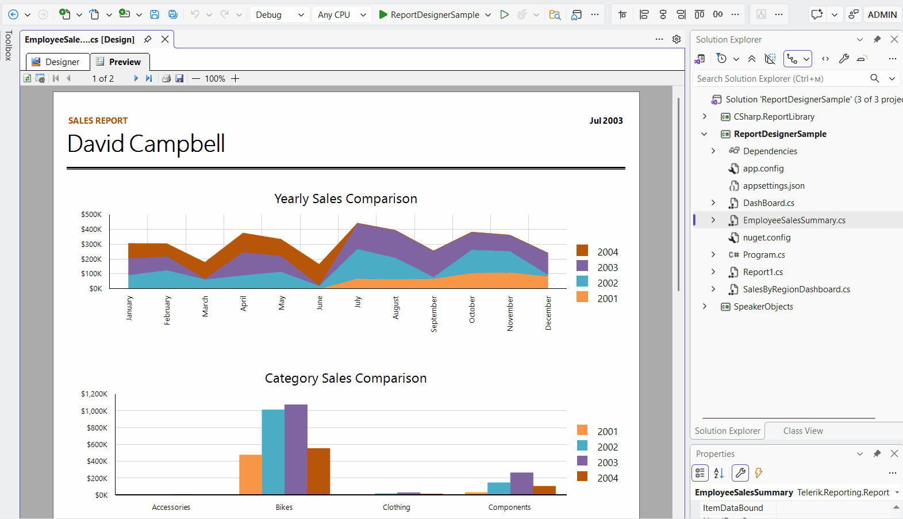
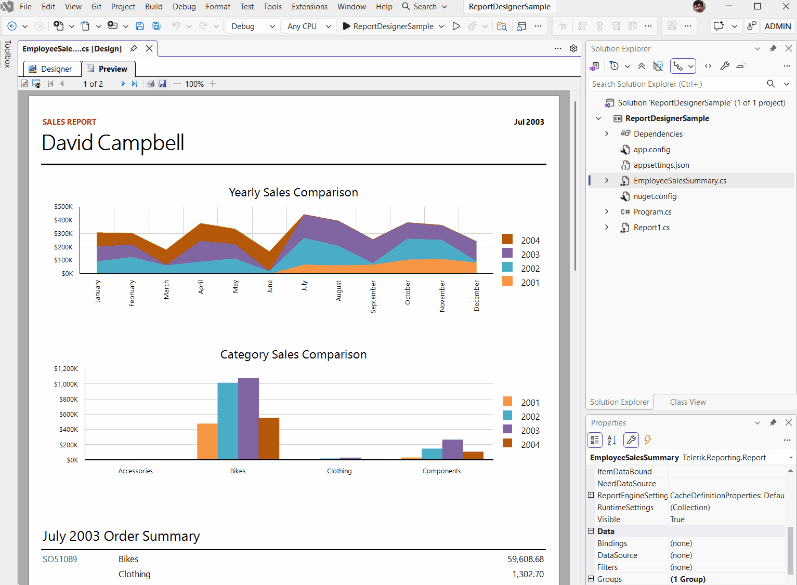

# Previewing Reports in the Visual Studio Report Designer for .NET

The Visual Studio Report Designer for .NET provides **Designer** and **Preview** tabs. Unlike the .NET Framework designer, it uses dialogs for report parameters and export options.

Before you preview a report, [set up the designer and open a coded report](slug:vs-report-designer-net-getting-started).

## Previewing a Report

Select the **Preview** tab to render the report. Use the preview toolbar to refresh the report, navigate between pages, print, or export the output. The zoom-out and zoom-in buttons adjust the preview scale.

Select **Designer** to return to the report layout.

>note The .NET designer does not provide a document map area or a separate HTML preview tab. The absence of HTML preview does not prevent export through an available HTML rendering extension.

## Entering Report Parameter Values

The parameters button opens the **Report Parameters** dialog. It does not show or hide a persistent parameters area beside the report.

To preview a report with parameter values:

1. Select **Preview**.
1. Click the parameters button on the preview toolbar, next to the refresh button.
1. In **Report Parameters**, enter the values.
1. Click **Preview** in the dialog to render the report with those values.

The following animation shows the parameters button and the **Report Parameters** dialog:

Click **Cancel** to close the dialog without applying new values. If the report has no parameters to answer, the designer displays a message instead of the dialog.

## Exporting Report Output

The export button opens the **Export Report** dialog instead of a drop-down menu of formats.

To export a report:

1. Select **Preview** and wait for the report to render.
1. Click the export button on the preview toolbar, next to the print button.
1. In **Export Report**, select the required **Format**.
1. Enter the output file path in **Save to**, or click **...** to browse for a location.
1. Click **OK** to export the report.

The following animation shows the export button and the format and file options:

The available formats depend on the rendering extensions available to the report engine. Export renders the report for the selected format with the current parameter values; it does not convert the displayed preview pages.

## See Also

* [Getting Started with the Visual Studio Report Designer for .NET](slug:vs-report-designer-net-getting-started)
* [Structure of the Visual Studio Report Designer](slug:visual-studio-report-designer-structure)
* [Troubleshooting the Visual Studio Report Designer](slug:telerikreporting/designing-reports/report-designer-tools/desktop-designers/visual-studio-report-designer/visual-studio-problems)
