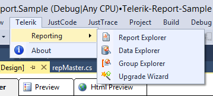

# Telerik Reporting Menu Overview

The __Telerik Reporting menu__ can be accessed whenever an area of the report designer is selected. From here you can call:

* [Report Explorer]() - allows you to see the structure of the report and to select any item in the report. This menu item is available only when you're in the context of the report designer.
* [Data Explorer]() - provides an overview of the database fields that are available to your report. This menu item is available only when you're in the context of the report designer.
* [Upgrade Wizard]() - guides you through the process of upgrading the projects and files of the current open solution to a newer version of Telerik Reporting. This menu item is always available in the Telerik Reporting Menu.
* [Group Explorer]() - the Group Explorer is an aid to navigating report/table groups. The Group Explorer allows you to see the structure of the groups, to select them and change the respective Grouping, Sorting and Filtering. This menu item is available only when you're in the context of the report designer.

The "[Upgrade Wizard]()" option is always available, while the other options are available __only when__ you are editing a Telerik Report in the [Visual Studio Report Designer]().

> If the report designer is opened, but still only the "[Upgrade Wizard]()" is visible, make sure the Report Designer is the active window i.e. it has focus.

