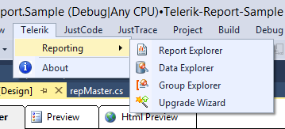

# Telerik Reporting Menu Overview

>note The Visual Studio Report Designer for .NET is available as a preview starting with Telerik Reporting [2026 Q3 (20.2.26.1007)](https://www.telerik.com/support/whats-new/reporting/release-history/progress-telerik-reporting-2026-q3-(20-2-26-1007)).

The **Telerik Reporting menu** belongs to the installed Visual Studio extension used with the **.NET Framework designer**. In Visual Studio 2019 and later, open **Extensions > Telerik > Reporting**. Earlier versions expose **Telerik > Reporting**.

When the .NET Framework report designer is active, the menu provides the following commands:

* [Report Explorer](slug:telerikreporting/designing-reports/report-designer-tools/desktop-designers/tools/report-explorer) - allows you to see the structure of the report and to select any item in the report. This menu item is available only when you're in the context of the report designer.
* [Data Explorer](slug:telerikreporting/designing-reports/report-designer-tools/desktop-designers/tools/data-explorer) - provides an overview of the database fields that are available to your report. This menu item is available only when you're in the context of the report designer.
* [Upgrade Wizard](slug:telerikreporting/designing-reports/report-designer-tools/desktop-designers/visual-studio-report-designer/upgrade-wizard) - guides you through the process of upgrading the projects and files of the current open solution to a newer version of Telerik Reporting. This menu item is always available in the Telerik Reporting Menu.
* [Group Explorer](slug:telerikreporting/designing-reports/report-designer-tools/desktop-designers/tools/group-explorer) - the Group Explorer is an aid to navigating report/table groups. The Group Explorer allows you to see the structure of the groups, to select them and change the respective Grouping, Sorting and Filtering. This menu item is available only when you're in the context of the report designer.

The **Upgrade Wizard** option is always available in the extension menu. The explorer options are available only when the .NET Framework report designer is active.

>note If only **Upgrade Wizard** is visible when a .NET Framework report designer is open, give the designer window focus.

The following image shows the full extension menu available for the .NET Framework designer:

## Opening Explorers in the .NET Designer

The NuGet-based .NET designer provides separate explorer windows. Open them through the report context menu's **View** submenu, not through **Extensions > Telerik > Reporting**.

For the procedure and an animation, see [Explorer Windows](slug:visual-studio-report-designer-structure#explorer-windows).

## Updating .NET Projects

The extension's Upgrade Wizard does not upgrade .NET projects. Update all Telerik Reporting package references to the same version instead. For prerelease builds, follow [Updating the Designer Package](slug:vs-report-designer-net-getting-started#updating-the-designer-package).

## See Also

* [Visual Studio Report Designer Overview](slug:telerikreporting/designing-reports/report-designer-tools/desktop-designers/visual-studio-report-designer/overview)
* [Getting Started with the Visual Studio Report Designer for .NET](slug:vs-report-designer-net-getting-started)
* [Structure of the Visual Studio Report Designer](slug:visual-studio-report-designer-structure)
