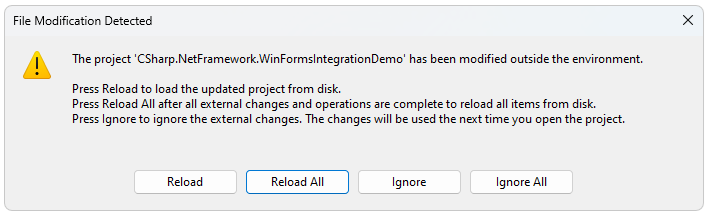

# Upgrade Wizard Overview

The Visual Studio Extensions offer the Project **Upgrade Wizard**. It will guide you through the process of upgrading **Telerik Reporting** projects to a newer (or older) version of Telerik Reporting. 

Before starting the wizard, you can check what version of Telerik Reporting is currently referred in your project:

  

The **Upgrade Wizard** can be started by using the **Extensions > Telerik > Reporting > Upgrade Wizard** menu item:

 

This wizard will upgrade the following:

* The references to Telerik Reporting assemblies to the selected version
* The project’s `.config` file
* All web page/user control files (`aspx`/`ascx`) with references to the Telerik Reporting assemblies
* All resource files (`resx`) with references to the Telerik Reporting assemblies

>note The wizard __will not__ change any code, or namespaces, nor will it remove obsolete properties, events, and methods. You may need to manually update your code after this wizard completes.

> Web Site projects are not supported by the Upgrade Wizard. In Web Sites assembly references are handled differently, and our recommendation is to upgrade manually or to turn the project into a Web Application that can be upgraded automatically - [Web Application Projects versus Web Site Projects in Visual Studio](https://learn.microsoft.com/en-us/previous-versions/aspnet/dd547590(v=vs.110)).

> `.NET` and `.NET Core` projects are not supported by the Upgrade Wizard. You need to upgrade manually to the selected version:
>
> * The references to the Telerik Reporting assemblies or NuGet packages
>
> * The HTML5 Report Viewer scripts

1. On the first step the wizard provides basic update process information:

	  

1. On the next step, the wizard lists all projects from the solution, which use Telerik Reporting. You can choose which projects will be updated (it is recommended to upgrade all projects to the chosen version, not just part of them) and the version which they will be upgraded to.

	   

1. The next screen allows you to create a backup for the project.

	    

1. Review the changes.

	   

1. The Complete step indicates whether the upgrade process is completed for all the projects successfully. It also indicates if any errors occured and the user is promped to decide whether to proceed or revert the changes:

	   

1. The Licensing step was added with the [Progress® Telerik® Reporting 2025 Q2 (19.1.25.521)](https://www.telerik.com/support/whats-new/reporting/release-history/progress-telerik-reporting-2025-q2-19-1-25-521) release of the product. It allows for seemlessly downloading the license key from your [Telerik account](https://www.telerik.com/account/) and putting it in the `%AppData%\Telerik` directory.

	

1. Finally, the wizard shows a log file with the changes:

	    

The Upgrade Wizard works only with project items. It is registered in Visual Studio and keeps track of Telerik Reporting installation folders on the machine. Telerik Reporting references are updated by using the selected in the wizard version and the installation folder registered for that version. If Telerik Reporting assemblies are referenced from a custom location, not the installation folder, the Upgrade Wizard will not update the content of the custom folder and references will be pointed to the installation folder.

The wizard requires access permissions to the solution folder and its files. If the solution or some of its projects are under source control, make sure that the correct source control plug-in is active in Visual Studio and that no files are exclusively checked out by another user.

Once you open a solution, the Upgrade Wizard will check what version of Telerik Reporting is used and if you have a newer one installed, it will offer to upgrade your application. Visual Studio would automatically popup the `Upgrade Wizard` as shown below:

If you do not want it to pop up automatically, simply check the "Do not start this wizard" checkbox at the bottom. If at a later stage, you decide that you want to upgrade your solution, simply use the [Telerik Reporting Menu]() and select _Upgrade Wizard_ from it.

The next step is to specify which project from the solution you want to upgrade and if you have multiple versions of Telerik Reporting installed - select the one you would like to upgrade/downgrade to:

You would be then asked whether you would like to back up your solution before proceeding with the upgrade and specify where it should be backed up. We highly recommend that you back up your solution(s) because the upgrade process is irreversible. Once you make your choice, you will be presented with a confirmation step where you can review the files that are going to be changed during the upgrade.

Choosing _Next_ from the wizard would proceed with the upgrade and you'll finish with a screen where all successfully upgraded projects/files will be shown with a green tick right next to them.

You can also review a detailed log of the upgrade once the solution is loaded into Visual Studio - to cancel this, you have to uncheck the _Show the upgrade log_ checkbox at the bottom.

Once your solution is opened in the IDE, it will notify you with a _File Modification Detected_ prompt that your project(s) have been modified outside of the environment and you should press "Reload" to reload the updated project:

## In case you receive compilation errors and/or warnings

Run the `Upgrade Wizard` to upgrade your _ReportLibrary_ projects hosting the reports created with the [Visual Studio Report Designer]().

This wizard __will not__ change any of your current code. As a result __you may receive compilation errors and/or warnings__ for properties, methods, and events marked as obsolete. In this case, a manual update of your code is required. The [Release Notes](https://www.telerik.com/support/whats-new/reporting/release-history) contain the complete list of obsolete and deleted properties, methods, and events including information on what to be used instead, and why. Please, review the release notes of all Telerik Reporting versions starting from the version you upgraded from to the version you upgraded to, including the ones in between for information on how to update your project.

Feel free to contact us via the [support ticketing system](https://www.telerik.com/account/support-center/contact-us/technical-support) in case you still experience problems after the upgrade, and we will help you resolve any remaining issues. It will be faster and easier if you package your solution/project as a _ZIP_ file and send it to Telerik, together with information on the errors/warnings you see.

## See Also

* [Missing Telerik menu in Visual Studio]()
