# Structure of the Visual Studio Report Designer

The .NET and .NET Framework designers share report layout tools, but differ in setup, preview controls, and explorer access. The following sections identify those differences. Screenshots of the older designer illustrate the .NET Framework interface.

## Comparing the Designers

The following table compares the designer workflows and features:

| Feature or workflow | .NET Framework designer | .NET designer |
| ------ | ------ | ------ |
| Distribution | Installed Telerik Reporting Visual Studio extension | `Telerik.Reporting.VSDesigner` NuGet package, referenced alongside the same-version `Telerik.Reporting` package |
| Opening a report | Double-click the report or select **View Designer** | Select **View Designer**; double-click behavior depends on the default editor |
| Visual Studio report templates | Available through the installed extension | Not supplied by the designer package |
| Preview modes | **Designer**, **Preview**, and **Html Preview** | **Designer** and **Preview**; no HTML preview tab |
| Report parameters | Parameters area in the preview viewer | **Report Parameters** dialog from the preview toolbar |
| Export | Format menu in the preview viewer | **Export Report** dialog from the preview toolbar |
| Document map area | Available in preview | Not available |
| Report, Data, and Group Explorer | Telerik extension menu | Report context menu's **View** submenu; not the Extensions menu |
| Zoom controls | Zoom combo box | Zoom-out and zoom-in buttons with a percentage label |
| Snap grid, gridline snapping, and snaplines | Supported | Supported |
| Dimensions, design-time watermarks, and panning | Supported | Supported |
| Report minimap | Available | Not available |

For project requirements and package configuration, see [Getting Started with the .NET Designer](slug:vs-report-designer-net-getting-started). For parameter and export procedures, see [Previewing Reports in the .NET Designer](slug:vs-report-designer-net-preview).

## Telerik Reporting Menu

For the **.NET Framework designer**, the [Telerik Reporting menu](slug:telerikreporting/designing-reports/report-designer-tools/desktop-designers/visual-studio-report-designer/telerik-reporting-menu) is accessible through **Extensions > Telerik > Reporting** in Visual Studio 2019 and later.

If you use Visual Studio versions up to 2017, you may find it in the __Telerik Menu --> Reporting__.

The menu lets you trigger the following functionalities:

* [Report Explorer](slug:telerikreporting/designing-reports/report-designer-tools/desktop-designers/tools/report-explorer)
* [Data Explorer](slug:telerikreporting/designing-reports/report-designer-tools/desktop-designers/tools/data-explorer)
* [Group Explorer](slug:telerikreporting/designing-reports/report-designer-tools/desktop-designers/tools/group-explorer)
* [Report Wizard](slug:telerikreporting/designing-reports/report-designer-tools/desktop-designers/tools/report-wizards/band-report-wizard/overview)
* [Upgrade Wizard](slug:telerikreporting/designing-reports/report-designer-tools/desktop-designers/visual-studio-report-designer/upgrade-wizard)

The .NET designer does not use these extension-menu commands to open its explorers. Use the [report context menu](#explorer-windows) instead.

## Explorer Windows

Both designers provide **Properties**, **Report Explorer**, **Data Explorer**, and **Group Explorer** windows. Visual Studio supplies the **Properties** window.

To open an explorer in the **.NET designer**:

1. Open the report and select **Designer**.
1. Right-click an unused area of the design surface to open the report context menu.
1. Select **View**, then **Report Explorer**, **Data Explorer**, or **Group Explorer**.

The following animation shows how to open and dock **Report Explorer** from the report context menu:

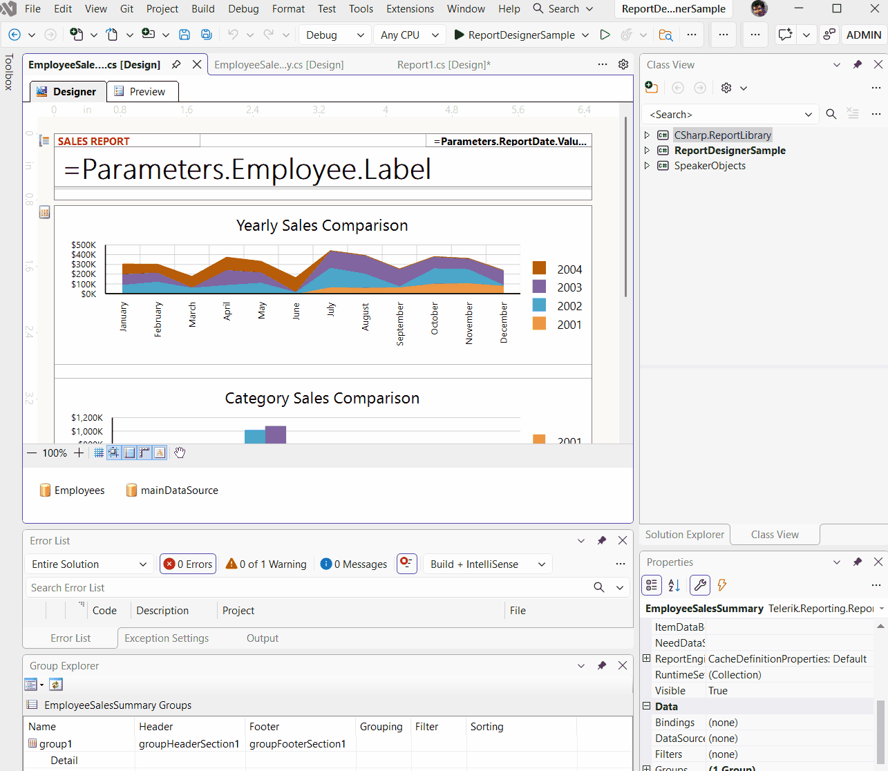

These explorer windows are separate from the legacy extension's windows. Commands under **Extensions > Telerik > Reporting** do not open the .NET designer's explorers.

## Design Views Buttons

In the .NET designer, select **Designer** or **Preview**. Report parameters and export options open dialogs from the preview toolbar. The designer does not provide an HTML preview tab or document map area.

The following image shows the **.NET Framework designer's** buttons for **Designer**, **Preview**, and **Html Preview**:

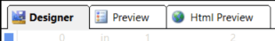

## Report Selector Button

In the .NET Framework designer, the report selector button is in the upper-left corner. Click it to select the report in **Properties**.

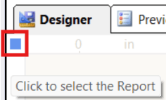

In the .NET designer, click an unused area of the design surface to select the report and display its properties.

## Rulers

They are on the top and left side of the designer and provide a point of reference to the report layout.

## Report Sections

The high-level report design consists of report sections for the report header, report footer, page header, page footer, detail, group header, and group footer. Each section can be resized by dragging the sizing grips at the bottom/right of each section. Most sections except the detail can be deleted by selecting the section and hitting the delete key. To delete a group section, you have to delete the whole group from the `Group Explorer`.

## Component Tray

Shows the [DataSource components](slug:telerikreporting/designing-reports/connecting-to-data/data-source-components/overview) that are used in this report.

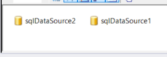

## Context Menu

The [context menu](slug:telerikreporting/designing-reports/report-designer-tools/desktop-designers/tools/context-menu) displays commands for the area you right-click. In the .NET designer, the report context menu also opens the [explorer windows](#explorer-windows).

The following image shows the context menu beside the **.NET Framework designer's** report surface:

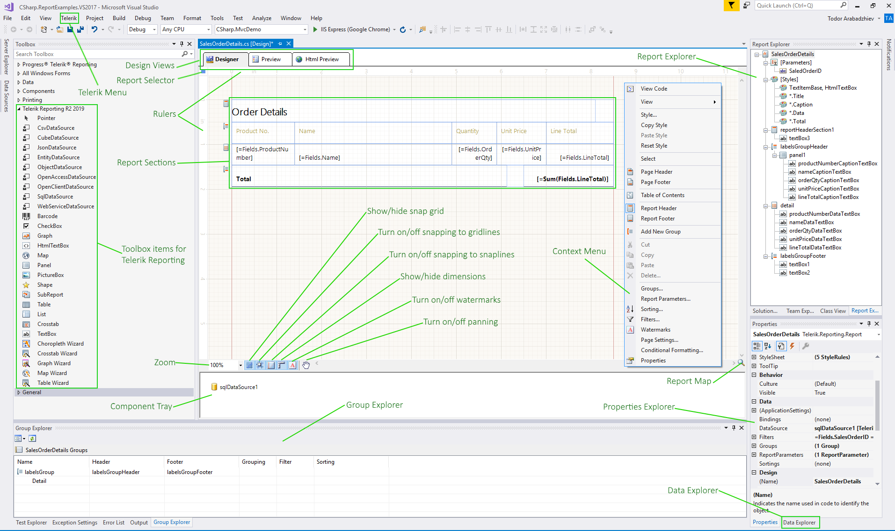

## Tooltip Buttons

Both designers provide a toolbar at the bottom of the design surface for zoom and layout aids. The following image shows the **.NET Framework designer's** toolbar:

In the .NET designer, the toolbar also supports the snap grid, snapping to gridlines and snaplines, dimensions, watermarks, and panning. The screenshots below illustrate these layout aids.

### Zoom

The .NET designer uses zoom-out and zoom-in buttons with a percentage label instead of a combo box.

In the .NET Framework designer, select the zoom percentage from the combo box. You can also hold `Ctrl` and use the mouse wheel. The following image shows this combo box:

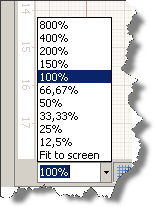

### Show/Hide the Snap Grid

The button shows or hides the **snap grid** in both designers. Grid visibility and snapping are separate options; use the gridline-snapping button to control whether objects snap to the grid.

The following .NET Framework example shows the grid:

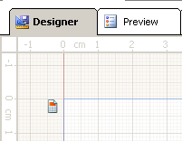

### Turn On/Off Snapping to Gridlines

This option allows you to drag objects on the design surface and have them snap to the grid lines shown on the designer's surface. The snapping will be applied regardless of the visibility of the snap grid.

### Turn On/Off Snapping to Snaplines

When this option is enabled, it allows you to drag objects on the design surface and snap them to the margins or alignment lines (red dashed line) of other objects within the same container element such as a layout panel, column, and row dividers in a grid panel. If a container has padding applied, it will be taken into account when snapping an object inside the container.

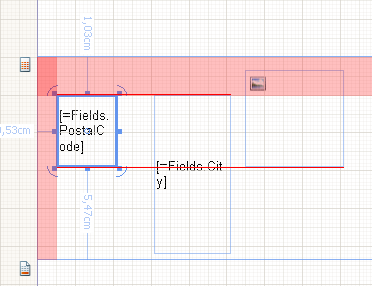

### Show/Hide Dimensions

Use this option to display dimensions for the selected item. In the .NET designer, the dimensions show distances to the edges of the item's parent container. Location dimensions are not displayed for items inside a Table.

The following .NET Framework example shows dimensions for a selected item:

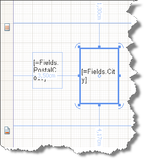

### Show/Hide Watermarks

If enabled, the report watermarks will be shown in the designer. Note that the displayed watermarks are just for reference and their contents may not look the same as when rendered.

### Turn On/Off Pan

This option allows you to switch between drag and pan mode in the designer. When enabled, the cursor is changed to a hand, and clicking and dragging on the designer surface will move the report contents. This tool is useful when working on higher zoom levels.

## Show/Hide the Report MiniMap

The report minimap is available only in the **.NET Framework designer**. The .NET designer does not provide this feature.

In the lower-right corner of the .NET Framework design surface, click **Show MiniMap** to navigate a zoomed report. Click the design surface to close the minimap.

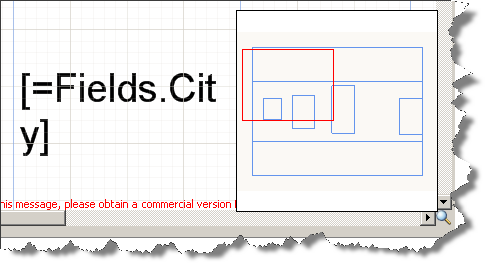

## Change the Alignment of an Element

Alignment determines how an element resizes. For example, a left-aligned element stretches to the right as the parent layout container gets resized. To change the alignment of an element use the __Layout__ toolbar and do *one* of the following:

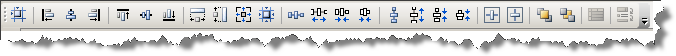

* Select two report items and change their `HorizontalAlignment` by clicking __Left__, __Center__, __Right__, or __Stretch__.
* Select two report items and change their `VerticalAlignment` by clicking __Top__, __Center__, __Bottom__, or __Stretch__. You can also change alignment by moving an element on the design surface.

For access to **Properties**, **Report Explorer**, **Group Explorer**, and **Data Explorer**, see [Explorer Windows](#explorer-windows).

>note For the .NET Framework designer in Visual Studio 2022, ensure that the report project's `Platform target` is not `x86`. Visual Studio cannot preview 32-bit assemblies in its 64-bit process.

## See Also

* [Visual Studio Report Designer Overview](slug:telerikreporting/designing-reports/report-designer-tools/desktop-designers/visual-studio-report-designer/overview)
* [Getting Started with the Visual Studio Report Designer for .NET](slug:vs-report-designer-net-getting-started)
* [Previewing Reports in the Visual Studio Report Designer for .NET](slug:vs-report-designer-net-preview)
* [Editing .NET Reports Through a .NET Framework Project (Legacy Workaround)](slug:how-to-use-vs-designer-in-dotnet-core)
* [Standalone Report Designer Overview](slug:telerikreporting/designing-reports/report-designer-tools/desktop-designers/standalone-report-designer/overview)
* [Web Report Designer Overview](slug:telerikreporting/designing-reports/report-designer-tools/web-report-designer/overview)