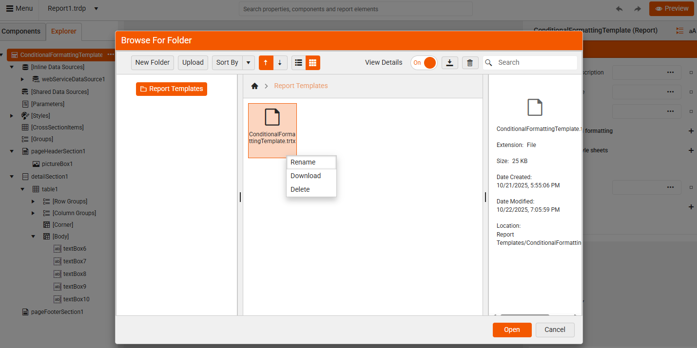

<style>
img[alt$="><"] {
  border: 1px solid lightgrey;
}
</style>

# Configuring Report Templates in Web Report Designer

|Minimum Version:|Q4 2025|
|----|----|

Web Report Designer offers functionality for working with report templates. It allows the developers to configure a specific folder for storing the report templates and to manage the access to this specific folder for certain users.

## Configure Report Templates Folder

All report templates are stored in a specific **Report Templates** folder. A default folder will be created at root level of your project. You can also navigate to a specific custom folder that contains all the report templates you wish to use.

The [ReportDesignerServiceConfiguration](#add-configuration-settings-in-the-startupcs-file) class provides a configuration setting for specifying the **TemplateDefinitionStorage**. Thus, you can navigate to a specific folder that stores all report templates:

````CSharp
services.TryAddSingleton<IReportDesignerServiceConfiguration>(sp => new ReportDesignerServiceConfiguration
{
	TemplateDefinitionStorage = new FileTemplateDefinitionStorage("templates_folder_path", new[] { "sub_folder_to_exclude" }),
});
````

>note Report templates (.trtx files) can be stored only in the configured `Report Templates` folder. Other file formats are not allowed in the folder.

## Managing Permissions

To restrict specific actions or features for users on the client side, for example to restrict `Report Templates`, the [DeniedPermissions]() setting of the **ReportDesignerServiceConfiguration** can be used. It allows developers to customize the designer experience by disabling certain tools, components, or capabilities based on application logic or user roles.

>note You can override the [GetDeniedPermissions]() method in your custom implementation of the reporting service to apply different restrictions based on the logged-in user or other conditions.

#### Restricting the Templates Folder

````CSharp
services.TryAddSingleton<IReportDesignerServiceConfiguration>(sp => new ReportDesignerServiceConfiguration
{
    DeniedPermissions = ReportDesignerPermissionsBuilder.Build(
        Permission.Commands_AssetsManager_ReportTemplates
        )
}));
````

Once the end-user is not granted permissions for the Report Templates, the following actions are available:

* Create a New Report from a Template - The **From Template** option is still *visible* but *restricted*. The restricted user is not allowed to create new or upload templates, delete or edit any existing templates. However, consuming the already existing templates is allowed.

|Restricted User|Default User|
|----|----|
||| 

* **Assets manager** - When a *restricted* user opens the Assets Manager, the `Report Templates` folder is invisible:

|Restricted User|Default User|
|----|----|
|||     

* **Save Report As** - The *restricted* end-user can only save as a **Report**. The option for saving as a **Template** is hidden. 

|Restricted User|Default User|
|----|----|
|||    

## See Also

* [How to Edit a Report Template]()
* [Working with Report Templates]()
