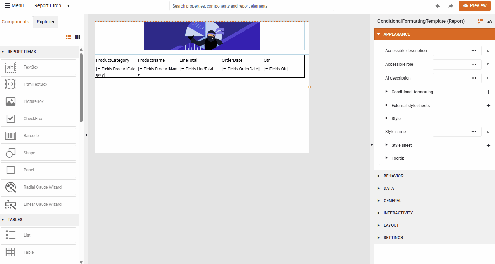

# How to Edit a Report Template in Web Report Designer

|Minimum Version:|Q4 2025|
|----|----|

To  edit an existing Report Template (.trtx file), follow the steps:  

1. Select the `New Report` option from the Menu:

	  

1. Create a Report **From Template**: 

    

1. Select the Report Template (.trtx file) you want to edit:

	 

1. Make the desired changes to the loaded predefined report

1. Save as a **Template** overwriting the previously selected .trtx file:

	   

## See Also

* [Setting up the Web Report Designer in .NET applications]()
* [Web Report Designer Customization]()
* [Report Templates in Standalone Report Designer]()
