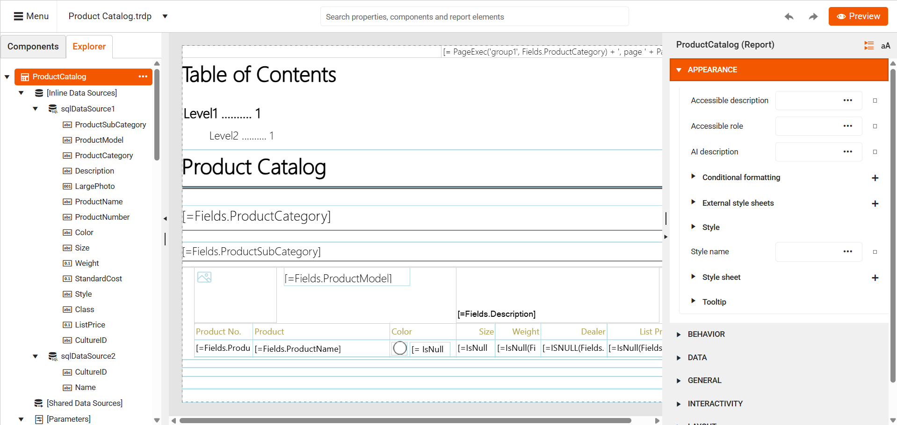
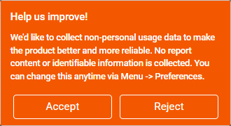

# Web Report Designer Overview

Telerik Web Report Designer is an HTML5/JavaScript/CSS3 jQuery-based widget that allows developers to [embed a report designer](https://www.telerik.com/products/reporting/embedded-reporting.aspx) into their web reporting applications. This way, every business app can enable its users to design, stylize, and preview reports without leaving the web browser. The styling is based on the Kendo UI Sass Default theme. The Telerik Web Report Designer previews reports in an HTML5 Report Viewer.

> The current version of the Web Report Designer offers beyond-basics functionality but is still under active development. Please give it a thorough review to make sure the designer fits your scenario before including it in a production project.

## Web Report Designer elements

The Web Report Designer consists of the following areas:



* `Design surface` - shows the web design report layout. Provides tools for selecting, moving, resizing, and editing the report items.
* `Menu area` - provides buttons for creating a new report and opening, saving, or previewing an already existing one. Also, allows switching between loaded reports and shows their saved state.
* `Properties area` - displays the properties of the selected report item. In case multiple items are selected, it shows only the properties that are marked as "mergeable", in other words, properties that can be applied to all items in the current selection. The list of properties can be organized in categories or in alphabetical order.
* `Components` - lists the available report components that can be added to the web design report. The items are organized in groups based on their type. The area supports two kinds of layout - grid and list. The list is the default view.
* `Explorer` - represents the web design report structure in a tree-like view. Allows the selection of the visual and non-visual report components and configures their properties.
* `Assets Manager` - enables users to organize resources in the Resource Storage of the server. Files and folders can be created, moved, renamed, and deleted, and files can also be uploaded and downloaded. It is accessible through the main menu. It is also used as an editor to select the source for a PictureBox, external stylesheets, CSV, and JSON data source, and reports for Subreport items and ReportBooks (Combined Reports).
* `Search` - provides the ability to search throughout all the designer areas: components, existing report items, or the available properties. Now you can add a new component, navigate to the needed report item, or change a property value with just a few keystrokes.
* `Onboarding Guide` - The guide will walk you through the main tools used in the Web Report Designer. The guide starts automatically when the report designer is first loaded if it has not been run before. If the user has already seen the guide, it will not start on startup. The guide can also be manually restarted through the `Search` by typing "Start Onboarding" and selecting it from the dropdown or clicking enter. The content for each step of the guide is fully localizable.

	The guide, by default, starts with the optional `Help us improve!` dialog asking the web designer user for agreement to collect non-personal usage data.

	

	The purpose of this analytical data is to gather general details on the usage of the designer's components and wizards/tools. The reason we want to analyse this data is to improve the web designer based on its actual usage feedback.

	For example, here is part of the data we collect for the [SqlDataSource]() and [its wizard]():
	+ How often do the report creators use the _SqlDataSource_ and its wizard?
	+ How much time do the users spend working with the wizard: the time between the opening and closing of the wizard. Too much time may mean the wizard is not very intuitive and needs adjustments to facilitate data source creation.
	+ Did the wizard complete successfully, i.e. with click on _Finish_ (successfully) or _Cancel_ (failure). Frequent failures in a particular step may indicate a need to improve it.

	By default, the `Help us improve!` window is allowed. The developers may disallow it by setting the [option]()) __skipCollectingUsageDataPrompt__ to __true__ (the default is _false_). The setting will force the onboarding guide to skip this window.

	The user may start/stop providing analytical data at any time. The current state of the agreement is kept by the general option __Collect non-personal usage data__ of the _Workspace Preferences_ menu item. Unchecking the option stops the collection of analytical data.

## How it works

The Web Report Designer uses a dedicated ASP.NET WebAPI REST service as a backend. The service is responsible for storage operations like creating, opening, or saving web design report definitions in a specified folder, as well as handling the various requests that concern server-side processing and rendering. The public methods of the service can be overwritten to adjust its functionality to a specific web reporting scenario.

## Requirements:

* The Web Report Designer can be integrated into ASP.NET Web Applications, both under `.NET Framework 4.6.2+` or `.NET {{site.mindotnetversion}}+`.
* The following NuGet packages are required:

	+ Telerik.Reporting
	+ Telerik.WebReportDesigner.Services

## Prerequisites:

* Web browser that supports [JavaScript EcmaScript 6](https://es6.io) : Google Chrome 77.0 or higher; Mozilla Firefox 69.0 or higher, Microsoft Edge 79 or higher.
* [jQuery](https://jquery.com/download/) __3.7.1__ or later.
* [Kendo UI for jQuery](https://www.telerik.com/kendo-jquery-ui) __{{site.kendosubsetversion}}__ or later.
* Telerik Report Viewer script. By default, it is requested from the service.
* Web Report Designer script. By default, it is requested from the service.
* All other scripts and styles will be provided by the Web Report Designer service when the designer widget is loaded. The list of loaded resources:

	+ [jQuery UI](https://jqueryui.com/) __1.12.1__ library. We recommend using the version of jQuery UI subset that is served by the Web Report Designer service because it includes a fix related to the dragging and dropping components. The subset includes Draggable, Droppable, Resizable, and their dependencies.
	+ webReportDesigner.min.css stylesheet.
	+ webReportDesignerTheme.css stylesheet.

* The web report designer in our example is stylized using [Roboto font](https://fonts.google.com/specimen/Roboto). A link to a font of your preference can be added before creating the Web Designer widget on the page.

## Kendo Widgets Requirements

Since the Web Report Designer uses [Kendo UI for jQuery](https://www.telerik.com/kendo-jquery-ui) for its template, it is possible to use it even with a custom build instead of using the entire Kendo bundle. You may do this using the [gulp build tool](https://docs.telerik.com/kendo-ui/intro/scripts/what-you-need#using-gulp).

Below you can find the list of widgets that the Web Report Designer requires in order to work properly in your web reporting application. Note that the widgets have other dependencies. The _Touch_ widget is required only for the gestures. Kendo's _MVVM_ is a set of a few Kendo classes that facilitates the process of separating the model from the view. It is used when databinding the KendoUI widgets to some model data.

Required widgets:

* Kendo MVVM
* Kendo Button
* Kendo ButtonGroup
* Kendo ComboBox
* Kendo DateInput
* Kendo DatePicker
* Kendo DateTimePicker
* Kendo DropDown
* Kendo TreeGrid
* Kendo Editor
* Kendo FileManager
* Kendo ListBox
* Kendo ListView
* Kendo Menu
* Kendo MultiSelect
* Kendo PanelBar
* Kendo Slider
* Kendo Splitter
* Kendo TabStrip
* Kendo Tooltip
* Kendo TreeView
* Kendo Upload
* Kendo Window
* Kendo Touch
* Kendo Autocomplete
* Kendo Stepper

The subset may be built with the following command:

````
gulp custom -c mvvm,button,buttongroup,combobox,dateinput,datepicker,datetimepicker,dropdowntree,grid,editor,filemanager,listbox,listview,menu,multiselect,panelbar,slider,splitter,tabstrip,tooltip,treeview,upload,window,touch,autocomplete,stepper
````

## Learn More

* [Configure Web Report Designer and Create a Basic Report]()
* [Implement a Common Master-Detail Report Scenario with the Web Report Designer]()

## See Also

* [How to set up in .NET applications]()
* [How to set up in .NET Framework application]()
