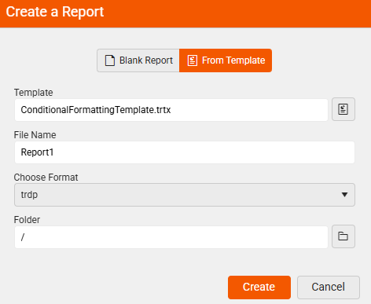
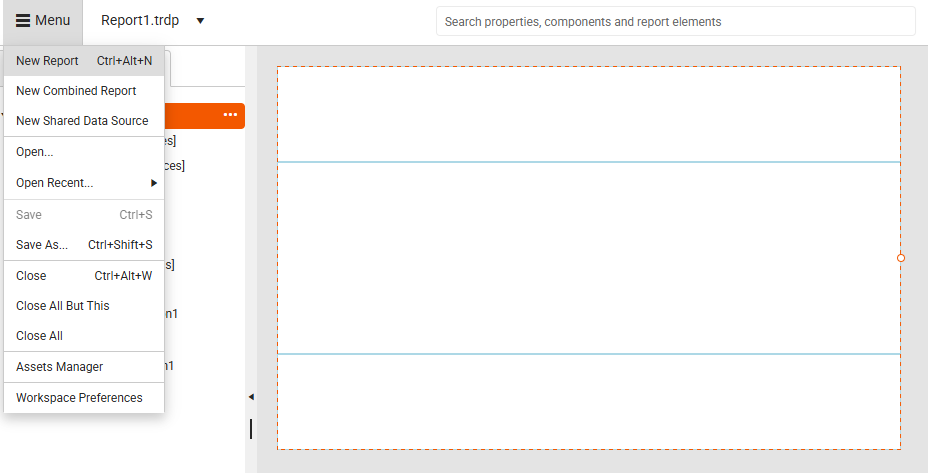
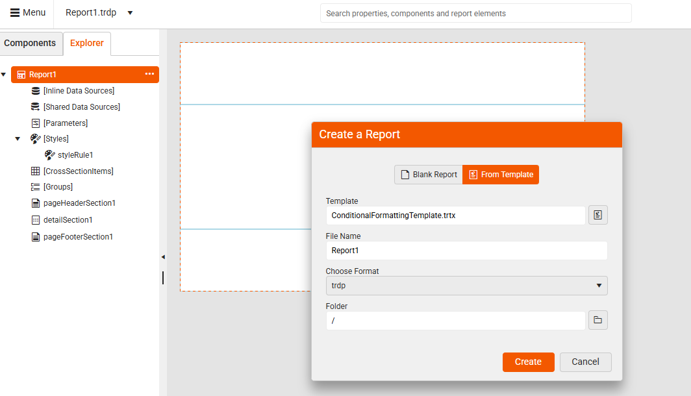
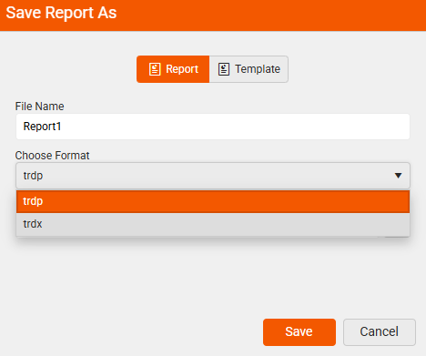

# Report Templates in Web Report Designer

|Minimum Version:|Q4 2025|
|----|----|

The main purpose of using report templates in the Telerik Web Report Designer is to help users quickly create consistent, professional-looking reports without starting from scratch every time. 

## Why Use Report Templates?

* **Save Time**: Templates provide a ready-made layout and structure, so you can focus on your data and content rather than design.

* **Ensure Consistency**: Using templates helps maintain a uniform look and feel across multiple reports - especially useful for teams or organizations.

* **Simplify Design for Non-Designers**: Even if you're not familiar with styling or layout best practices, templates give you a polished starting point.

* **Customize and Reuse**: You can modify a template to suit your needs and reuse it across different projects or departments.

* **Standardize Branding**: Templates can include your company’s logo, colors, fonts, and layout preferences - ensuring every report aligns with your brand.

## How Templates Work in Web Report Designer

When creating a new report, instead of beginning with a **Blank Report**, you can start with a .trtx **Template** file. 

|Create a Blank Report|Create From a Template|
|----|----|
| ||  

This gives you a predefined layout, styling, and structure, saving time and effort. Templates can include:
* Headers and footers
* Company branding (logos, colors, fonts)
* Predefined data regions (tables, charts, etc.)
* Style rules and formatting

This makes it easy to maintain a consistent look across multiple reports. 

### Starting from a Template

1. Select the `New Report` option from the Menu:

	   

1. Select an existing Template: When creating a new report, you can choose a template from the available list. The designer loads the layout and styles, and you can then customize the content and data bindings.
	
	 

1. Enter `File Name` and `Format`: Once the template is selected, enter an appropriate name for the report you are creating from the template and choose the `Format`:

	 

### Creating Your Own Templates

You can design a report in the Web Report Designer and save it as a template. This allows you or your team to reuse it for future reports. When you wish to save the currenty opened report, select the `Save As...` option from the Menu:

  

The end-user is presneted the option to save the report either as a `Report` (.trdp or .trdx file format), or as a `Template` (.trtx file format):

|Save As Report|Save As Template|
|----|----|
| || 
 
### Report File Formats

The file extensions **.trdp**, **.trdx**, and **.trtx** are used in Telerik Reporting to represent different types of report files. Here's a breakdown of what each one is for:

|Format| Description| Use Case|Designer Compatibility|
|----|----|----|----|
|.trdp|Full report with resources. XML-based, editable|Ideal for packaging a report with its assets (images, styles, etc.).|Used in both Web Report Designer and Standalone Report Designer.|
|.trdx|Report definition only. Packaged binary (ZIP)|Better for deployment and performance|Supported in Standalone Report Designer and Web Report Designer.|
|.trtx|XML file used as a template|Used to create new reports based on a predefined layout or style|Primarily used in Web Report Designer.|

It stands for Telerik Report Definition XML and contains the structure, layout, data bindings, and styling of a report. Unlike .trdp (which is a packaged format), .trdx is plain XML, making it easier to version control, edit manually, or generate dynamically.

## Configure Templates Folder

## Managing Permissions

## See Also

* [Report Templates in Standalone Report Designer]()
