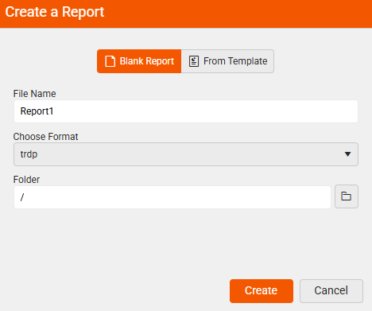
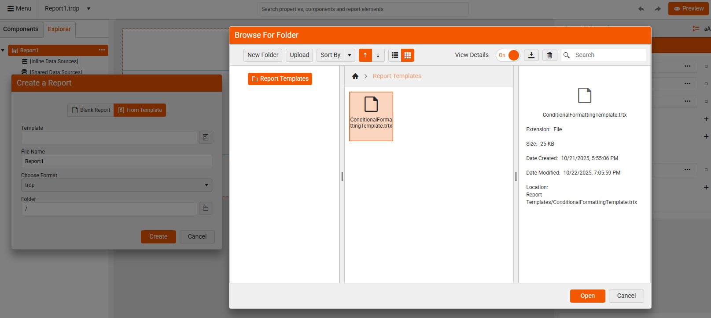
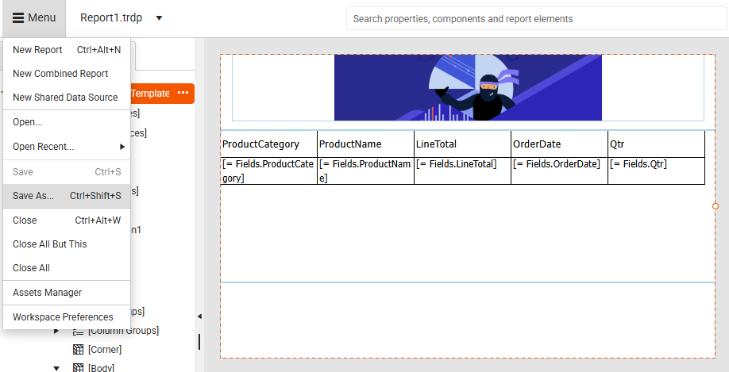
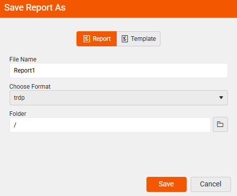

<style>
img[alt$="><"] {
  border: 1px solid lightgrey;
}
</style>

# Report Templates in Web Report Designer

|Minimum Version:|Q4 2025|
|----|----|

The main purpose of using report templates in the Telerik Web Report Designer is to help users quickly create consistent, professional-looking reports without starting from scratch every time. 

## Why Use Report Templates?

* **Save Time**: Templates provide a ready-made layout and structure, so you can focus on your data and content rather than design.

* **Ensure Consistency**: Using templates helps maintain a uniform look and feel across multiple reports - especially useful for teams or organizations.

* **Simplify Design for Non-Designers**: Even if you're not familiar with styling or layout best practices, templates give you a polished starting point.

* **Customize and Reuse**: You can modify a template to suit your needs and reuse it across different projects or departments.

* **Standardize Branding**: Templates can include your company’s logo, colors, fonts, and layout preferences - ensuring every report aligns with your brand.

## How Templates Work in Web Report Designer

When creating a new report, instead of beginning from scratch with a **Blank Report**, you can start with a .trtx **Template** file. 

|Create a Blank Report|Create From a Template|
|----|----|
| ||  

This gives you a predefined layout, styling, and structure, saving time and effort. Templates can include:
* Headers and footers
* Company branding (logos, colors, fonts)
* Predefined data regions (tables, charts, etc.)
* Style rules and formatting

This makes it easy to maintain a consistent look across multiple reports. 

### Starting from a Template

1. Select the `New Report` option from the Menu:

	   

1. Select an existing `Template`: When creating a new report, you can choose a template from the available list. The designer loads the layout and styles, and you can then customize the content and data bindings.
	
	 

1. Enter `File Name` and `Format`: Once the template is selected, enter an appropriate name for the report you are creating from the template and choose the `Format`:

	 

### Creating Your Own Templates

You can design a report in the Web Report Designer and save it as a template. This allows you or your team to reuse it for future reports. When you wish to save the currenty opened report, select the `Save As...` option from the Menu:

  

The end-user is presneted the option to save the report either as a `Report` (.trdp or .trdx file format), or as a `Template` (.trtx file format):

|Save As Report|Save As Template|
|----|----|
| || 
 
### Report File Formats

The file extensions **.trdp**, **.trdx**, **.trtx** and **.trbp** are used in Telerik Reporting to represent different types of report files. Here's a breakdown of what each one is for:

|Format| Description| Use Case|Designer Compatibility|
|----|----|----|----|
|.trdp|**T**elerik **R**eport **D**efinition **P**ackage - Full report with resources. XML-based, editable|Ideal for packaging a report with its assets (images, styles, etc.).|Used in both Web Report Designer and Standalone Report Designer.|
|.trdx|**T**elerik **R**eport **D**efinition **X**ML - Report definition only. Packaged binary (ZIP)|Better for deployment and performance|Supported in Standalone Report Designer and Web Report Designer.|
|.trtx|**T**elerik **R**eport **T**emplate **X**ML - XML file used as a template|Used to create new reports based on a predefined layout or style|Supported in Standalone Report Designer and Web Report Designer.|
|.trbp|**T**elerik **R**eport **B**ook **P**ackage - Stores a report book - a collection of multiple reports|Used when you want to combine several reports into one document (e.g., for printing or exporting)|Standalone Report Designer (and programmatically)|

The report template format **.trtx** stands for Telerik Report Definition XML and contains the structure, layout, data bindings, and styling of a report. Unlike .trdp (which is a packaged format), .trdx is plain XML, making it easier to version control, edit manually, or generate dynamically.

## Configure Report Templates Folder

If your application doesn't have a specific **Report Templates** folder setup, a default one will be created at root level of your project. You can also navigate to a specific custom folder that contains all the report templates you wish to use.

The [ReportDesignerServiceConfiguration](#add-configuration-settings-in-the-startupcs-file) class provides a configuration setting for specifying the **TemplateDefinitionStorage**. Thus, you can navigate to a specific folder that stores all report templates:

````CSharp
services.TryAddSingleton<IReportDesignerServiceConfiguration>(sp => new ReportDesignerServiceConfiguration
{
	TemplateDefinitionStorage = new FileTemplateDefinitionStorage("templates_folder_path", new[] { "sub_folder_to_exclude" }),
});
````

>note Report templates (.trtx files) can be stored only in the configured `Report Templates` folder. Other file formats are not allowed in the folder.

## Managing Permissions

To restrict specific actions or features for users on the client side, for example to restrict `Report Templates`, the [DeniedPermissions]() setting of the **ReportDesignerServiceConfiguration** can be used. It allows developers to customize the designer experience by disabling certain tools, components, or capabilities based on application logic or user roles.

>note You can override the [GetDeniedPermissions]() method in your custom implementation of the reporting service to apply different restrictions based on the logged-in user or other conditions.

#### Restricting the Templates Folder

````CSharp
services.TryAddSingleton<IReportDesignerServiceConfiguration>(sp => new ReportDesignerServiceConfiguration
{
    DeniedPermissions = ReportDesignerPermissionsBuilder.Build(
        Permission.Commands_AssetsManager_ReportTemplates
        )
}));
````

Once the end-user is not granted permissions for the Report Templates, the following actions are available:

* Create a New Report from a Template - The **From Template** option is still *visible* but *restricted*. The restricted user is not allowed to create new or upload templates, delete or edit any existing templates. However, consuming the already existing templates is allowed.

|Restricted User|Default User|
|----|----|
||| 

* **Assets manager** - When a *restricted* user opens the Assets Manager, the `Report Templates` folder is invisible:

|Restricted User|Default User|
|----|----|
|||     

* **Save Report As** - The *restricted* end-user can only save as a **Report**. The option for saving as a **Template** is hidden.

|Restricted User|Default User|
|----|----|
|||    

## See Also

* [How to Edit a Report Template]()
* [Setting up the Web Report Designer in .NET applications]()
* [Web Report Designer Customization]()
* [Report Templates in Standalone Report Designer]()
