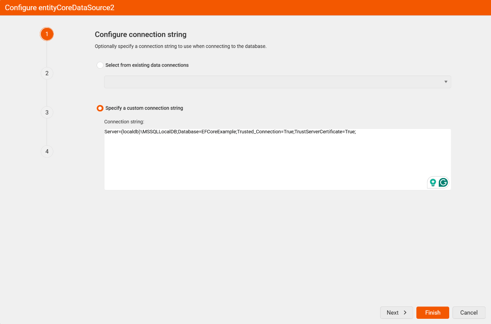
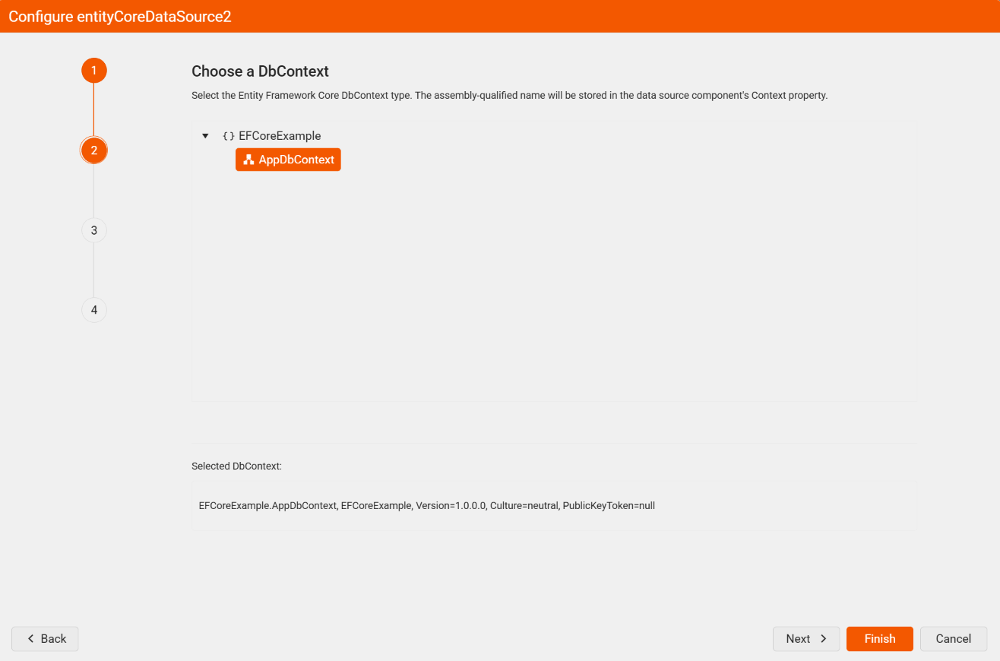
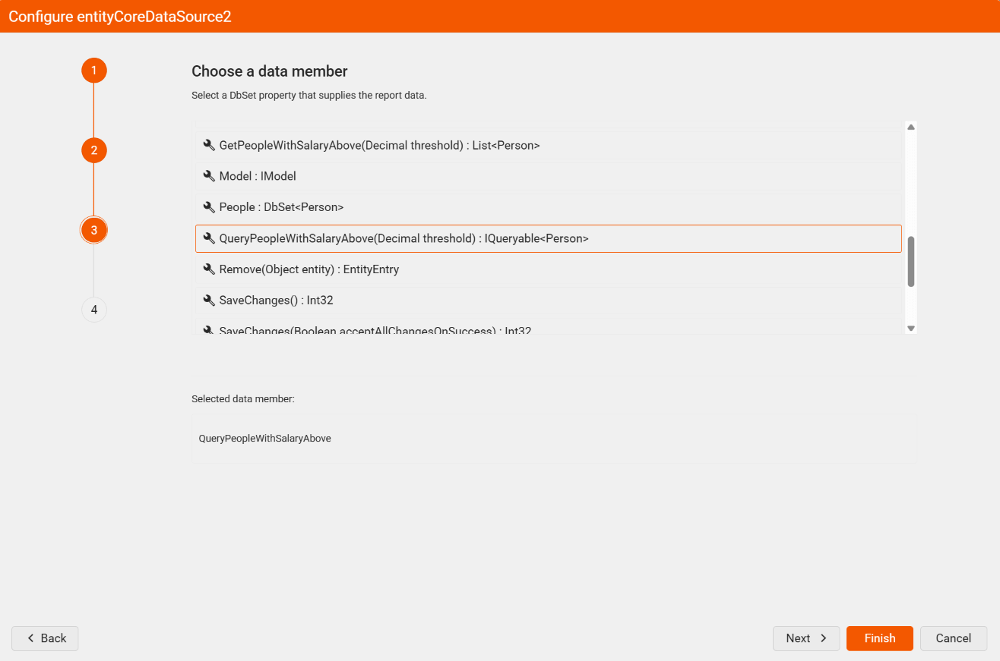
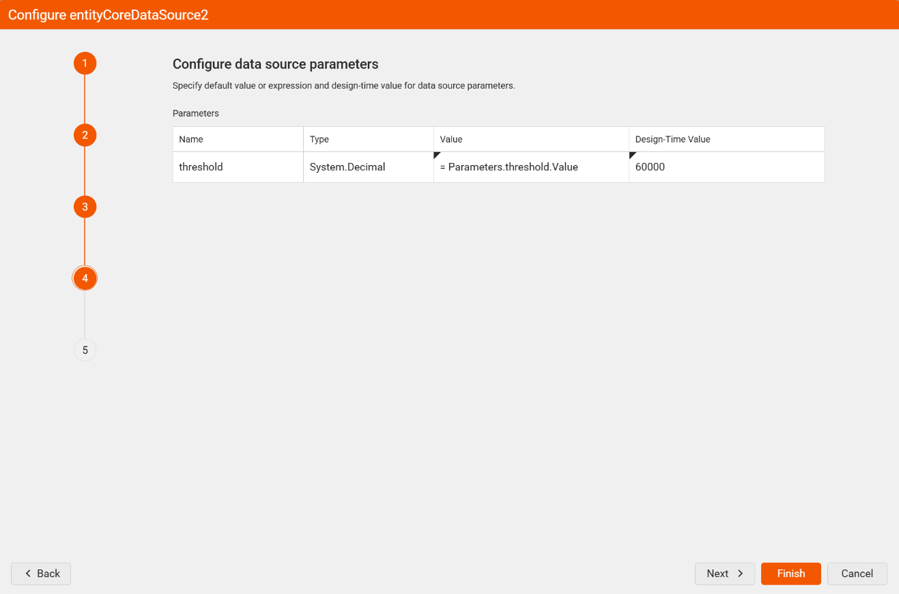
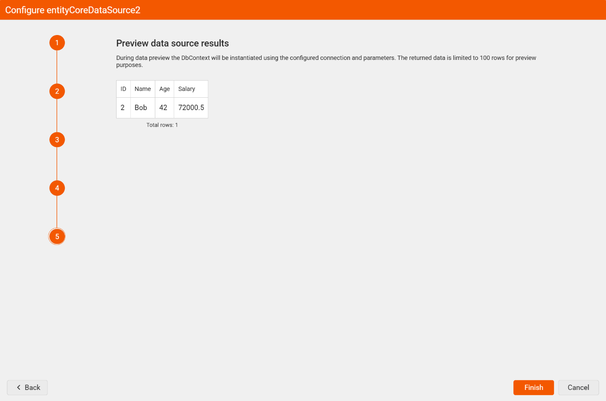

# EntityCoreDataSource Wizard Overview

The **EntityCoreDataSource Wizard** allows you to create a new or edit an existing `EntityCoreDataSource` component in the Telerik Web Report Designer. This article describes how to bind a report to an [Entity Framework Core](https://learn.microsoft.com/en-us/ef/core/) `DbContext` through the wizard that you can invoke from the Web Report Designer toolbox of components.

> For the Web Report Designer to be able to instantiate your `DbContext`, the type must expose a public parameterless constructor and you must provide an [IDesignTimeDbContextFactory<TContext>](https://learn.microsoft.com/en-us/ef/core/cli/dbcontext-creation#from-a-design-time-factory) implementation in the same assembly. If you rely on `OnConfiguring` to supply the connection string, the connection used at design time will be the one configured there.

## Configuring the DbContext Assembly in the Web Report Designer

When started, the application that hosts the Web Report Designer will try to resolve the registered assemblies. Resolving them means that the .NET runtime will try to load the assemblies into the application domain.

1. Add the `DbContext` class library as a reference to the host project, or copy it through a post-build action to the output directory of the application. If the assembly depends on other assemblies (for example, the Entity Framework Core runtime and its database provider), you must also make sure that the dependent assemblies are available next to it.
1. Register the assembly in the application configuration file so the designer can discover the `DbContext` types it contains.

	The default .NET application's configuration is the `appsettings.json` file:

	```JSON
	"telerikReporting": {
		"assemblyReferences": [
			{
				"name": "EFCoreExample"
			}
		]
	}
	```

	Another option is a custom implementation of the [IConfiguration](https://learn.microsoft.com/en-us/dotnet/api/microsoft.extensions.configuration.iconfiguration) interface.

The configuration is ready. The next step is to run the wizard.

## Adding the EntityCoreDataSource Through the Wizard

After you have registered the assembly, run the Web Report Designer project. Go to the **Components** tab and click **Entity Core Data Source**. Follow the steps below to complete the wizard:

1. **Configure connection string**. In this step you have to point the wizard to the assembly (`.dll`) that contains the Entity Framework Core `DbContext` you want to use. The designer loads the assembly together with its dependencies so that the wizard can enumerate the available `DbContext` types and their members.

	

1. **Choose a DbContext** — The wizard lists the `DbContext` types discovered in the registered assemblies, grouped by namespace. Select the context, and click **Next**.

	> If the desired `DbContext` type does not appear in the list, make sure that the host application has been rebuilt, that the assembly is registered in the configuration file, and that all its dependencies (including the Entity Framework Core runtime and the database provider) are resolvable.

	

1. **Choose a data member** — Select a member of the chosen `DbContext` that is responsible for data retrieval. You can choose either a property that returns the desired entities directly (typically a `DbSet<T>`, such as **Products**) or a method that executes business logic against the model to obtain the data for the report. Click **Next**.

	

1. **Configure data source parameters** — If the selected member is a method with parameters, each argument corresponds to a data source parameter. This step is skipped when the selected member has no parameters.

	For each parameter, specify:
	* `Value`: a constant value, an expression, or create a new `ReportParameter` whose value will be assigned automatically.
	* `Design Time Value`: a constant value to be used at design time when the designer needs to execute the member to obtain the schema or to preview data. At design time there is no expression context, so expressions are not supported and the values must be constant. These values do not affect execution at run time.

	> The names and types of the defined parameters must match exactly the arguments of the selected method. Otherwise, the `EntityCoreDataSource` component will not be able to resolve or call the method correctly and will raise an exception at run time.

	

1. **Preview data source results** — Preview the data returned by the configured `DbContext` member using the design-time parameter values. This is the last step of the wizard. After you press **Finish**, the wizard will configure the `EntityCoreDataSource` component with the specified settings and close.

	

## Displaying the Data

As a final step, display the data from the `EntityCoreDataSource` in the report:

1. From the **Explorer** tab, click the Report.
1. From the Properties pane, go to **Data** > **DataSource** and select the `EntityCoreDataSource`.
1. Drag the fields from the **Explorer** tab onto the report and click **Preview**.

## See Also

- [ObjectDataSource Wizard in the Web Report Designer](slug:telerikreporting/designing-reports/report-designer-tools/web-report-designer/tools/objectdatasource-wizard)
- [EntityCoreDataSource Wizard in the Standalone Report Designer for .NET](slug:desktop-entitycoredatasource-wizard)
- [EntityCoreDataSource Component Overview](slug:entitycoredatasource-overview)
