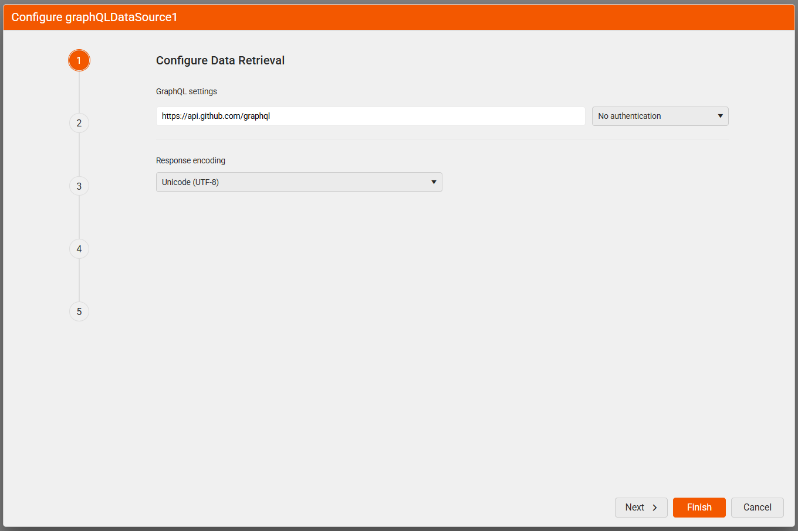
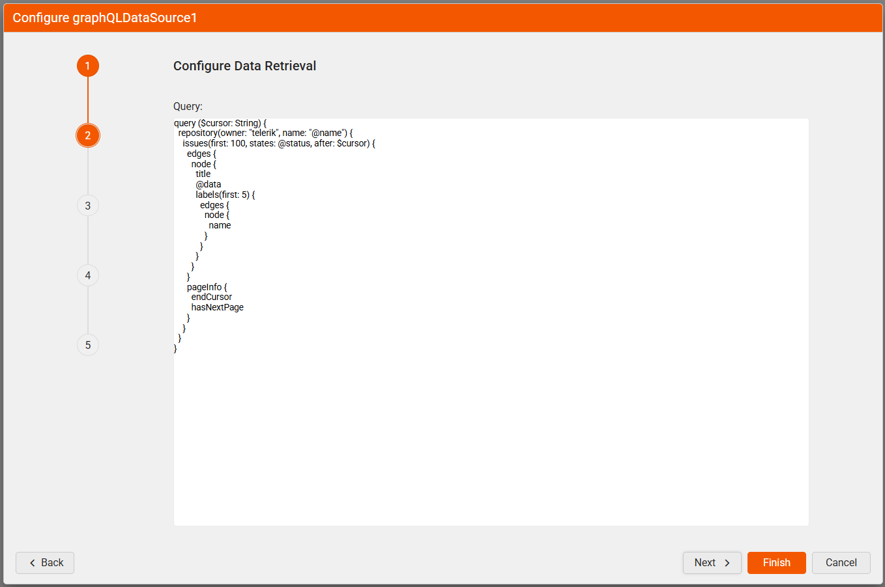
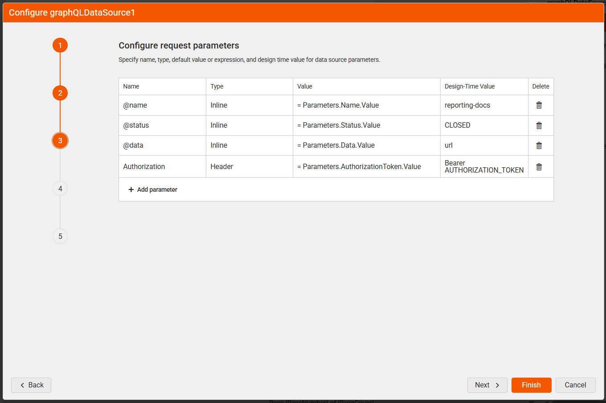
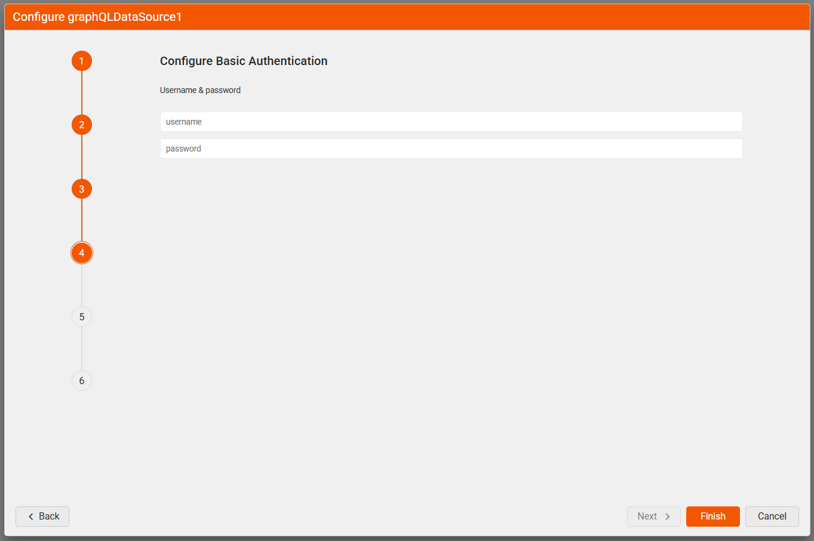
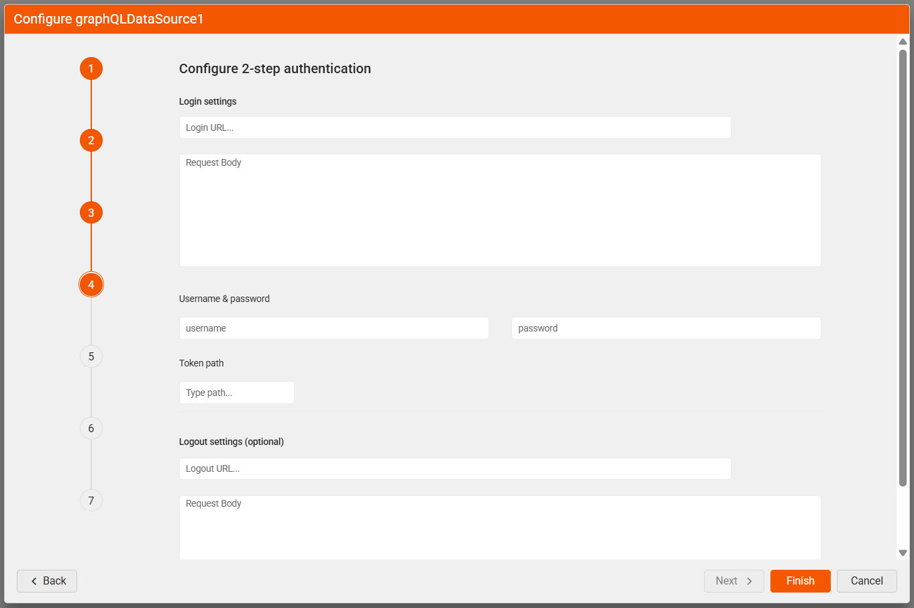

# GraphQLDataSource Wizard Overview

The GraphQLDataSource Wizard allows you to create new or edit existing [GraphQLDataSource components]() in the [Telerik Web Report Designer]().

## Wizard Flow Summary

| Authentication Type | Steps Displayed |
|---------------------|-----------------|
| None                | Data Retrieval → GraphQL Query → Request Parameters → Design-Time Data → Preview |
| Basic               | + Basic Authentication |
| 2-Step              | + 2-Step Authentication + 2-Step Auth Parameters |

### Configure Data Retrieval: Part 1

Configure the HTTP request properties used to retrieve data from the GraphQL service.

| Setting | Description |
| ------ | ------ |
|Service URL|The URL the request is sent to. Returns the data from the GraphQL service.|
|Authentication Type|The authentication type. Supported options are Basic and 2-Step authentication.|
|Response Encoding|Data encoding. The default is UTF-8.|

### Configure Data Retrieval: Part 2

Define the GraphQL query to be sent to the service. You can write a static query or use inline parameters to inject values dynamically.

### Configure Request Parameters

Define parameters for the HTTP request. The supported types are Query, Header, Cookie, and Inline. The inline parameters are parameters that are used to replace parameter tokens (@param1) in the URL and the GraphQL Query fields with an expression result or static value. For more information about the different types of parameters, refer to [Using Parameters in the GraphQLDataSource]().

### Configure Basic Authentication (Optional)

> This step is skipped unless you choose `Basic` authentication in the first step of the wizard.

Enter the credentials for basic authentication.

| Setting | Description |
| ------ | ------ |
|Username|The username used to authenticate. Required.|
|Password|The password used to authenticate.|

### Configure 2-Step Authentication (Optional)

>note This step is skipped unless you choose `2-Step` authentication in the first step of the wizard.

Set up the settings for the 2-step (Bearer) authentication.

| Setting | Description |
| ------ | ------ |
|Login URL|Returns the authentication token or session key. Required.|
|Login Body|The body of the login HTTP request.|
|Username|The username used to authenticate. Needed only if the Login URL uses Basic Authentication.|
|Password|The password used to authenticate.|
|Token Path|A regular expression to retrieve the authentication or session key from the response.|
|Logout URL|Called if the resource features a lockout for too many sessions.|
|Logout Body|The body of the logout HTTP request.|

### Configure Authentication Parameters (Optional)

>note This step is skipped unless you choose `2-Step` authentication in the first step of the wizard.

Specify parameters for the authentication HTTP request. The supported types are Query, Header, Cookie, and Inline, like in the [Configure Request Parameters step](#configure-request-parameters).

### Choose Design-Time Data

Choose the source of design-time data (used, for example, to display available data source fields in the [Edit Expression dialog]()). The available options are:

* **Use real data while designing the report** – HTTP requests are sent to the GraphQL service during design time to retrieve the data.
* **Upload JSON file** – Use an external JSON file for the data. The URI can be relative or absolute.
* **Use JSON inline as hard-coded data while designing the report** - Use a hard-coded JSON string.

>tip Use an external JSON file or hard-coded data if the GraphQLDataSource component relies on a token that needs to be updated dynamically through report parameters. Report parameters can be used only at runtime.

### Preview Data Source Results

Preview the data returned based on the current configuration. Optionally, specify a JSONPath expression to filter the result.

| Setting | Description |
| ------ | ------ |
|Data Selector|The [JSONPath](https://www.newtonsoft.com/json/help/html/QueryJsonSelectTokenJsonPath.htm) expression string used to query the data. For more information, refer to [How to Use JSONPath to filter JSON data]().|

## See Also

* [GraphQLDataSource Component Overview]()
* [Using JSONPath to Filter JSON data]()
* [Using Parameters with GraphQLDataSource]()
