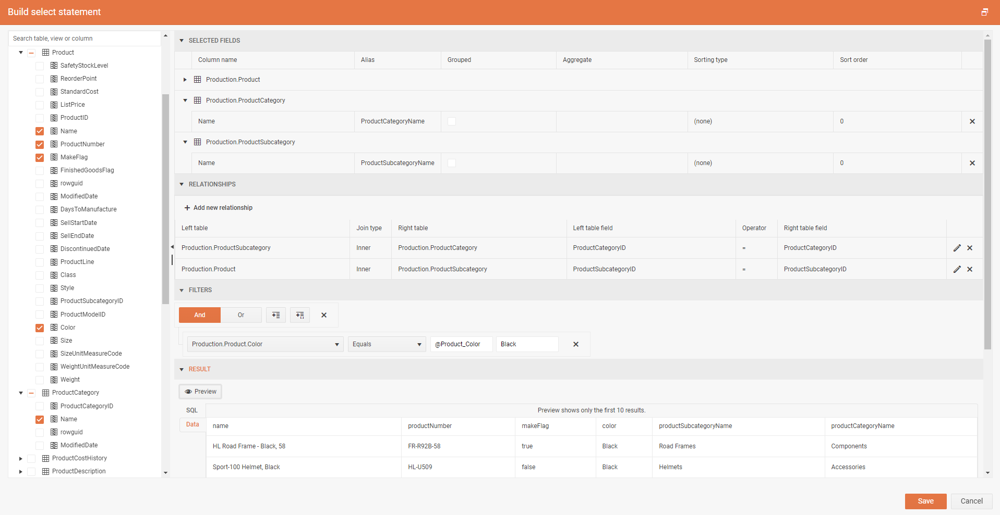

# Web Report Designer Query Builder

The Web Report Designer provides both a graphical and a text-based query builder to help you create queries to retrieve data from a relational database for a SqlDataSource component. The Query Builder supports any ADO.NET/ODB/OLEDB data provider with a working implementation of `GetSchema` with COLUMN collection support.

The following figure shows the graphical query builder.

Use the graphical query builder to explore the database tables and views, interactively build SQL SELECT statements, and view the result. The select statement specifies the database tables, views and columns from which to retrieve data for an [SqlDataSource component](). If you choose multiple related tables, you need to specify the relationship between each set of two tables.

## Query Builder Panes

The following sections describe the function of each pane.

* [Database View](#database-view-pane) Displays a hierarchical view of tables and views that are organized by database schema.
* [Selected Fields](#selected-fields-pane) Displays the list of database field names from the selected items in the Database View pane.
* [Relationships](#relationships-pane) Displays a list of relationships between the selected tables.
* [Filters](#filters-pane) Displays a list of filter criteria for tables or views.
* [Result](#result-pane) Displays sample data for the automatically generated query.

### Database View Pane

The __Database View__ pane is positioned on the left-hand side of the form. It displays the metadata for database objects that you have permission to view. The permission is determined by the data source connection and credentials. The hierarchical view displays database objects organized by database schema. Expand the node for each schema to view tables and views. Expand a table or view to display its columns. 

The columns checked in this pane are automatically transferred to the Selected Fields pane. If a table is checked, all of its columns will be transferred to the Selected Fields pane.
The relationship editor opens automatically when more than one table is checked.

### Selected Fields Pane

The __Selected Fields__ pane displays the selected columns to include in the query. The fields displayed in this pane become the field collection for the report data item. These fields represent the data you can display in tables, graphs, and other report items when you view a report.

The following columns are displayed:

* __Column name__ Displays the selected field names grouped by the table or view they belong to.
* __Alias__ The alias to use for the field. The alias will be automatically generated if the last added field name is already in use. Additionally, field aliases can be changed or added manually.
* __Grouped__ Displays a checkbox that indicates whether the field should be used in a grouping statement.
* __Aggregate__ Displays the aggregate to be applied to the field _(a grouped field cannot have an aggregate)_. The available options are `Count`, `Max`, `Min`, `Average`, and `Sum`. By default, the `Sum` aggregate will be applied to all fields that are not part of the query's grouping statement when the `Grouped` checkbox of a field is ticked.
* __Sorting type__ Displays the sorting type to be applied to the field. The available options are `(none)`, `Ascending`, and `Descending`. By default, the `(none)` option is selected, indicating that the selected statement will not be sorted based on the current field.
* __Sort order__ Displays the order in which the field sortings should be applied.
* __Remove__ Contains a button to remove the current field from the select query. Removing the field requires confirmation.

### Relationships Pane

The __Relationships__ pane displays the SQL JOIN statements that need to be created for the selected tables.

The following option is available:

* __Add new relationship__ Opens the relationship editor used to define relationships between tables or views. Each relationship generates a join clause in the query. When using multiple relationships in a query, one of the tables in each relationship, except the first one, must be referenced in preceding relationships.

The following columns are available:

* __Left table__ Displays the name of the first table that is part of the join relationship.
* __Join type__ Displays the type of SQL join statement that is used in the automatically generated query. The available join types are `Inner`, `Left`, `Right`, `Outer`, and `Unrelated`.
* __Right table__ Displays the name of the second table that is part of the join relationship.
* __Left table field__ Indicates which field from the left table should be used in the join statement.
* __Operator__ Displays the operator used on the left and right fields from the joined tables.
* __Right table field__ Indicates which field from the right table should be used in the join statement.
* __Edit/Remove__ Contains buttons to edit or remove the current relationship.

### Filters Pane

The __Filters__ pane displays the criteria used to limit the number of data rows that are retrieved at runtime. Criteria specified in this pane are used to generate an SQL WHERE clause.

The following options are available:

* __Logical operator__ Choose the logical operator used between the filter expressions in the current group. The available options are `And` and `Or`.
* __Add Expression__ Add a new filter expression to the current group.
* __Add Group__ Add a new filter group that can have a different logical operator. Filter groups can be defined hierarchically.
* __Close__ Remove the current filter group and all of its child filter expressions.

The following columns are displayed:

* __Field Name__ Displays the name of the field to apply the criteria.
* __Operator__ The operator to use in the filter expression.
* __Value/Parameter name__ The value or parameter name to add to the query.
* __Preview value__ The value to use for the _Result_ pane.
* __Delete__ Remove the current filter expression from the expression group.

### Result Pane

The __Result__ pane displays the automatically generated query that is specified by selections in the other panes. It can also preview the data returned after executing the query. The columns in the result set are the fields that you specify in the _Selected Fields_ pane.

The data is not saved in the report definition. The actual data in the report is retrieved when the report is processed.

The following options are available:

* __Preview button__ Preview the automatically generated query or the data returned by it based on the selections in the other panes.
* __SQL/Data switch__ Choose between previewing the automatically generated SQL query or the data returned by it.

## Query Builder State

After clicking _Save_, the [SqlDataSource Wizard]() Select Statement will be replaced with the currently generated SQL query.

The Query Builder keeps the current setup state. However, if you modify the SQL query outside it and then use the Query Builder, it will override the manual SQL query modifications.

> The functionalities of the __Web Report Designer Query Builder__ and [__Standalone Report Designer Query Builder__]() are not identical. Thus, if a report that has been edited by the Query Builder of the Web Report Designer is opened in the Query Builder of the Standalone Report Designer, an error message about an inconsistent query state may be shown.

## See Also

* [Web Report Designer Overview]()
