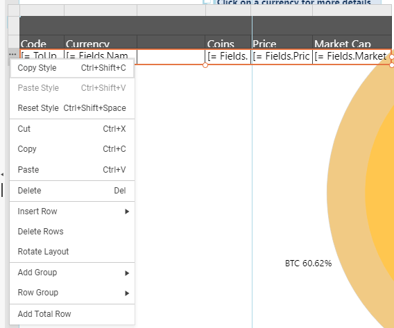

# Web Report Designer Table Context Menu

The table context menu may be opened from the ellipses (`...`) displayed when you hover over the corresponding table, table column, or table row. The exact options in the menu depend on the selected table part - see [Crosstab Areas](). They are determined by the static and dynamic groups the column/row falls in, whether there are merged cells, etc.

## Context Menu for the entire Table item

Hover over the top left table corner known as the __Corner area__ to open the Context Menu for the entire table

The context menu items are:

* __Copy, Paste, Reset Style__: Use to copy the style from one table to another, or reset to the default style.
* __Bring To Front/Send To Back:__ Allows you to change the order of the items in the items collection of a section. Use when the table overlaps with another item to determine which one should stay on the top.
* __Cut, Copy, Paste__: Use to copy the entire table.
* __Delete__: Delete the corresponding table.

## Context Menu for a Table Column

Hover over the top right corner of the specific table column in the __Column Groups area__ to open its Context Menu.

The context menu items are as follows. Some of the options may be hidden or disabled, depending on the context, for example, the static and dynamic groups the column falls in:

* __Copy, Paste, Reset Style__: Use to copy the style from one table column to another, or reset the default style.
* __Cut, Copy, Paste__: Use to copy the content from one table column to another.
* __Delete__: Delete the content of the table column.
* __Insert Column__: Let you insert a new column. Available options: `Left` or `Right` of the current one.
* __Insert Row__: Let you insert a new row. Available options: `Above` or `Below` the current one.
* __Delete Columns__: Use to delete the corresponding columns.
* __Delete Rows__: Use to delete the corresponding rows.
* __Rotate Layout__: Rotate the table so that its columns become rows and vice-versa.
* __Add Group__: Use to add Row/Column group. Available options for `Row Group` / `Column Group`: `Parent`, `Child`, `Adjacent Above/Left` or `Adjacent Below/Right`.
* __Move Column__: Use to move a column or selection of columns. Only columns from static groups may be moved. If there are merged cells in the column, all the columns within the merged cells will be automatically selected and moved. Works only in tables and not in crosstabs. The designer automatically detects the possible moving directions. Available options: `Move Left` and `Move Right`.

## Context Menu for a Table Row

Hover over the left top corner of the specific table row in the __Row Groups area__ to open its Context Menu.

The context menu items are as follows. Some of the options may be hidden or disabled, depending on the context, for example, the static and dynamic groups the row falls in, if there are merged cells, etc.:

* __Copy, Paste, Reset Style__: Use to copy the style from one table row to another, or reset the default style.
* __Cut, Copy, Paste__: Use to copy the content from one table row to another.
* __Delete__: Delete the content of the table row.
* __Insert Row__: Let you insert a new row. Available options:
	+ For static groups: `Above` or `Below`.
	+ When the table has dynamic groups, you may add the new row as part of the current table group: `Inside Group - Above`, `Inside Group - Below`, or outside it: `Outside Group - Above`, `Outside Group - Below`.
* __Delete Rows__: Use to delete the corresponding row.
* __Rotate Layout__: Rotate the table so that its rows become columns and vice-versa.
* __Split Cells__: Use to split the merged cells on the row.
* __Add Group__: Use to add Row/Column group. Available options: `Parent`, `Child`, `Adjacent Above/Left`, or `Adjacent Below/Right`.
* __Row Group__: Use to delete the group. You may choose whether to delete only the group or the related items as well. Available options: `Delete Group Only` and `Delete Group and Related Rows`.
* __Add Total Row__: Add a row with totals. The row will contain the Sum of the cell contents in the corresponding column when applicable.
