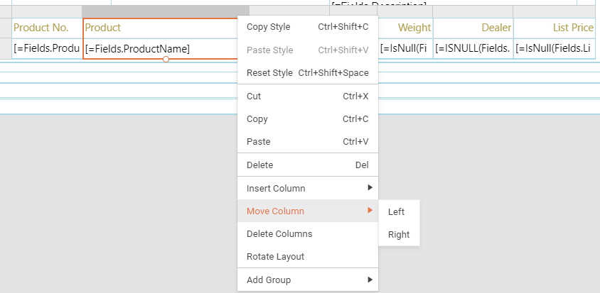

# Web Report Designer Table Context Menu

The table context menu may be opened from the ellipses(`...`) displayed when you hover over the corresponding table or table column in its:

* top left table corner for the entire table

	

* top right corner of the specific table column

	

* left top corner of the specific table row

	

The common context menu items are:

* __Copy, Paste, Reset Style__: Use to copy the style from one table or table column/row in the report to another, or reset the default style.
* __Cut, Copy, Paste__: Use to cut/copy the entire table or the content from one table column/row to another.
* __Delete__: Delete the corresponding table or the content of the table column/row.

Table context menu items

* __Bring To Front/Send To Back:__ Allow you to change the order of the items in the items collection of a section.

Table Column and Table Row context menu items

