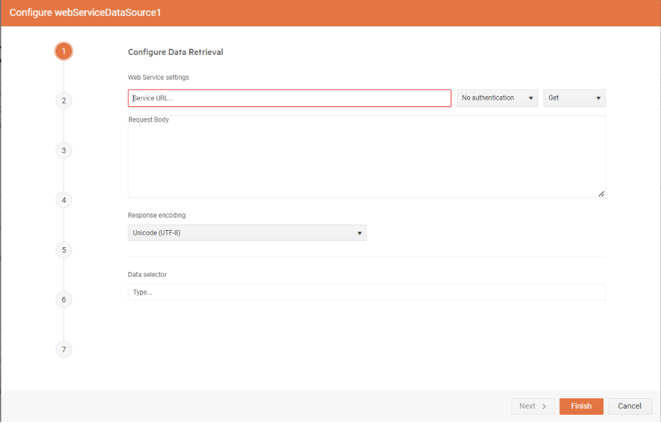
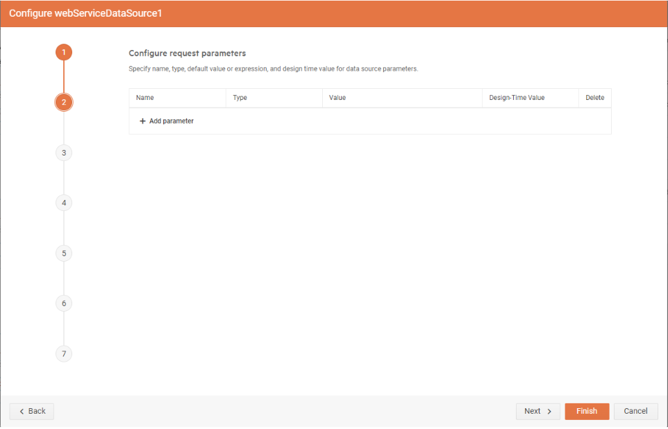
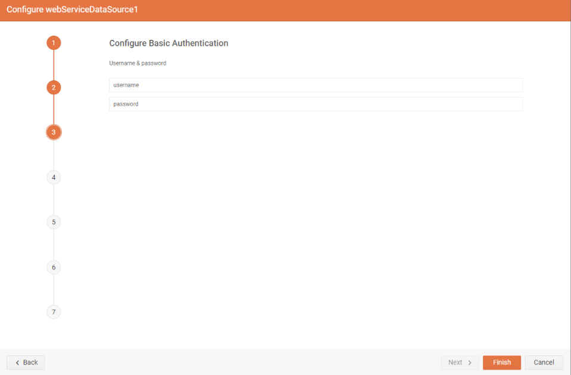
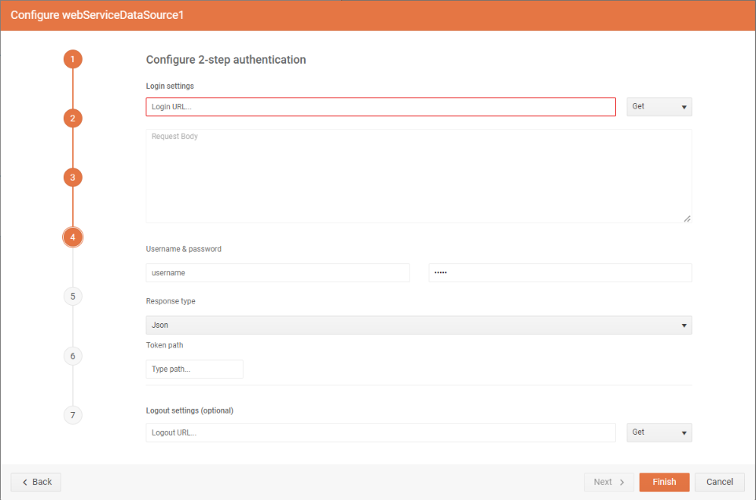
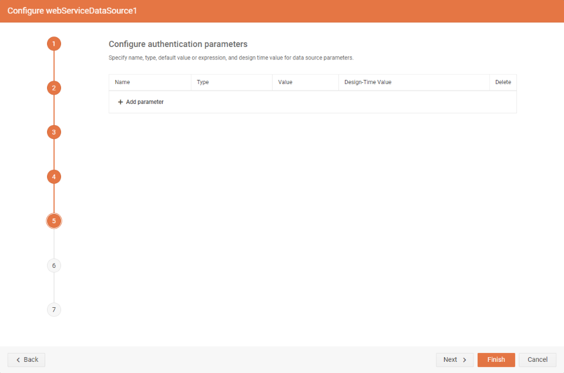
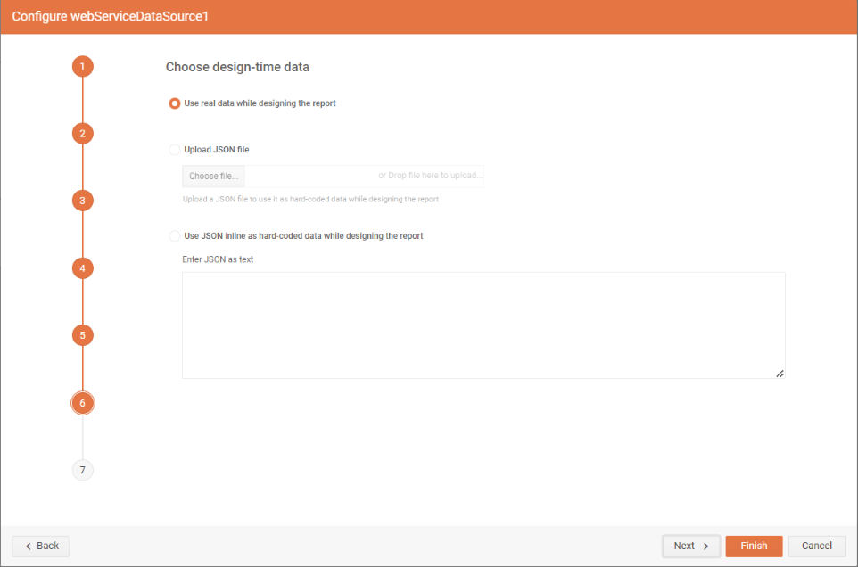
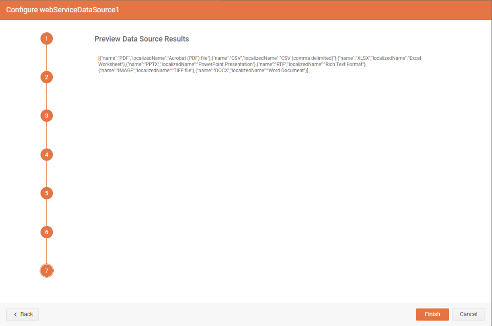

# WebServiceDataSource Wizard Overview

The WebServiceDataSource Wizard allows you to create a new or edit an existing [WebServiceDataSource component]() in the [Telerik Web Report Designer]().

### Configure Data Retrieval

This is the first step of the wizard. Here, setup the properties of the `HTTP` request which will retrieve data from the web service:

| Setting | Description |
| ------ | ------ |
|Service URL|The URL the request is sent to. Returns the data from the web service. Required.|
|Authentication Type|The authentication type. We support Basic and 2-step authentications.|
|Encoding|Data encoding. Default is UTF-8.|
|Method|HTTP request method. GET and POST are the supported methods.|
|Body|The body of the POST method. Applicable only for POST HTTP request method.|
|Data Selector|The [JSONPath](https://www.newtonsoft.com/json/help/html/QueryJsonSelectTokenJsonPath.htm) expression string which will be used to query the data. For more information please refer to [How to Use JSONPath to filter JSON data]().|

### Configure Request Parameters

In the second step of the wizard, the name, type, default value or expression, and design time value for data source parameters can be specified. The supported types for those parameters are `Query`, `Header`, `Cookie`, and `Inline`.

### Configure Basic Authentication

>note This step is skipped unless `Basic` authentication is chosen in the first step of the wizard.

In the third step of the wizard, the account credentials for basic authentication can be entered.

| Setting | Description |
| ------ | ------ |
|Username|The username used to authenticate. Required.|
|Password|The password used to authenticate.|

### Configure 2-Step Authentication

>note This step is skipped unless `2-Step` authentication is chosen in the first step of the wizard.

In the fourth step of the wizard step, the necesary settings for the `WebServiceDataSource` component to complete the 2-step (Bearer) authentication can be set. 
The following OAuth 2.0 authorization mechanisms are supported out-of-the-box:

* [Password Grant](https://www.oauth.com/oauth2-servers/access-tokens/password-grant/)
* [Client Credentials](https://www.oauth.com/oauth2-servers/access-tokens/client-credentials/)

| Setting | Description |
| ------ | ------ |
|Login URL|This URL returns the authentication token or session key that allows you to access the API. Required.|
|Username|The username used to authenticate. The username and password are needed only when the Login URL uses Basic Authentication to retrieve the authentication token/key.|
|Password|The password used to authenticate.|
|Response|Specifies the type of the expected response from the Login URL. JSON and plain text are supported.|
|Login Method|Specifies the HTTP request method to be used.|
|Token Path|This is a regular expression that allows to retrieve the authentication or session key from the response received via the Login URL. For example, when the Login URL returns a JSON response containing the authentication token in the form: *{"access_token":"cbm9W3MeTeVPuO5CIq_DTvG5KbzydpRQ","token_type":"bearer","expires_in":1799,"userName":"demouser",".issued":"Tue, 15 May 2018 08:42:32 GMT",".expires":"Tue, 15 May 2018 09:12:32 GMT"}* the token path regular expression to retrieve the token would be: *(?:"access_token":")(.*?)(?:")* |
|Logout URL|This URL is called if the resource features a lockout for having too many sessions open. Refresh the report and try again after successfully logging out.|
|Logout Method|Specifies the HTTP request method used for the Logout URL.|
|Body|The body of the login HTTP request. Applicable only for POST HTTP request method.|

### Configure Authentication Parameters

>note This step is skipped unless `2-Step` authentication is chosen in the first step of the wizard.

In the fifth step of the wizard, the parameters of the `HTTP`request for authentication can be applied. The supported types are `Query`, `Header`, `Cookie` and `Inline`.

### Choose Design-Time Data

In the sixth step of the wizard can be chosen whether the real data retrieved by making a request to the specified `URL` should be used, sample data from a `.JSON` file or an inline JSON string.

### Preview Data Source Results

In the last step of the wizard, if the configurations on the previous steps were correct, the Web Report Designer will make a request with the given settings and if successful will then display the returned JSON as a string in the wizard window. 

## See Also

* [WebServiceDataSource Component]()
* [Using Parameters with the WebServiceDataSource Component]()