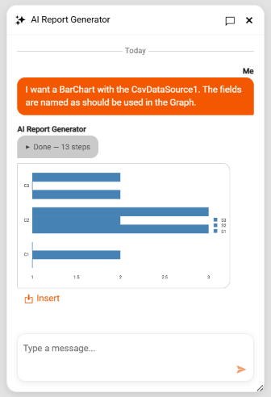

# AI-Assisted Graph and Gauge Design in the Web Report Designer

The Web Report Designer includes an **AI Assist** experience that lets you create and edit [Graph](slug:telerikreporting/designing-reports/report-structure/graph/overview) and [Gauge](slug:telerikreporting/designing-reports/report-structure/gauge/overview) items from natural-language prompts. AI Assist combines an agentic workflow, on-the-fly JSON Schemas, and validation against the Telerik Reporting item model so the generated item is data-bound, valid, and ready to apply to the report.

> note AI Assist for Graph and Gauge items is available starting with the `2026 Q2 (20.1.26.520)` Telerik Reporting release.

## Overview

AI Assist targets the report items that are most time-consuming to wire up by hand. The current scope covers the following item types:

- **Graph** — bar, line, area, pie, and other supported chart variations.
- **Radial Gauge** — radial Key Performance Indicator (KPI) gauges with ranges, scales, and pointers.
- **Linear Gauge** — linear KPI gauges with ranges, scales, and pointers.

For every supported item, AI Assist follows the same pattern. It retrieves a JSON Schema for the requested item type, asks the language model to craft a complete item definition that conforms to that schema, validates the result against the report model, and iterates until the item is valid. After you accept the proposal, the Web Report Designer applies the item through the same design-time logic that backs manual edits, including support for undo and redo.

> important Currently, the AI Assist generates only Graph and Gauge items. It does not generate full reports, data sources, parameters, or other report items.

## Opening AI Assist

To start an AI Assist session, follow these steps:

1. Open the report in the **Web Report Designer**.
1. Click on the AI Assist button at the bottom right corner of the Report area.
1. The **AI Report Generator** window pops up, replacing the button.

## Create and Edit Flows

AI Assist chooses between a Create flow and an Edit flow based on the current selection on the design surface when you open the panel.

### Create Flow

The Create flow runs when no supported Graph or Gauge item is selected. The agent receives the JSON Schema for the requested item type and the available data context, and then constructs a new item definition from scratch.

To create a new item:

1. Clear the selection, or select an unsupported item.
1. Open **AI Assist**.
1. Type a prompt that describes the visualization you need, including the data fields, metric, and intended layout.
1. Review the preview rendered with actual or sample data.
1. Click **Accept** to add the item to the report, or refine the prompt to iterate.

### Edit Flow

The Edit flow runs when a supported Graph or Gauge item is selected. The agent receives both the JSON Schema and the current item state as JSON, and produces a new full item definition that reflects your prompt.

To edit an existing item:

1. Select the Graph or Gauge item on the design surface.
1. Open **AI Assist**.
1. Type a prompt that describes the change, for example: `Switch the series to a stacked bar and add a legend on the right.`
1. Review the preview.
1. Click **Accept** to replace the item, or refine the prompt to iterate.

> tip After you accept a proposal, the resulting item state becomes the next initial state for follow-up prompts in the same chat session. Selecting a different item or report clears the item-specific context.

## How It Works: JSON Schema and Validation

AI Assist relies on a transient JSON Schema for every interaction. The schema is generated on demand through reflection over the current report item model and is not versioned. After you accept the crafted item JSON, the Web Report Designer deserializes it into the standard Telerik Report Definition (TRDX) model and stores it through the usual report lifecycle.

The schemas conform to [JSON Schema Draft 2020-12](https://json-schema.org/draft/2020-12) and follow conventions that maximize compatibility with language models:

- Each property declares `type`, a natural-language `description`, and, where relevant, `enum`, `default`, `examples`, `minimum`, `maximum`, or `format`.
- Required and optional properties are listed explicitly through `required` arrays.
- Recommended value ranges and `do` and `do-not` guidance are encoded directly in the property descriptions.
- Nested structures such as series, categories, axes, ranges, labels, and data bindings are expressed as plain nested objects and arrays in a single schema document.
- Complex constructs such as `$ref` graphs, `allOf`, `anyOf`, and `not` are avoided. The `oneOf` keyword is used sparingly when a true union of small shapes is needed.

After the agent crafts a candidate item, a validation tool deserializes the JSON against the report model and returns any errors in natural language. The agent revises the JSON and retries until the item is valid or a configured retry limit is reached.

## Data Source Usage

AI Assist uses the existing Web Report Designer tools to retrieve the available data sources and their schemas. The agent maps your natural-language intent to existing fields only and does not invent tables or columns. When required data is missing, the agent reports the gap and proposes alternatives.

> note When the preview uses sample data instead of live report data, AI Assist labels the preview clearly. Sample data is generated from the known schema of the bound data source.

## Prompting Tips and Examples

Concrete prompts produce better results than open-ended requests. Include the item type, the metric or category, the data fields, and any layout preference.

The following table lists prompt patterns for common scenarios:

| Scenario | Example Prompt |
|----------|----------------|
| Time-series line chart | `Create a line chart of monthly Sales from the Orders table for 2024, with months on the x-axis.` |
| Stacked bar chart | `Create a stacked bar chart of Revenue by Region, stacked by Product Category.` |
| KPI radial gauge | `Create a radial gauge that shows the current Customer Satisfaction score on a scale from 0 to 100, with a green range above 80.` |
| Linear gauge with thresholds | `Create a linear gauge for Server CPU usage from 0 to 100, with green up to 60, yellow up to 85, and red above 85.` |

To refine a result, describe the change in a follow-up prompt. For example, after the agent generates a bar chart, send `Switch to a horizontal layout and sort the categories descending by value.`

## Security, Privacy, and Limits

AI Assist sends the user prompt, the relevant JSON Schema, and the necessary report metadata to the configured language model. Live data values are not sent unless the chat explicitly references them.

The feature follows the existing Web Report Designer security and telemetry patterns:

- Prompt handling, schema generation, validation tooling, and data access were threat-modeled to prevent prompt-driven data exfiltration or unintended actions.
- Basic usage telemetry is collected, subject to user consent and the existing Web Report Designer analytics configuration.
- `TODO(author): document the administrator configuration switches that enable, disable, or restrict AI Assist (for example, application settings, environment variables, or service-level toggles).`

The current release has the following limits:

- AI Assist generates only Graph, Radial Gauge, and Linear Gauge items.
- AI Assist does not generate full reports, data sources, parameters, or other report items.
- The agent does not invent data fields. The bound data source must already expose the required tables and columns.
- A configurable retry limit caps how many times the agent revises an invalid item before surfacing an error.

## Next Steps

- [Designing Reports in the Web Report Designer](slug:telerikreporting/designing-reports/report-designer-tools/web-report-designer/overview)
- [Graph](slug:telerikreporting/designing-reports/report-structure/graph/overview)
- [Linear Gauge](slug:telerikreporting/designing-reports/report-structure/gauge/linear-gauge)
- [Radial Gauge](slug:telerikreporting/designing-reports/report-structure/gauge/radial-gauge)

## See Also

- [Web Report Designer Overview](slug:telerikreporting/designing-reports/report-designer-tools/web-report-designer/overview)
- [AI Coding Assistant](slug:ai-coding-assistant)
