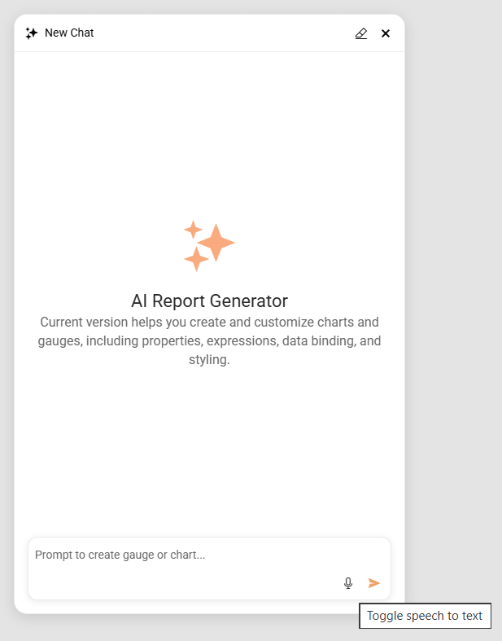

# AI-Assisted Graph and Gauge Design in the Web Report Designer

The Web Report Designer includes an **AI Report Generator** experience that lets you create and edit [Graph](slug:telerikreporting/designing-reports/report-structure/graph/overview) and [Gauge](slug:telerikreporting/designing-reports/report-structure/gauge/overview) items from natural-language prompts. AI Report Generator combines an agentic workflow, on-the-fly JSON Schemas, and validation against the Telerik Reporting item model so the generated item is data-bound, valid, and ready to apply to the report.

> note AI Report Generator for `Graph` and `Gauge` items is available starting with the `2026 Q2 (20.1.26.611)` Telerik Reporting release.

## Overview

AI Report Generator targets the report items that are most time-consuming to wire up by hand. The current scope covers the following item types:

- **Graph** — bar, line, area, pie, and other supported chart variations.
- **Radial Gauge** — radial Key Performance Indicator (KPI) gauges with ranges, scales, and pointers.
- **Linear Gauge** — linear KPI gauges with ranges, scales, and pointers.

For every supported item, AI Report Generator follows the same pattern. It retrieves a JSON Schema for the requested item type, asks the language model to craft a complete item definition that conforms to that schema, validates the result against the report model, and iterates until the item is valid. After you accept the proposal, the Web Report Designer applies the item through the same design-time logic that backs manual edits, including support for undo and redo.

> important Currently, AI Report Generator generates only `Graph` and `Gauge` items. It does not generate full reports, data sources, parameters, or other report items.

## Opening AI Report Generator

To start an AI Report Generator session, follow these steps:

1. Open the report in the **Web Report Designer**.
1. Click the **AI Report Generator** button at the bottom-right corner of the report area.
1. The **AI Report Generator** window pops up, replacing the button.


## Create, Edit, and Question Flows

AI Report Generator chooses between a **Create flow**, an **Edit flow**, and a **Question flow** based on the message you send and the current selection on the design surface when you open the panel.

### Create Flow

The **Create flow** runs when no supported `Graph` or `Gauge` item is selected. You must select the Report, or a Report Section/Item that can host the `Graph` or `Gauge`, for example, the Report Detail section, a Panel, etc.

If you select an item or section that cannot host the `Graph` or `Gauge`, the AI Report Generator will open in disabled state:


When you select a proper Report Section/Item, the AI Report Generator switches to its **Create flow**.

The agent receives the JSON Schema for the requested item type and the available data context, and then constructs a new item definition from scratch.

To create a new item:

1. Clear the selection, or select an unsupported item.
1. Open the [AI Report Generator](#opening-ai-report-generator).
1. Type a prompt that describes the visualization you need, including the data fields, metric, and intended layout.
1. The AI Generator will generate the Graph/Gauge directly in the report, or ask for clarification.
1. Review the preview rendered with actual data. If the result is not as expected, select **Undo Changes** to revert it and refine your requirements.


### Edit Flow

The **Edit flow** runs when a supported `Graph` or `Gauge` item is selected. The agent receives both the JSON Schema and the current item state as JSON, and produces a new full item definition that reflects your prompt.

To edit an existing item:

1. Select the `Graph` or `Gauge` item on the design surface.
1. Open the [AI Report Generator](#opening-ai-report-generator).
1. Type a prompt that describes the change, for example: `Switch the series to a stacked bar and add a legend on the right.`
1. Review the preview.
1. Click **Accept** to replace the item, or refine the prompt to iterate.

> tip After you accept a proposal, the resulting item state becomes the next initial state for follow-up prompts in the same chat session. Selecting a different item or report clears the item-specific context.

### Question Flow

In addition to authoring, the agent answers questions about `Graph` and `Gauge` items, their properties, and best-practice configuration. Use this flow for prompts such as `What is the difference between a Bar series and a StackedBar series?` or `Which scale type should I use for time-based data on the x-axis?`. The agent answers in plain text without modifying the report.

When a request is unrelated to Telerik Reporting or falls outside the `Graph` and `Gauge` scope (for example, "add a TextBox" or "create a Table"), the agent declines politely and points you to the standard Web Report Designer tools instead.

## How It Works: Tools, Schema, and Validation

The **AI Report Generator** is built on an agentic loop powered by `Microsoft.Extensions.AI` function tools. The agent has access to a small, focused tool surface that lets it inspect the current report and craft a valid item definition without inventing schema or data:

| Tool | Purpose |
|------|---------|
| `ResolveMinimalSchemaSet` | Returns the JSON Schemas for one or more Telerik Reporting model types and recursively pulls in the schemas of their required, non-polymorphic property types. The agent calls this first to learn the shape of the item it must produce. |
| `GetItemGuidance` | Returns curated, item-specific authoring guidance (for example, for `Graph`, `BarChart`, `LineChart`, `RadialGauge`, or `LinearGauge`) so the agent applies recommended defaults and avoids common pitfalls. |
| `GetSkill` | Returns cross-cutting authoring skills that cover concerns such as [expressions](slug:telerikreporting/designing-reports/connecting-to-data/expressions/using-expressions/expressions-as-values-of-item-properties), [conditional formatting](slug:telerikreporting/designing-reports/connecting-to-data/expressions/using-expressions/conditional-formatting), [bindings](slug:telerikreporting/designing-reports/connecting-to-data/expressions/using-expressions/bindings), [aggregates](slug:telerikreporting/designing-reports/connecting-to-data/expressions/expressions-reference/functions/aggregate-functions), and [sorting and filtering](slug:telerikreporting/designing-reports/connecting-to-data/expressions/using-expressions/grouping,-filtering-and-sorting). The agent loads only the skills relevant to the user's intent. |
| `GetDataSources` | Returns the data sources defined on the current report along with their field names and types. The agent calls this before writing any field expression so it never invents tables or columns. |
| `ValidateDefinitionDeep` | Validates the crafted JSON item definition in two stages: first against the JSON Schema for the given type, then by deserializing the definition into a live report item. The agent explicitly calls this tool after producing a candidate definition and receives any errors in natural language. It then revises the JSON and retries until both stages pass or a configured retry limit is reached. |

After the agent crafts a candidate item, it calls `ValidateDefinitionDeep` to check the definition. If validation fails, the agent receives the errors in natural language and revises the JSON. This cycle repeats until the item passes both the schema check and deserialization, or the configured retry limit is reached.

The transient JSON Schemas are generated on demand through reflection over the current report item model and are not versioned. After you accept the crafted item JSON, the Web Report Designer deserializes it into the standard Telerik Report Definition (TRDX) model and applies it through the same design-time logic that backs manual edits, including support for undo and redo.

The schemas conform to [JSON Schema Draft 2020-12](https://json-schema.org/draft/2020-12) and follow conventions that maximize compatibility with language models:

- Each property declares `type`, a natural-language `description`, and, where relevant, `enum`, `default`, `examples`, `minimum`, `maximum`, or `format`.
- Required and optional properties are listed explicitly through `required` arrays.
- Recommended value ranges and `do` and `do-not` guidance are encoded directly in the property descriptions.
- Nested structures such as series, categories, axes, ranges, labels, and data bindings are expressed as plain nested objects and arrays in a single schema document.
- Complex constructs such as `$ref` graphs, `allOf`, `anyOf`, and `not` are avoided. The `oneOf` keyword is used sparingly when a true union of small shapes is needed.

## Data Source Usage

**AI Report Generator** uses the `GetDataSources` tool to retrieve the available data sources from the current report definition and their field schemas, including calculated fields. The agent maps your natural-language intent to existing fields only and does not invent tables or columns. When required data is missing, the agent reports the gap and proposes alternatives.

> note When the preview uses sample data instead of live report data, AI Report Generator labels the preview clearly. Sample data is generated from the known schema of the bound data source.

## Prompting Tips and Examples

Concrete prompts produce better results than open-ended requests. Include the item type, the metric or category, the data fields, and any layout preference.

The following table lists prompt patterns for common scenarios:

| Scenario | Example Prompt |
|----------|----------------|
| Time-series line chart | `Create a line chart of monthly Sales from the Orders table for 2024, with months on the x-axis.` |
| Stacked bar chart | `Create a stacked bar chart of Revenue by Region, stacked by Product Category.` |
| KPI radial gauge | `Create a radial gauge that shows the current Customer Satisfaction score on a scale from 0 to 100, with a green range above 80.` |
| Linear gauge with thresholds | `Create a linear gauge for Server CPU usage from 0 to 100, with green up to 60, yellow up to 85, and red above 85.` |

To refine a result, describe the change in a follow-up prompt. For example, after the agent generates a bar chart, send `Switch to a horizontal layout and sort the categories descending by value.`

## Configuring AI Report Generator in the Host Application

AI Report Generator runs as a SignalR-backed service in the application that hosts the Web Report Designer. The host application controls which language model the agent uses, when chat sessions expire, and which users may invoke the feature.

### Prerequisites

The AI Report Generator requires a valid `Subscription` or `Trial` license.

### Server-side Configuration

To enable AI Report Generator, follow these steps:

- Register the agent services in `Program.cs`. You must provide the `createClientCallback` implementation:

	```CSharp
	builder.Services.AddAIReportGenerator(
				createClientCallback: GetChatClient
	);
	```

- Provide a custom `IChatClient` factory implementation for the `createClientCallback`.

	The following snippets show the typical wiring with a custom `IChatClient` factory:

	- **Azure OpenAI**:

		```CSharp
		static IChatClient GetChatClient(IConfiguration configuration)
		{
			const string aiClientConfigSection = "telerikReporting:AIReportGenerator";
			var aiClientCreds = configuration[$"{aiClientConfigSection}:credential"];
			var endpoint = configuration[$"{aiClientConfigSection}:endpoint"];
			var model = configuration[$"{aiClientConfigSection}:model"];

			return new Azure.AI.OpenAI.AzureOpenAIClient(new Uri(endpoint),
						new ApiKeyCredential(aiClientCreds))
					.GetChatClient(model)
					.AsIChatClient();
		}
		```

	- **OpenAI**:

		```CSharp
		static IChatClient GetChatClient(IConfiguration configuration)
		{
			const string aiClientConfigSection = "telerikReporting:AIReportGenerator";
			var aiClientCreds = configuration[$"{aiClientConfigSection}:credential"];
			var model = configuration[$"{aiClientConfigSection}:model"];

			return new OpenAI.Chat.ChatClient(model, aiClientCreds).AsIChatClient();
		}
		```

- Map the agent endpoint in `Program.cs`:

	```CSharp
	app.MapControllers();
	app.UseAIAgentServices();
	```

	`UseAIAgentServices` maps the agent SignalR hub at `/wrd-ai-report-generator`. The Web Report Designer client connects to this endpoint when the **AI Report Generator** button is invoked. If the host removes this registration, the **AI Report Generator** button does not appear in the designer.

	To host the hub at a custom path, for example when the application is deployed under a virtual application path, pass the path to `UseAIAgentServices`:

	```CSharp
	app.UseAIAgentServices("/my-app/wrd-ai-report-generator");
	```

	When you override the hub path, set `reportDesignerHubUrl` in `reportGeneratorHubOptions` to the same path "/my-app/wrd-ai-report-generator" so that the Web Report Designer client connects to the correct endpoint:

	```TypeScript
	reportGeneratorHubOptions: {
		reportDesignerHubUrl: "/my-app/wrd-ai-report-generator"
	}
	```

	To require authorization for the **AIAgentServices** SignalR endpoint, call `.RequireAuthorization()` on `UseAIAgentServices`. This is sufficient for **cookie-based authentication**:

	```C#
	app.UseAIAgentServices().RequireAuthorization();
	```

	The **bearer token authentication** requires additional back-end configuration: see [Authentication and authorization in ASP.NET Core SignalR: Bearer token authentication](https://learn.microsoft.com/en-us/aspnet/core/signalr/authn-and-authz?view=aspnetcore-10.0#bearer-token-authentication). For this scenario, you must also configure the `reportGeneratorHubOptions` property of the Web Report Designer. The property accepts an `accessTokenFactory` callback that returns a `string` or `Promise<string>`.

	The following example reads the token from the `localStorage`:

	```TypeScript
	reportGeneratorHubOptions: {
		accessTokenFactory: () => localStorage.getItem("access_token") ?? ""
	}
	```

	The following example retrieves the token asynchronously from the endpoint "/auth/token":

	```TypeScript
	reportGeneratorHubOptions: {
		accessTokenFactory: () => fetch("/auth/token").then(r => r.text())
	}
	```

As an alternative to passing delegates directly, call the `AddAIReportGenerator(IConfiguration)` overload to read the options from a `telerikReporting:AIReportGenerator` section in `appsettings.json`:

```JSON
{
  "telerikReporting": {
    "AIReportGenerator": {
      "friendlyName": "MicrosoftExtensionsAzureOpenAI",
      "credential": "YOUR_API_KEY",
      "endpoint": "https://your-azure-openai-endpoint.cognitiveservices.azure.com",
      "model": "gpt-4.1-mini",
      "Store_SessionIdleTimeoutMinutes": 30,
      "EnableConversationLogging": false,
      "ConversationLogPath": null,
      "ShowTokenUsage": false,
      "RequestTimeout": 60,
      "RequestMaxTokens": 100000
    }
  }
}
```

The available options are:

| Option | Description |
|--------|-------------|
| `friendlyName` | Name of the Telerik AI client provider to use. Supported values: `MicrosoftExtensionsAzureOpenAI`, `MicrosoftExtensionsOpenAI`, `MicrosoftExtensionsAzureAIInference`, `MicrosoftExtensionsOllama`. Required when using the `AddAIReportGenerator(IConfiguration)` overload without a `createClientCallback`. |
| `endpoint` | The AI provider endpoint URL. For Azure OpenAI, this is your Azure Cognitive Services resource URL. Required when using the configuration-only overload. |
| `credential` | The API key used to authenticate with the AI provider. Required when using the configuration-only overload. |
| `model` | The deployment or model name to invoke (for example `gpt-4.1-mini`). Required when using the configuration-only overload. |
| `Store_SessionIdleTimeoutMinutes` | Idle timeout, in minutes, for an AI Report Generator chat session. Defaults to 1 day (1 440 minutes) when omitted. |
| `EnableConversationLogging` | When `true`, conversation transcripts are written to disk after each agent interaction. Defaults to `false`. |
| `ConversationLogPath` | Base directory for conversation logs. Logs are organized into per-user, timestamped subfolders. When `null`, defaults to `{AppContext.BaseDirectory}/Conversations`. Used only when `EnableConversationLogging` is `true`. |
| `ShowTokenUsage` | When `true`, the chat progress bubble in the designer shows token usage information after each interaction. Defaults to `false`. |
| `RequestTimeout` | Timeout in seconds for a single agent interaction. When the request does not complete in the allotted time, it is cancelled and an error message is sent to the client. Defaults to `60`. |
| `RequestMaxTokens` | Maximum total number of tokens (input and output) that a single agent interaction is allowed to consume. The interaction is terminated when the cumulative token count reaches this limit. Defaults to `100000`. |
| `Hub_MaximumReceiveMessageSize` | Maximum size in bytes of a SignalR message received from the client. Increase this value when working with large report definitions. Defaults to `1048576` (1 MB). |
| `Hub_ClientTimeoutInterval` | SignalR client timeout in seconds. When the client does not respond within this interval, the connection is dropped. Defaults to `60`. |

To restrict who can invoke AI Report Generator, gate the `Commands_AIAgent_Use` permission in your `Telerik.WebReportDesigner.Services.Models.Permission` authorization configuration. Users who lack this permission do not see the **AI Report Generator** entry point.

> note AI Report Generator is a separate NuGet package, `Telerik.WebReportDesigner.Services.AI`, which the host application must reference in addition to the standard Web Report Designer packages.

### Client-side Configuration

The Web Report Designer requires `SignalR` version 10 or newer to run the AI Report Generator. For example, you may reference it from the official CDN:

```HTML
<script src="https://unpkg.com/@microsoft/signalr@10.0.0/dist/browser/signalr.js"></script>
```

The **AI Report Generator** button does not appear in the designer without the SignalR reference.

## Speech-to-Text Support

> note Speech-to-Text support in AI Report Generator is available starting with the `2026 Q2 (20.1.26.611)` Telerik Reporting release.

The AI Report Generator includes voice input for the AI Assist prompt. A **Microphone** icon appears next to the prompt text box. You can click the icon to start or stop listening. The transcribed text appears in the prompt text box, where you can edit it before submitting.



To dictate a prompt with voice input:

1. Click the **Microphone** icon next to the AI Assist prompt text box. The icon and a short status label reflect the current state: **Idle**, **Listening**, or **Error**.

	The browser may ask you for permission to use the microphone. You must allow, if you want to use Speech-to-Text.
	
1. Speak your prompt clearly.
1. Click the **Microphone** icon again to stop listening.
1. Review and edit the transcribed text in the prompt text box.
1. Submit the prompt as usual.

Speech recognition relies on browser-native capabilities such as the Web Speech API. No external speech provider configuration is required. When the browser or operating system does not support speech recognition, the **Microphone** icon is hidden or disabled and shows an explanatory tooltip. The rest of the AI Report Generator continues to work normally.

If microphone permission is denied or revoked, a short non-blocking message appears and the control returns to the **Idle** state. If no speech is detected, a lightweight notification appears and you can retry immediately.

The **Microphone** control is keyboard-accessible and exposes ARIA labels and status announcements for screen readers, consistent with the existing Web Report Designer accessibility support.

## Security, Privacy, and Limits

**AI Report Generator** sends the user prompt, the relevant JSON Schema, and the necessary report metadata to the configured language model. Live data values are not sent unless the chat explicitly references them.

The feature follows the existing Web Report Designer security and telemetry patterns:

- Prompt handling, schema generation, validation tooling, and data access were threat-modeled to prevent prompt-driven data exfiltration or unintended actions.
- Basic usage telemetry is collected, subject to user consent and the existing Web Report Designer analytics configuration.
- Administrators control availability through host-level service registration and the `Commands_AIAgent_Use` permission, as described in [Configuring AI Report Generator in the Host Application](#configuring-ai-report-generator-in-the-host-application).

The current release has the following limits:

- AI Report Generator generates only `Graph`, `Radial Gauge`, and `Linear Gauge` items.
- AI Report Generator does not generate full reports, data sources, parameters, or other report items.
- The agent does not invent data fields. The bound data source must already expose the required tables and columns.
- A configurable retry limit caps how many times the agent revises an invalid item before surfacing an error.

## Next Steps

- [Designing Reports in the Web Report Designer](slug:telerikreporting/designing-reports/report-designer-tools/web-report-designer/overview)
- [Graph](slug:telerikreporting/designing-reports/report-structure/graph/overview)
- [Linear Gauge](slug:telerikreporting/designing-reports/report-structure/gauge/linear-gauge)
- [Radial Gauge](slug:telerikreporting/designing-reports/report-structure/gauge/radial-gauge)

## See Also

- [Web Report Designer Overview](slug:telerikreporting/designing-reports/report-designer-tools/web-report-designer/overview)
- [AI Coding Assistant](slug:ai-coding-assistant)
