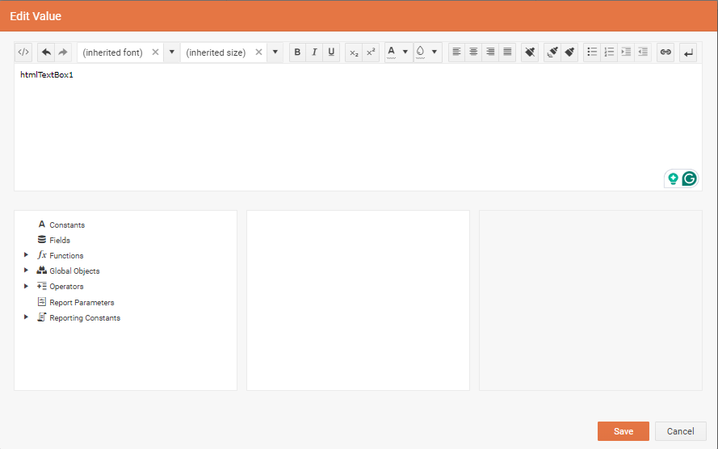

# Editing in HtmlTextBox

In the [2024 Q1 (18.0.24.130)](https://www.telerik.com/support/whats-new/reporting/release-history/progress-telerik-reporting-2024-q1-18-0-24-130) release, we replaced the plain-text editor for the `Value` property of the [HtmlTextBox item]() with a [KendoUI Editor component](https://docs.telerik.com/kendo-ui/controls/editor/get-started). This lets the user have instant visual feedback on how their HTML will look in the rendered report.

The editor lets you easily add [Embedded Expressions in HtmlTextBox]() through the list of predefined and dynamic elements that can be used in your expression. A list of expression element categories is located in the lower left-hand list of the editor, the elements for each category are located in the lower middle list, and descriptions are displayed in the lower right-hand panel.

To add an embedded expression to the HtmlTextBox content double-click an element from the bottom middle list. This will add the corresponding dynamic object wrapped in curly brackets. You may further edit the content inside the brackets manually by adding other dynamic objects and relations between them. The entire embedded expression will be evaluated and replaced in runtime by the Reporting engine.

When you select content from the HtmlTextBox, you may format it with the functionality of the KendoUI Editor. The proper styling will be applied automatically as inline CSS styles. The supported styles are listed in the article [Styling and Formatting HtmlTextBox]().

When you have finished editing the HtmlTextBox content, click the `Save` button at the bottom of the editor to populate the `Value` property of the item. Alternatively, you may cancel the operation by clicking the `Cancel` button.

## See Also

* [Growing and Shrinking of HtmlTextBox]()
* [Known Limitations of the HtmlTextBox]()
* [Telerik Reporting Homepage](https://www.telerik.com/products/reporting)
* [Reporting Forums](https://www.telerik.com/forums/reporting)
* [Reporting Blog](https://www.telerik.com/blogs/tag/reporting)
* [Reporting Videos](https://www.telerik.com/videos/reporting)
* [Reporting Roadmap](https://www.telerik.com/support/whats-new/reporting/roadmap)
* [Reporting Pricing](https://www.telerik.com/purchase/individual/reporting)
* [Reporting Training](https://learn.telerik.com/learn/course/external/view/elearning/19/reporting-report-server-training)
