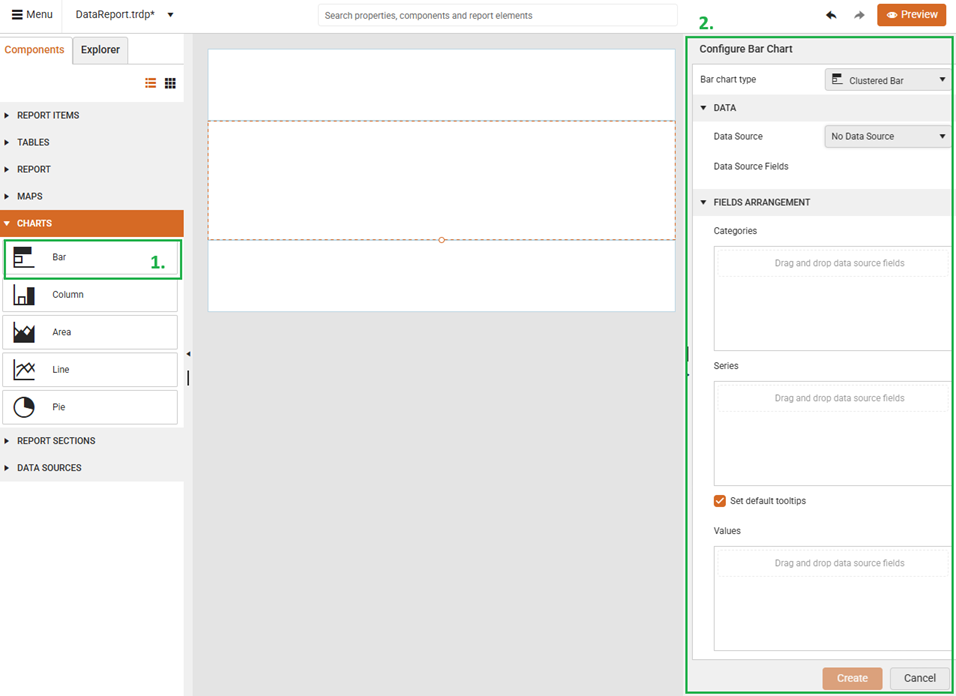

List
<style>
img[alt$="><"] {
  border: 1px solid lightgrey;
}

</style>

# Charts 

The **Web Report Designer** offers a **Charts** section inside the **Components** tray allowing the end-user to visualize the data records from different [Data Source]() storages: 

<div style="display: flex; align-items: flex-start; gap: 24px;">
  <" title="Components tray" src="images/wrd-components-tray-charts.png" style="max-width:240px; height:auto; border:1px solid lightgrey;" />
  <table style="width:100%; height:100%;">
    <tr>
      <th style="width:30%">Chart Type</th><th>Description</th>
    </tr>
    <tr>
      <td><a href="https://docs.telerik.com/reporting/report-items/graph/chart-types/bar">Bar Chart</a></td>
      <td>Displays data series as sets of horizontal bars, graphically summarizes and renders data categories, and enables users to easily compare amounts or values between different categories.</td>
    </tr>
    <tr>
      <td><a href="https://docs.telerik.com/reporting/report-items/graph/chart-types/line">Line Chart</a></td>
      <td>Displays series as sets of points connected by a single line and represents large amounts of data that occur over a continuous period of time.</td>
    </tr>
    <tr>
      <td><a href="https://docs.telerik.com/reporting/report-items/graph/chart-types/area">Area Chart</a></td>
      <td>Displays a series as a set of points connected by a line with the whole area filled in under the line.</td>
    </tr>
    <tr>
      <td><a href="https://docs.telerik.com/reporting/report-items/graph/chart-types/column">Column Chart</a></td>
      <td>Displays data series as sets of vertical bars that are grouped by category.</td>
    </tr>
    <tr>
      <td><a href="https://docs.telerik.com/reporting/report-items/graph/chart-types/pie">Pie Chart</a></td>
      <td>Displays the contribution of fractional parts to a whole and is most commonly used to make comparisons between groups.</td>
    </tr>
    <tr>
      <td><a href="https://docs.telerik.com/reporting/report-items/graph/chart-types/pie#pie-chart-variations">Doughnut Chart</a></td>
      <td>Similar to the Pie Chart which has an open space in the center.</td>
    </tr>
  </table>
</div>

Before adding a Chart report item, first, you need to select the **Details** section of the report. Then, you can select the desired chart type from the **Components** tray and configure it with the desired data source.

## Bar Charts

By clicking the `Bar` item from the **Components** tray, a new tab will appear on the right-hand side of the **Web Report Designer**: 

>caption Configuration Settings

    

>note The *Configuration pane* is identical for all chart types, allowing the end-user to specify the Data Source and configure the Categories, Series and Values groups.

You are ready to build the desired chart and use an already defined [Data Sources](). According to the data that should be displayed, it is possible to configure **Categories**, **Series** and **Values** groups. The following short video shows how to feed the chart with data from the already existing SQL Data Source that displays the total **Freight** for each **Country**:

>caption Populating Bar Chart with Orders' Freight by ShipCountry

<!--      -->

<iframe width="560" height="315" src="https://www.youtube.com/embed/PD8RnyexfvQ?si=-sUhyCqDy0FC54O0" title="YouTube video player" frameborder="0" allow="accelerometer; autoplay; clipboard-write; encrypted-media; gyroscope; picture-in-picture; web-share" referrerpolicy="strict-origin-when-cross-origin" allowfullscreen></iframe>

### Combine Mode

In case of having multiple series per category in the chart, it is possible to fine-tune the *combine mode* for the bar series for better illustration of the data. Telerik Reporting supports the following Bar chart types:

    

Let's have the following sample CSV data that will be used for the example:

>caption CSV Data Source

```
Category, Year, Value
Accessories, 2003,230
Accessories,2004,340
Bikes, 2001, 150
Bikes, 2002, 195
Bikes, 2003, 340
Bikes, 2004, 265
Clothing, 2002, 80
Clothing, 2003, 120
Clothing, 2004, 110
Components, 2001, 230
Components, 2002, 140
Components, 2003, 280
Components, 2004, 310
```

<iframe width="560" height="315" src="https://www.youtube.com/embed/ypQHSpXnJkw?si=_pjCxfXAIfKoWBa_" title="YouTube video player" frameborder="0" allow="accelerometer; autoplay; clipboard-write; encrypted-media; gyroscope; picture-in-picture; web-share" referrerpolicy="strict-origin-when-cross-origin" allowfullscreen></iframe>

Now, we will create a Bar Chart that uses the **Year** column for the *Categories*, the **Category** column for the *Series* and the **Value** column for the *Values*. According to the selected Bar Chart Type, the following charts will be displayed:

|Bar Chart Type||
|----|----|
|**Clustered Bar**|| 
|**Stacked Bar**| |
|**100% Stacked Bar**| |

## Column Charts

By clicking the `Column` item from the **Components** tray, a similar tab (like the one shown in the *Configuration Settings* above) will appear on the right-hand side of the **Web Report Designer**. The **Column** chart type is very similar to the **Bar** chart (which displays series as sets of horizontal bars) and to the **Range** Column chart (which displays series as sets of vertical bars with varying beginning and end points).

We will use the same *CSV Data Source* and configure the **Year** column for the *Categories*, the **Category** column for the *Series* and the **Value** column for the *Values*:

>caption Populating Column Chart

<iframe width="560" height="315" src="https://www.youtube.com/embed/ePCehcujGnU?si=iQ5SDFrLaJeatsgl" title="YouTube video player" frameborder="0" allow="accelerometer; autoplay; clipboard-write; encrypted-media; gyroscope; picture-in-picture; web-share" referrerpolicy="strict-origin-when-cross-origin" allowfullscreen></iframe>

According to the selected Column Chart Type, the following charts will be displayed: 

|Column Chart Type||
|----|----|
|**Clustered Column**||  
|**Stacked Column**| |
|**100% Stacked Column**| |


## Area Charts

By clicking the `Area` item from the **Components** tray, the *Configuration Settings* pane will appear on the right-hand side of the **Web Report Designer**. We will use the same *CSV Data Source* and configure the **Year** column for the *Categories*, the **Category** column for the *Series* and the **Value** column for the *Values*:

>caption Populating Area Chart

<iframe width="560" height="315" src="https://www.youtube.com/embed/1F4df2B3TTw?si=SskFAdk4lDTmijfr" title="YouTube video player" frameborder="0" allow="accelerometer; autoplay; clipboard-write; encrypted-media; gyroscope; picture-in-picture; web-share" referrerpolicy="strict-origin-when-cross-origin" allowfullscreen></iframe>

According to the selected **Area Chart Type**, the following charts will be displayed: 

 

|Area Chart Type||
|----|----|
|**Area**||   
|**Stacked Area**| |
|**100% Stacked Area**| | 

## Line Charts 

By clicking the `Line` item from the **Components** tray, the *Configuration Settings* pane will appear on the right-hand side of the **Web Report Designer**. We will use the same *CSV Data Source* and configure the **Year** column for the *Categories*, the **Category** column for the *Series* and the **Value** column for the *Values*:

>caption Populating Line Chart

<iframe width="560" height="315" src="https://www.youtube.com/embed/FVBqHGrqYvQ?si=MBSYV08JWm7KEhUJ" title="YouTube video player" frameborder="0" allow="accelerometer; autoplay; clipboard-write; encrypted-media; gyroscope; picture-in-picture; web-share" referrerpolicy="strict-origin-when-cross-origin" allowfullscreen></iframe>
  
According to the selected **Line Chart Type**, the following charts will be displayed: 

  

|Chart Type|Line|Line with Markers|
|----|----|----|
|**Line**||  | 
|**Stacked Line**| | |
|**100% Stacked Line**| |  

## Pie Charts

By clicking the `Pie` item from the **Components** tray, the *Configuration Settings* pane will appear on the right-hand side of the **Web Report Designer**. We will use the same *CSV Data Source* and configure the **Year** column for the *Categories*, the **Category** column for the *Series* and the **Value** column for the *Values*:

>caption Populating Pie Chart

<iframe width="560" height="315" src="https://www.youtube.com/embed/U9HMcfjAofc?si=3OCMV8NEyz8VwmaZ" title="YouTube video player" frameborder="0" allow="accelerometer; autoplay; clipboard-write; encrypted-media; gyroscope; picture-in-picture; web-share" referrerpolicy="strict-origin-when-cross-origin" allowfullscreen></iframe>

According to the selected **Pie Chart Type**, the following charts will be displayed: 

 

|Pie Chart Type||
|----|----|
|**Pie**||   
|**Doughnut**| | 

## See Also

* [Web Report Designer]()
* [Overview of the Graph Report Item]()


