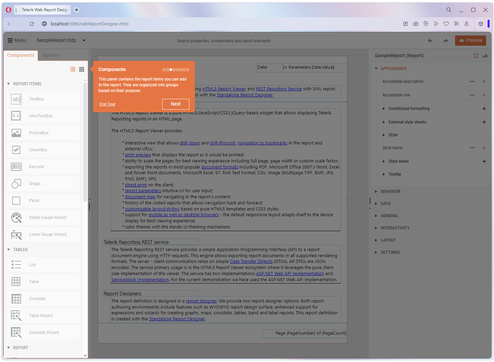

# Components

Each report is constructed by [report items]() organized in different groups in the **Components** tab based on their purpose. 

    

The available items are:

|Group|Report Items|
|----|----|
|**Report Items**|<ul><li>TextBox</li><li>HtmlTextBox</li><li>PictureBox</li><li>CheckBox</li><li>Barcode</li><li>Shape</li><li>Panel</li><li>Radial Gauge Wizard</li><li>Linear Gauge Wizard</li></ul>|
|[Tables](): The Table report item is a generalized layout report item that displays report data in cells that are organized into rows and columns.|<ul><li>List</li><li>Table</li><li>Crosstab</li><li>Table Wizard</li><li>Crosstab Wizard</li></ul>|
|**Report**|<ul><li></li><li></li><li></li><li></li><li></li><li></li></ul>|
|**Maps**|<ul><li></li><li></li><li></li><li></li><li></li><li></li></ul>|
|[Charts](): The Graph report item is a native Telerik Reporting item that allows you to generate different Chart types (objects) and visually present large volumes of aggregated information.|<ul><li>Bar Chart</li><li>Line Chart</li><li>Area Chart</li><li>Column Chart</li><li>Pie Chart</li><li>Doughnut Chart</li><li>Polar Chart</li><li>Range Chart</li><li>Scatter (Point) Chart</li><li>Bubble Chart</li><li>Sparkline Chart</li><li>OHLC Chart</li></ul>|
|**Report Sections**|<ul><li></li><li></li><li></li><li></li><li></li><li></li></ul>|
|[DataSources](): Data Source components are used to connect data items to different types of data without writing any code.|<ul><li>SQL Data Source</li><li>CSV Data Source</li><li>Web Service Data Source</li><li>GraphQL Data Source</li><li>JSON Data Source</li><li>Object Data Source</li></ul>|

## See Also

* [Web Report Designer]()

