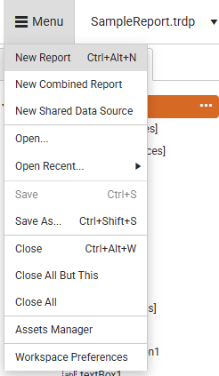
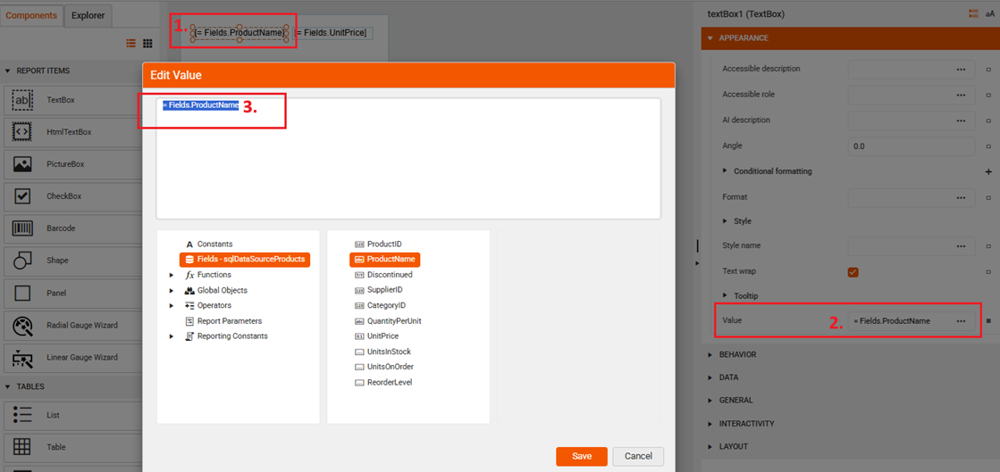
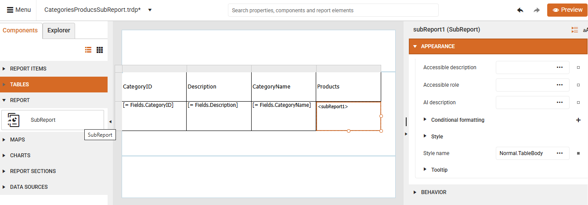

<style>
img[alt$="><"] {
  border: 1px solid lightgrey;
}

</style>

# SubReport

The **Web Report Designer** offers a **Report** section inside the **Components** tray allowing the end-user to add a **SubReport** item which enables you to display reports within reports and serves as a container, similar to the report sections, growing in size depending on its children.

   

## Creating Master-Detail Reports with SubReports

The following example shows how to achieve a master-detail report using a SubReport Item. The master report (e.g. *CategoriesProductsSubreport.trdp*) contains a table filled with the Northwind.**Categories** table. The **SubReport** item (*ProductsReport.trdp*) shows the Northwind.**Products** records filtered by the respective **CategoryID**.

The report is achieved by using the following steps:

### Building the Child Report

1. Start with a blank report (*ProductsReport.trdp*) that will be used for the child report, select its header/footer section and delete them.

   

2. Add a new [SQL Data Source]() populated with the Northwind.Products table:

Here is the SQL query that selects the respective data:

```SQL
SELECT
	[dbo].[Products].[ProductID], 
	[dbo].[Products].[ProductName], 
	[dbo].[Products].[Discontinued], 
	[dbo].[Products].[SupplierID], 
	[dbo].[Products].[CategoryID], 
	[dbo].[Products].[QuantityPerUnit], 
	[dbo].[Products].[UnitPrice], 
	[dbo].[Products].[UnitsInStock], 
	[dbo].[Products].[UnitsOnOrder], 
	[dbo].[Products].[ReorderLevel]
FROM [dbo].[Products]
```

3. Set the **DataSource** of the Report using the created SQLDataSource with the Products:

    

4. From the **Components tray** drag two **TextBox** report items to the Details section and set the **Value** property to be bound to the **ProductName** and **UnitPrice** fields respectively:

     

5. Preview the report to see that all Products are listed.

6. Add an integer report parameter **ProductCategoryID** which will be used for filtering the products:

   

7. Update the SELECT query of the added SQLDataSource and add a WHERE clause using a SQL parameter (which is mapped to the previously created report parameter):

```SQL 
SELECT
	[dbo].[Products].[ProductID], 
	[dbo].[Products].[ProductName], 
	[dbo].[Products].[Discontinued], 
	[dbo].[Products].[SupplierID], 
	[dbo].[Products].[CategoryID], 
	[dbo].[Products].[QuantityPerUnit], 
	[dbo].[Products].[UnitPrice], 
	[dbo].[Products].[UnitsInStock], 
	[dbo].[Products].[UnitsOnOrder], 
	[dbo].[Products].[ReorderLevel]
FROM [dbo].[Products]
WHERE [dbo].[Products].[CategoryID]=@sqlParamCategoryId
```

    

8. Save the report (*ProductsReport.trdp*). This would be used as our sub-report.

### Building the Master Report

1. Create a new blank report (*CategoriesProducts.trdp*).

2. Add a new [SQL Data Source]() filled with the Northwind.Categories table:

```SQL
SELECT
	[dbo].[Categories].[CategoryID], 
	[dbo].[Categories].[CategoryName], 
	[dbo].[Categories].[Description], 
	[dbo].[Categories].[Picture]
FROM [dbo].[Categories]
```

3. Select the report's Detail section and use the [Table Wizard]() to add a table bound to the just added SQLDataSource:

   

4. Select the "Picture" header and change its text to "Products".

5. Select the "Picture" data row >> the cell bound to the Picture field and add a **SubReport** item by selecting the respective report item from the Components tray:

   

6. Specify the **Inner Report** for the **SubReport** item and select the Uri option that refers to the previously created ProductsReport.trdp:

   

7. Adjust the Parameters and link the SubReport parameter (ProductCategoryID) with the master report's **CategoryID** field:

   

8. Save the changes and preview the master report. You will see all categories listed with the respective products for each category: 

    

A detailed video is available covering the complete process:

<iframe width="560" height="315" src="https://www.youtube.com/embed/TDRZETEWtSk?si=Lgm3HkxytrWh0zTB" title="YouTube video player" frameborder="0" allow="accelerometer; autoplay; clipboard-write; encrypted-media; gyroscope; picture-in-picture; web-share" referrerpolicy="strict-origin-when-cross-origin" allowfullscreen></iframe>

## See Also

* [Web Report Designer]() 
* [DataSources]() 


