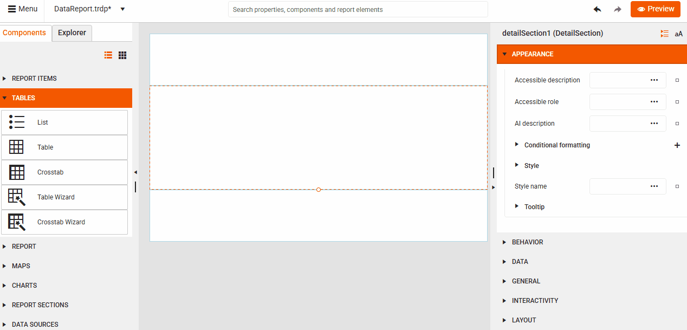

List

# Tables

The **Web Report Designer** offers a **Tables** section inside the **Components** tray allowing the end-user to visualize the data records from different [Data Source]() storages: 

  <" title="Components tray" src="images/wrd-components-tray-tables.png" style="max-width:240px; height:auto; border:1px solid lightgrey;" />
  <table style="width:100%; height:100%;">
    <tr>
      <th style="width:30%">Data Source</th><th>Description</th>
    </tr>
    <tr>
      <td><a href="">List</a></td>
      <td>Displays data from a set of Business Objects creating a free-form data layout. You are not limited to a grid layout, you can freely place fields inside the List.</td>
    </tr>
    <tr>
      <td><a href="">Table</a></td>
      <td>Displays report data in cells that are organized into rows and columns..</td>
    </tr>
    <tr>
      <td><a href="">Crosstab</a></td>
      <td>Displays aggregated data summaries that are grouped in rows and columns. The number of rows and columns for groups is determined by the number of unique values for each row and column groups.</td>
    </tr>
    <tr>
      <td><a href="">Table Wizard</a></td>
      <td>The Table wizard guides you through the process of adding a Table item to a report.</td>
    </tr>
    <tr>
      <td><a href="">Crosstab Wizard</a></td>
      <td>The Crosstab wizard guides you through the process of adding a Crosstab item to a report.</td>
    </tr>
  </table>

## List

By dragging the `List` item from the **Components** tray and dropping it onto the **Details** section of the report, you are ready to build the desired layout with report items like TextBoxes and use the already defined [Data Sources]().
The following short video illustrates how to add a List, bind it to an already existing SQL Data Source item and adding a TextBox report item for displaying the FirstName of the data records:

>caption Displaying Data in a List 

     

 

## Table 

When added from a report designer, the Table contains three columns with a table header row and a details row for the data.

## Crosstab 

 

## See Also

* [Web Report Designer]()
* [Getting Started with the Crosstab]()

