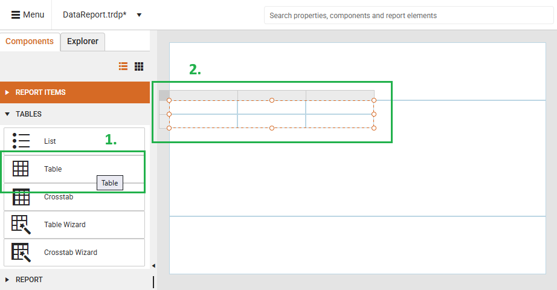
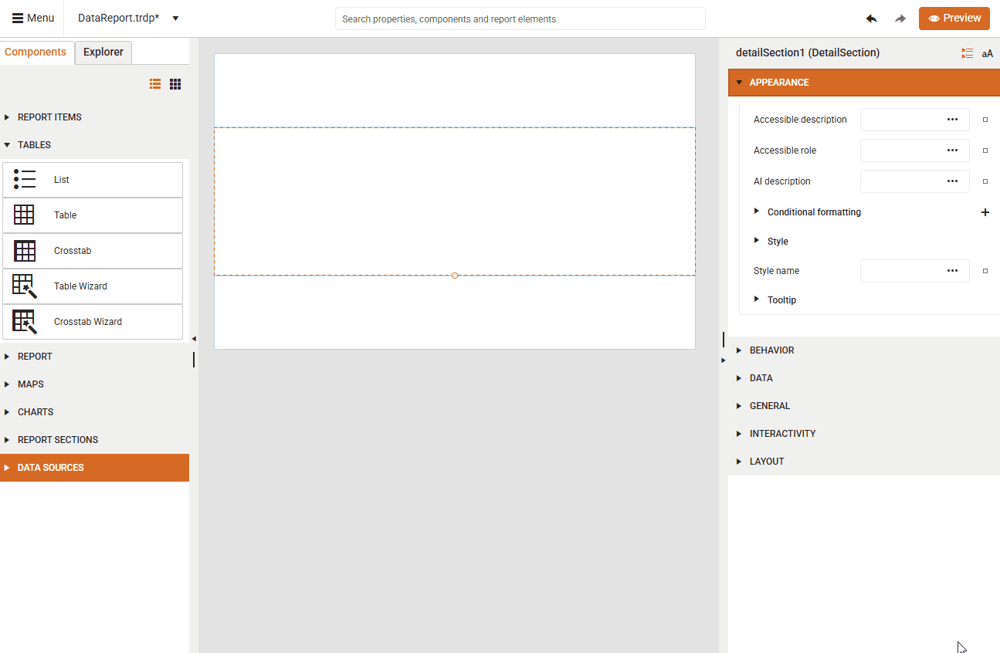
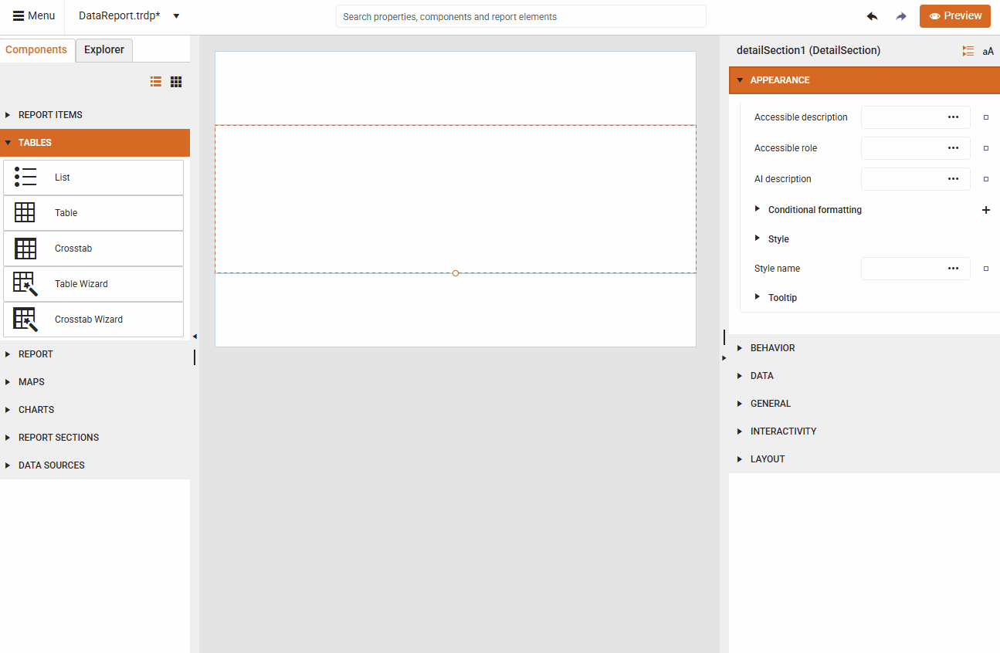
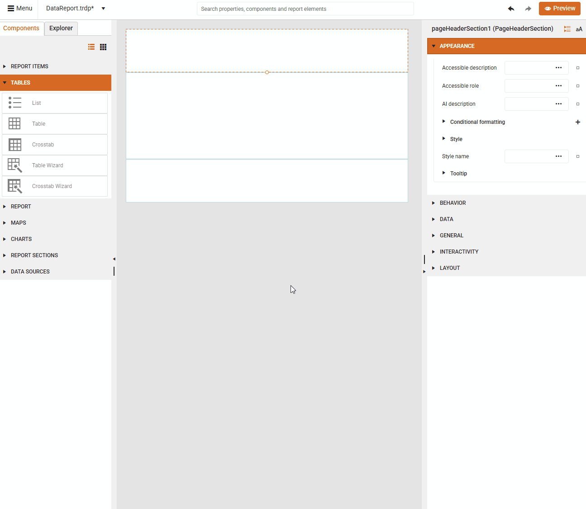

List

# Tables

The **Web Report Designer** offers a **Tables** section inside the **Components** tray allowing the end-user to visualize the data records from different [Data Source]() storages: 

  <" title="Components tray" src="images/wrd-components-tray-tables.png" style="max-width:240px; height:auto; border:1px solid lightgrey;" />
  <table style="width:100%; height:100%;">
    <tr>
      <th style="width:30%">Data Source</th><th>Description</th>
    </tr>
    <tr>
      <td><a href="https://docs.telerik.com/reporting/report-items/table-crosstab-list/template-items#list">List</a></td>
      <td>Displays data from a set of Business Objects creating a free-form data layout. You are not limited to a grid layout, you can freely place fields inside the List.</td>
    </tr>
    <tr>
      <td><a href="https://docs.telerik.com/reporting/report-items/table-crosstab-list/template-items#table">Table</a></td>
      <td>Displays report data in cells that are organized into rows and columns..</td>
    </tr>
    <tr>
      <td><a href="https://docs.telerik.com/reporting/report-items/table-crosstab-list/template-items#crosstab">Crosstab</a></td>
      <td>Displays aggregated data summaries that are grouped in rows and columns. The number of rows and columns for groups is determined by the number of unique values for each row and column groups.</td>
    </tr>
    <tr>
      <td><a href="https://docs.telerik.com/reporting/designing-reports/report-designer-tools/web-report-designer/tools/table-crosstab-wizard">Table Wizard</a></td>
      <td>The Table wizard guides you through the process of adding a Table item to a report.</td>
    </tr>
    <tr>
      <td><a href="https://docs.telerik.com/reporting/designing-reports/report-designer-tools/web-report-designer/tools/table-crosstab-wizard">Crosstab Wizard</a></td>
      <td>The Crosstab wizard guides you through the process of adding a Crosstab item to a report.</td>
    </tr>
  </table>

## List

By dragging the `List` item from the **Components** tray and dropping it onto the **Details** section of the report, you are ready to build the desired layout with report items like TextBoxes and use the already defined [Data Sources]().
The following short video illustrates how to add a List, bind it to an already existing [SQL Data Source]() item and adding a TextBox report item for displaying the FirstName of the data records:

>caption Displaying Data in a List 

     

## Table 

By dragging the `Table` item from the **Components** tray and dropping it onto the **Details** section of the report, you are ready to build the desired layout with report items like TextBoxes and use the already defined [Data Sources]().

When added from a report designer, the Table contains three columns with a table header row and a details row for the data:

      

The following short video illustrates how to add an empty Table report item, bind it to an already existing [CSV Data Source](), add the necessary TextBox report items for the column headers and for the data records displaying the First/Last Names:

        

## Crosstab 

By dragging the `Crosstab` item from the **Components** tray and dropping it onto the **Details** section of the report, you are ready to build the desired layout with the generated empty column/row groups and body parts. 

When added from a report designer, the [Crosstab]() contains a column group, a row group and a body for crosstab data:

     

The following short video illustrates how to add an empty Crosstab report item, bind it to an already existing [SQL Data Source](), bind the generated empty Column/Row groups and map the necessary TextBox report items for the column/row group and for the data records displaying the total sum of Freight for the respective OrderID:

        

## Table Wizard

By clicking the [Table Wizard]() item from the **Components** tray, a new tab will appear on the right-hand side of the **Web Report Designer**:

>caption Table Wizard

      

The following short video illustrates how to add a Table report item with the wizard, bind it to an already existing [Web Service Data Source]() item and arrange the desired fields for displaying the name and localized name of the data records:

      

## Crosstab Wizard
 
By clicking the [Crosstab Wizard]() item from the **Components** tray, a new tab will appear on the right-hand side of the **Web Report Designer**:

>caption Crosstab Wizard

  

The following short video illustrates how to add a [Crosstab]() report item with the wizard, bind it to an already existing [SQL Data Source]() item populated with Northwind.Orders table and arrange the desired fields for displaying the OrderID as rows and total sum of Freight of the data records:

     

## See Also

* [Web Report Designer]()
* [Getting Started with the Crosstab]()
* [DataSources]()
* [Template Variations of the Table Report Item]()

