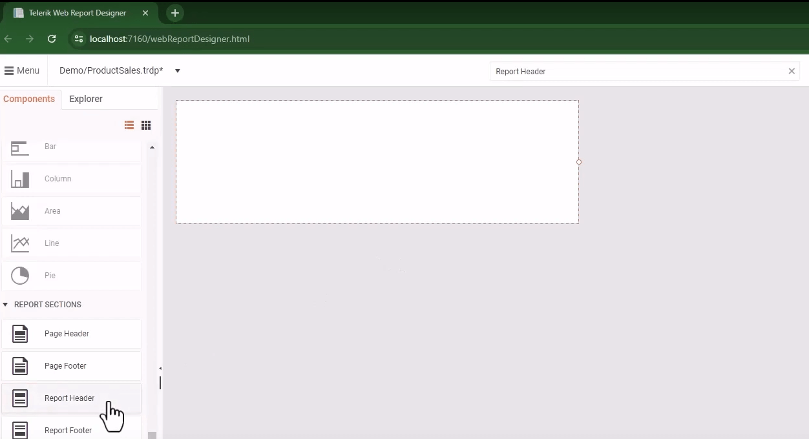

# Creating a New Report

This tutorial demonstrates the essential steps necessary to create a new report in the [Web Report Designer]().

You will start from scratch by creating a blank report and styling it by adding a custom header, company logo, and title. Then, you will connect the report to a data source. Finally, you will add graphs that will visualize the report's data.

To create the report:

1. Go to the Report Designer's main **Menu** and select **New Report**. This opens the **Create a Report** dialog.
1. In the **File Name** field, enter the desired name for the report, for example, `ProductSales`.
1. In the **Save as type** drop-down, select the TRDP report type. TRDP is the recommended report type and stands for Telerik Report Definition Packed.
1. Select the location for the report and click **Save**.

	

## Styling the Report

Newly created reports contain three default [report sections](#report-sections): `page header`, `page footer`, and `detail` section. They are empty initially. When customizing the report, you may add or delete sections, and add [report items]() to them, for example, TextBoxes and PictureBoxes.

To style the sample report:

1. Delete the default page header (at the top of the page) and page footer (at the bottom of the page) by selecting each of them and pressing the `Delete` keyboard key. Let's leave the detail section (the main body of the report).
1. Add a report header section to the report:

	2.1. Use `Ctrl+F` to focus the search box.
	2.2. Type `Report Header`, and press `Enter`. This will focus on the **Page Header** report section in the **Components** menu.
	2.3. Click the **Report Header** item to add this section to the report.

	

1. Add a company logo to the report header by using a picture box:

	3.1. Use `Ctrl+F` to focus the search box.
	3.2. Type `PictureBox`, and press `Enter`. This will focus on the **PictureBox** report component in the **Components** menu.
	3.3. Click the **PictureBox** item and drag it to the report header. Adjust its size and position as needed.
	3.4. Make sure that the picture box is focused (selected), and locate the **DATA** category in the properties area of the Web Report Designer. The properties area is the pane on the right, which contains properties specific to the currently selected report item.
	3.5. Go to **DATA** > **Value** and click the  button to open the Assets Manager.
	3.6. Select the **Images** folder and then click the **Upload** button to upload an image from your device.
	3.7. Select the newly uploaded image and click **Save**.

	

1. Add a title to the report by using a text box:

	4.1. Use `Ctrl+F` to focus the search box.
	4.2. Type `TextBox`, and press `Enter`. This will focus on the **TextBox** report component in the **Components** menu.
	4.3. Click the **TextBox** item and drag it to the report header. Adjust its size and position as needed.
	4.4. Double-click on the text box and type `Sales by Category`.
	4.5. To change the text font, go to **APPEARANCE** > **Style** > **Font** in the properties area pane on the right and apply the desired styles, for example, Arial with size 22 pt in bold.

	

## Adding the Report Data

The report in this tutorial will visualize data fetched from a remote source that is accessible through a URL.

To add data to the report:

1. Locate the **DATA SOURCES** category in the **Components** menu of the Web Report Designer.
1. Click the **Web Service Data Source** item to start the data source configuration wizard.
1. Click the **TextBox** item and drag it to the report header. Adjust its size and position as needed.
1. In the **Service URL** field, enter `https://demos.telerik.com/reporting/api/data/ProductSales.min` — the URL of the service providing the data for the report.
1. Skip the next pages, until you reach the preview data page, where you may click `Finish`.

	

## Adding a Chart

To visualize the data you will add a Column Chart component:

1. Locate the **CHARTS** category in the **Components** menu of the Web Report Designer.
1. Click the **Column** item and drag it to the detail section of the report. This will load the Column Chart configurator on the right.
1. In the **DATA** > **Data Source** dropdown, select `webServiceDataSource1` — this will populate the **Data Source Fields** in the Column Chart configurator.

	

1. Drag the `ProductCategory` field from **DATA** > **Data Source Fields** to **FIELDS ARRANGEMENT** > **Categories**.
1. Drag the `LineTotal` field from **DATA** > **Data Source Fields** to **FIELDS ARRANGEMENT** > **Values**.
1. Click **Create** to add the configured chart to the report.

## Styling the Chart

Optionally, you can adjust the appearance of the Chart:

1. Select the Graph in the report detail section.
1. In the configuration pane on the right, go to **PRESENTATION** > **Legend** > **Style** and clear the **Visible** checkbox. This will remove the legend from the Chart.
1. Go to **PRESENTATION** > **Titles** and select the `graphTitle1` item to open the **Edit Item** dialog.
1. Expand the **Style** category and clear the **Visible** checkbox. This will remove the Chart's title.

	

## Next Steps

* [Implement a Common Master-Detail Report Scenario]()

## See Also

* [Video tutorial 'Getting Started with the Web Report Designer: Part 1'](https://www.youtube.com/watch?v=L-utkcB8-5c)
* [Video tutorial 'Getting Started with the Web Report Designer: Part 2'](https://www.youtube.com/watch?v=DXKlgq-MYIU)
* [Web Report Designer](%{slug telerikreporting/designing-reports/report-designer-tools/web-report-designer/overview%})
* [Demo Page for Telerik Reporting](https://demos.telerik.com/reporting)
* [Telerik Reporting Homepage](https://www.telerik.com/products/reporting)
* [Reporting Forums](https://www.telerik.com/forums/reporting)
* [Reporting Blog](https://www.telerik.com/blogs/tag/reporting)
* [Reporting Videos](https://www.telerik.com/videos/reporting)
* [Reporting Roadmap](https://www.telerik.com/support/whats-new/reporting/roadmap)
* [Reporting Pricing](https://www.telerik.com/purchase/individual/reporting)
* [Reporting Training](https://learn.telerik.com/learn/course/external/view/elearning/19/reporting-report-server-training)
