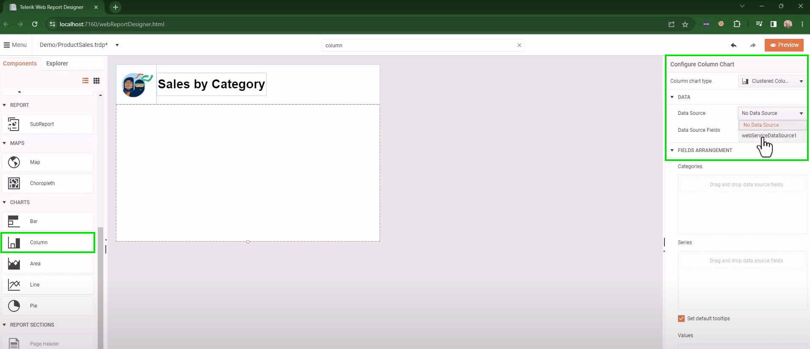

# Creating a Simple Report

This tutorial demonstrates the fundamental steps that will help you create a new report in the Web Report Designer.

You will create a new report and connect it to a data source. Then, you will customize it by adding a company logo, title, and graphs that will visualize the report's data.

1. Go to the main toolbar `Menu` and select `New Report`. The `Create Report` dialog opens and lets you:

	1. Enter the `File Name`. Let's name the report `ProductSales`.
	1. Select the `Type`. Leave the `Type` to be `TRDP` standing for _Telerik Report Definition Packed_, the recommended Declarative [Report Definition](#report-definition).
	1. Enter `Location`. Type `Demo` to place the report in the _Demo_ subfolder.
	1. Click `Save` to apply the settings.

	

1. The new empty report should open in the designer with its default Page Header, Detail, and Page Footer sections. Let's delete the page sections by selecting them and pressing the `Delete` key from the keyboard.

1. Next, we want to add a [Report Header](). Press `Ctrl+F` to focus the Search box, type `Report Header`, and press `Enter` key to focus the report section in the `Components` menu. Click the item to add the section to the report.

	

1. Let's add the company logo to the report.

	1. We need to add a [PictureBox]() to the Report Header. You may search for the report item, drag it to the Report Header, and adjust its size and position as needed.
	1. To upload the logo, search for the `Value` property in the PictureBox, and click on the icon beside it. It opens the `Select File...` dialog, which represents the [Assets Manager](#assets-manager). The latter contains report assets such as images, external stylesheets, etc.

		

	1. Select the `Images` folder and click the `Upload` button to upload the image. Click on the `Browse` button to find the image on your system and open it. Add the selected image by clicking on the `Upload` button. Now the image is in the Assets Manager and you may click `Save`. The value should be populated and the image should be displayed in the PictureBox.

1. Add title to the report. You may use the [TextBox]() report item.

	1. Search in the global search box of the designer and drag the item from the `Components` menu to the Report Header.
	1. You may change the text inline. Double-click on the item to enter it and type `Sales by Category`.
	1. Apply Styles by selecting the TextBox, searching for _Style_, and finding the appropriate _Font_ styles. Let's use the default Font "Arial", with Size 22pt, bolded, centered, and aligned to the middle.
	1. Position and realign the TextBox so that the content fits and looks beautiful.

	

1. Our next step would be to add a [DataSource component]() to the Report. Let it be the [WebServiceDataSource]() fetching data from a remote source.

	1. Search for the component and add it to the report. It opens the _Configure Web Service DataSource_ wizard.
	1. For `ServiceUrl` we will add the known URL to our demo site `https://demos.telerik.com/reporting/api/data/ProductSales.min`. It points to a reliable JSON data file. Leave the other options with their default values.

		

	1. Skip the next page, where you may add request parameters, as we don't have any.
	1. Skip also the third page that asks whether in design-time you would like to use real or mocked data. We will use real data (the default setting).
	1. Preview the data on the next page and click `Finish`.

		

	1. The wizard closes and in the designer's `Explorer` tab you should see the new WebServiceDataSource component with its data fields listed.

1. Next, lets add the [Graph]() item that is going to show the sales data.

	1. Search for `Column` and drag the Column chart from the `Explorer` menu to the report Detail section. This will open a chart configurator to the right pane.
	1. Select the WebServiceDataSource from the dropdown of the Graph DataSource property. The fields will be listed.

		

	1. Drag the `ProductCategory` field to the `Categories`.
	1. For the `Values` property use the `LineTotal` field.
	1. Click on `Create` to render the chart with real data and show it in the report.
	1. Finally, style the column graph:

		* Find and remove the `Legend` by unchecking its `Style` > `Visible` checkbox.
		* Enter the `Titles` section, select the graph title, and uncheck the `Visible` checkbox in the `Style` section from the opened `Edit item` dialog.

		

1. Preview the pixel-perfect report document by clicking on the designer `Preview` button at the top right corner.

## See Also

* [Reference 1]()
* [Reference 2]()
