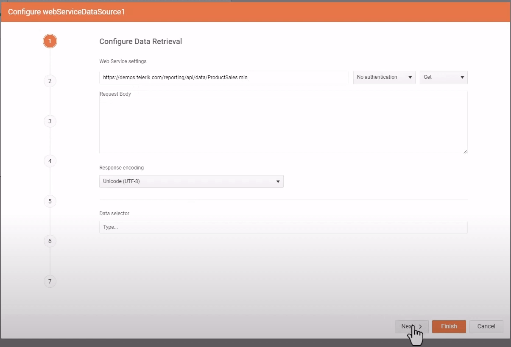

# Creating a Simple Report

This tutorial demonstrates the fundamental steps that will allow you to make a new report in the Web Report Designer.

You will start by creating a blank report and styling it by adding a custom header, company logo, and a title. Then, you will connect the report to a data source. Finally, you will add graphs that will visualize the report's data.

To create the report:

1. Go to the Report Designer's main **Menu** and select **New Report**. This opens the **Create a Report** dialog.

1. In the **File Name** field, enter the desired name for the report, for example, `ProductSales`.

1. In the **Save as type** drop-down, select the TRDP report type. TRDP is the recommended report type and stands for Telerik Report Definition Packed.

1. Select the location for the report and click **Save**.

	

## Styling the Report

Newly created reports contain default elements such as headers, footers, and detail sections. When customizing the report, you can change these default elements and add new once, for example, images.

To style the sample report:

1. Delete the default page header (at the top of the page), footer (at the top of the page), and detail section (the main body of the report) by selecting each of them and pressing the `Delete` keyboard key. 

1. Add a new custom report header:

   2.1. Use `Ctrl+F` to focus the search box.

   2.2. Type `Report Header`, and press `Enter`. This will focus the **Page Header** report section in the **Components** menu.

   2.3. Click the **Page Header** item to add this section to the report.

	

1. Add a company logo to the report header by using a picture box:

	3.1. Use `Ctrl+F` to focus the search box.

	3.2. Type `PictureBox`, and press `Enter`. This will focus the **PictureBox** report component in the **Components** menu.

    3.3. Click the **PictureBox** item and drag it to the report header. Adjust its size and position as needed.

	3.4. Make sure that the picture box is focused (selected), locate the **DATA** category in the properties area of the Web Report Designer. The properties area is the pane on the right, which contains properties specific to the currently selected report item.

	3.5. Go to **DATA** > **Value** and click the  button to open the Assets Manager.
	
	3.6. Select the **Images** folder and then click the **Upload** button to upload an image from your device.
	
	3.7. Select the newly uploaded image and click **Save**.

	

1. Add a title to the report by using a text box:

	4.1. Use `Ctrl+F` to focus the search box.
	
	4.2. Type `TextBox`, and press `Enter`. This will focus the **TextBox** report component in the **Components** menu. 
    
	4.3. Click the **TextBox** item and drag it to the report header. Adjust its size and position as needed.
	
	4.4. Double-click on the text box and type `Sales by Category`.
	
	4.5. To change the text font, go to **APPEARANCE** > **Style** > **Font** in the properties area pane on the right and apply the desired styles, for example, Arial with size 22 pt in bold.

	

## Adding the Report Data

1. Our next step would be to add a [DataSource component]() to the Report. Let it be the [WebServiceDataSource]() fetching data from a remote source.

	1. Search for the component and add it to the report. It opens the _Configure Web Service DataSource_ wizard.
	1. For `ServiceUrl` we will add the known URL to our demo site `https://demos.telerik.com/reporting/api/data/ProductSales.min`. It points to a reliable JSON data file. Leave the other options with their default values.

		

	1. Skip the next page, where you may add request parameters, as we don't have any.
	1. Skip also the third page that asks whether in design-time you would like to use real or mocked data. We will use real data (the default setting).
	1. Preview the data on the next page and click `Finish`.

		

	1. The wizard closes and in the designer's `Explorer` tab you should see the new WebServiceDataSource component with its data fields listed.

## Adding a Graph

1. Next, lets add the [Graph]() item that is going to show the sales data.

	1. Search for `Column` and drag the Column chart from the `Explorer` menu to the report Detail section. This will open a chart configurator to the right pane.
	1. Select the WebServiceDataSource from the dropdown of the Graph DataSource property. The fields will be listed.

		

	1. Drag the `ProductCategory` field to the `Categories`.
	1. For the `Values` property use the `LineTotal` field.
	1. Click on `Create` to render the chart with real data and show it in the report.
	1. Finally, style the column graph:

		* Find and remove the `Legend` by unchecking its `Style` > `Visible` checkbox.
		* Enter the `Titles` section, select the graph title, and uncheck the `Visible` checkbox in the `Style` section from the opened `Edit item` dialog.

		

1. Preview the pixel-perfect report document by clicking on the designer `Preview` button at the top right corner.

## See Also

* [Reference 1]()
* [Reference 2]()
