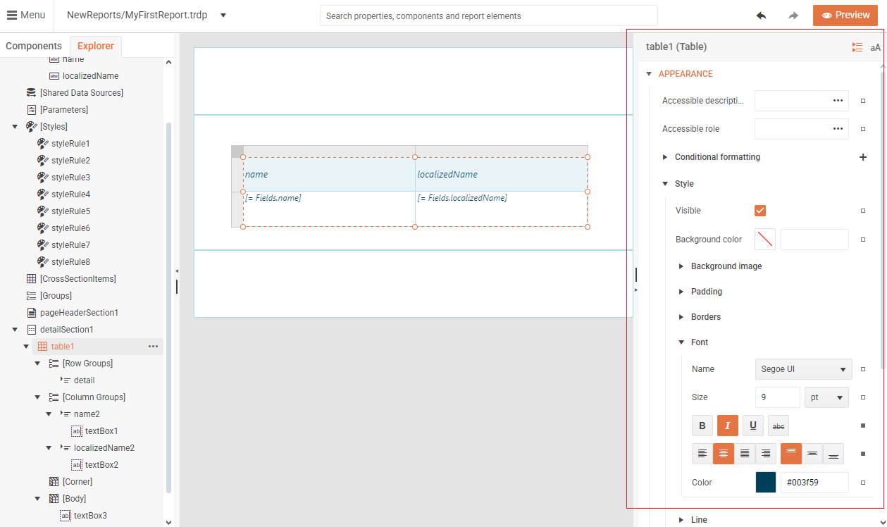
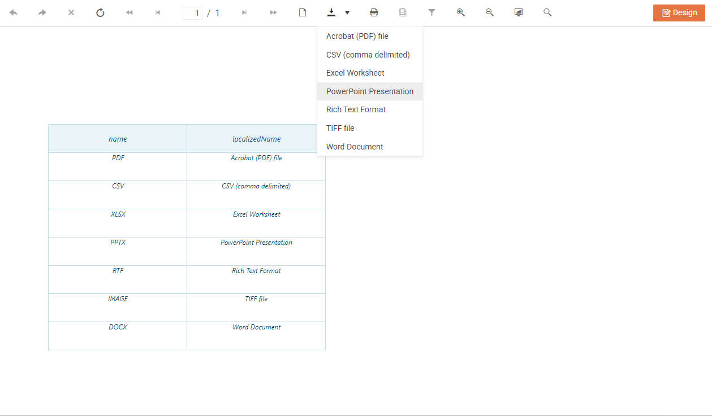

# Getting Started 

This tutorial will guide you through your first steps of creating a report from scratch using the Web Report Designer.

1. Create a new empty Report:

       

2. In the **Components** tab, under the **Data Sources** group, select the **Web Service Data Source** option:

      

3. Using the [WebServiceDataSource Wizard](), we will add a new [WebServiceDataSource]() that will be used for the data population in our first report.

    * Enter directly the *Service URL*, e.g. *https://demos.telerik.com/reporting/api/reports/formats*, and display data located on a service in JSON format while using no code.
    
       

    * You can **Finish** the wizard or go through the **Next** steps if other fine-tuning is necessary:

        * Configure request parameters (if such are required)

         

        * Choose desing-time data - select the *Use real data while designing the report* option

          

        * Preview data source results - It is expected to see the data preview in JSON format:

          

    Once the wizard is completed, the Web Service Data Source object should be available in the **Explorer** tab under the **Inline DataSources** group:

     

4. Go back to the **Components** tab, select the report's **Detail section** and trigger the [Table Wizard]() option:  

     

5. Configure the Table:

      

6. Style the Table using the [Properties Area]():

       

7. Click the **Preview** button at the top right corner to see your first report with a table, populated with data coming from a web service. The tollbar allows you to easily export the report to the desired [format]():

      

<iframe width="560" height="315" src="https://www.youtube.com/embed/L-utkcB8-5c?si=h-Eu4paNlOkJkGF6" title="YouTube video player" frameborder="0" allow="accelerometer; autoplay; clipboard-write; encrypted-media; gyroscope; picture-in-picture; web-share" referrerpolicy="strict-origin-when-cross-origin" allowfullscreen></iframe>

<iframe width="560" height="315" src="https://www.youtube.com/embed/DXKlgq-MYIU?si=ezqIjyrUTPLziUXl" title="YouTube video player" frameborder="0" allow="accelerometer; autoplay; clipboard-write; encrypted-media; gyroscope; picture-in-picture; web-share" referrerpolicy="strict-origin-when-cross-origin" allowfullscreen></iframe>

## See Also

* [Web Report Designer]()
* [WebServiceDataSource]()
* [WebServiceDataSource Wizard]()

